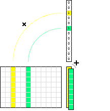
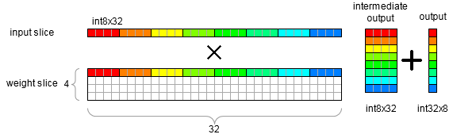
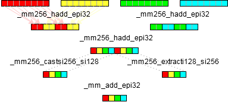
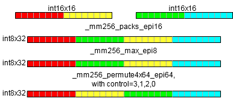
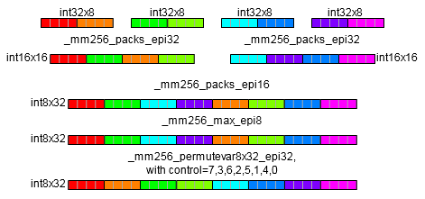
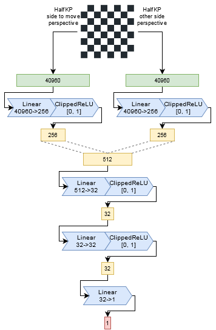
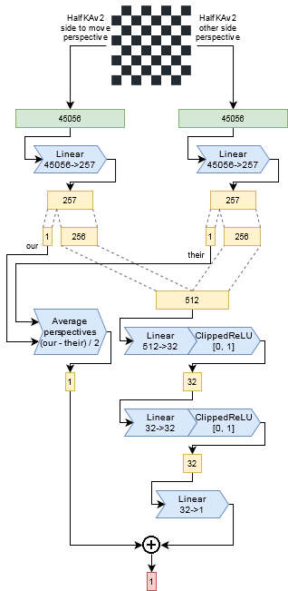
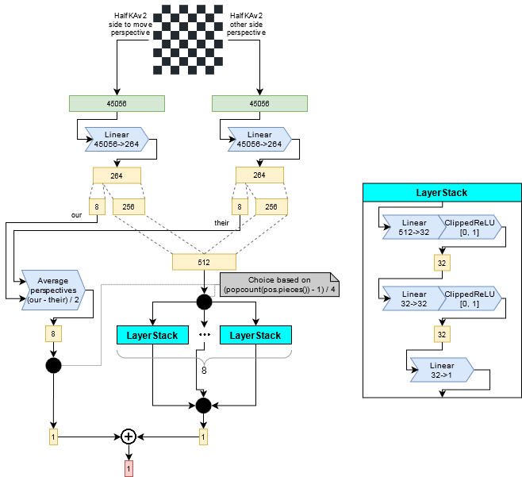

# NNUE

## Preface

This document describes in detail what NNUE is, how it works in theory, how the inference is implemented and how to make it efficient, how to train it with pytorch, and describes some architectural enhancements possible.

## Table of contents

* [Preface](#preface)
* [Table of contents](#table-of-contents)
* [Basics](#basics)
    + [What is NNUE?](#what-is-nnue-)
    + [Quantization 101](#quantization-101)
    + [What layers are used in NNUE?](#what-layers-are-used-in-nnue-)
        - [Linear layer](#linear-layer)
        - [Linear layer with sparse inputs](#linear-layer-with-sparse-inputs)
        - [Clipped ReLU layer](#clipped-relu-layer)
    + [A simple input feature set.](#a-simple-input-feature-set)
    + [A simple NNUE network](#a-simple-nnue-network)
    + [Accumulator](#accumulator)
    + [HalfKP](#halfkp)
        - [Multiple perspectives, multiple accumulators](#multiple-perspectives--multiple-accumulators)
            * [How to combine them?](#how-to-combine-them-)
            * [What weights to use?](#what-weights-to-use-)
        - [HalfKP example and network diagram](#halfkp-example-and-network-diagram)
* [Forward pass implementation](#forward-pass-implementation)
    + [Example network](#example-network)
    + [Layer parameters](#layer-parameters)
    + [Accumulator](#accumulator-1)
        - [Refreshing the accumulator](#refreshing-the-accumulator)
        - [Updating the accumulator](#updating-the-accumulator)
    + [Linear layer](#linear-layer-1)
    + [ClippedReLu](#clippedrelu)
    + [Putting it together](#putting-it-together)
    + [Consideration of networks size and cost.](#consideration-of-networks-size-and-cost)
        - [Feature set](#feature-set)
        - [First set of hidden neurons](#first-set-of-hidden-neurons)
        - [Further layers](#further-layers)
* [Training a net with pytorch](#training-a-net-with-pytorch)
    + [Model specification](#model-specification)
    + [Preparing the inputs](#preparing-the-inputs)
        - [Parsing the training data sets and moving them to the python side](#parsing-the-training-data-sets-and-moving-them-to-the-python-side)
        - [But what is actually sent, how, and how it's made into tensors?](#but-what-is-actually-sent--how--and-how-it-s-made-into-tensors-)
    + [Feature factorization](#feature-factorization)
        - [Virtual feature coalescing](#virtual-feature-coalescing)
        - [Other factors](#other-factors)
        - [Real effect of the factorizer](#real-effect-of-the-factorizer)
    + [Loss Function](#loss-function)
        - [Mean Squared Error (MSE)](#mean-squared-error--mse-)
            * [loss](#loss)
            * [grad](#grad)
        - [Huber](#huber)
            * [loss](#loss-1)
            * [grad](#grad-1)
        - [Cross entropy](#cross-entropy)
            * [loss](#loss-2)
            * [grad](#grad-2)
* [Quantization](#quantization)
    + [Stockfish quantization scheme](#stockfish-quantization-scheme)
        - [Feature Transformer](#feature-transformer)
        - [Linear layer](#linear-layer-2)
        - [ClippedReLU](#clippedrelu)
    + [The math of quantization and how to make it fit](#the-math-of-quantization-and-how-to-make-it-fit)
        - [Feature Transformer](#feature-transformer-1)
        - [Linear layer](#linear-layer-3)
    + [Implementation](#implementation)
    + [Optimized implementation](#optimized-implementation)
        - [Feature Transformer](#feature-transformer-2)
        - [Linear layer](#linear-layer-4)
            * [m256_add_dpbusd_epi32](#m256_add_dpbusd_epi32)
            * [m256_haddx4](#m256_haddx4)
        - [ClippedReLU](#clippedrelu-1)
            * [int16 -> int8](#int16----int8)
            * [int32 -> int8](#int32----int8)
    + [Accounting for quantization in the trainer](#accounting-for-quantization-in-the-trainer)
* [Optimizing the trainer (CUDA)](#optimizing-the-trainer--cuda-)
    + [Using custom CUDA kernels](#using-custom-cuda-kernels)
    + [Feature transformer](#feature-transformer)
        - [Data loader](#data-loader)
        - [Forward](#forward)
        - [Backward](#backward)
        - [FeatureTransformerSlice layer](#featuretransformerslice-layer)
        - [Results](#results)
* [Architectures and new directions](#architectures-and-new-directions)
    + [Simple HalfKP Stockfish architecture](#simple-halfkp-stockfish-architecture)
    + [HalfKAv2 feature set.](#halfkav2-feature-set)
    + [A part of the feature transformer directly forwarded to the output.](#a-part-of-the-feature-transformer-directly-forwarded-to-the-output)
    + [Multiple PSQT outputs and multiple subnetworks](#multiple-psqt-outputs-and-multiple-subnetworks)

## Basics

### What is NNUE?

NNUE (ƎUИИ Efficiently Updatable Neural Network) is, broadly speaking, a neural network architecture that takes advantage of having minimal changes in the network inputs between subsequent evaluations. It was invented for Shogi by Yu Nasu and later ported to chess for use in Stockfish, but is applicable to many other board games and perhaps even in other domains. NNUE operates on the following principles:

1. The network should have relatively low amount of non-zero inputs.
2. The inputs should change as little as possible between subsequent evaluations.

The principle 1. means that when the network is scaled in size the inputs must become sparse. Current best architectures have input sparsity in the order of 0.1%. Small amount of non-zero inputs places a low upper bound on the time required to evaluate the network in cases where it has to be evaluated in its entirety. This is the primary reason why NNUE networks can be large while still being very fast to evaluate.

The principle 2. means that in most turn based games it can take advantage from the fact that a single move changes the board state only slightly. This is of lower importance than the first principle and completely optional for the implementations to take advantage of, but nevertheless gives a measurable improvement in implementations that do care to utilize this assumption.

Overall the NNUE principles are applicable also to expensive deep networks, but they shine in fast shallow networks, which are suitable for low-latency CPU inference without the need for batching. The target performance is million(s) of evaluations per second per thread. This is an extreme use case that requires extreme solutions.

### Quantization 101

Quantization is the process of changing the domain of the neural network from floating point values to integer values. NNUE networks are designed to be evaluated fast, therefore they utilize available int8 performance to the fullest extent. With some int16 and int32 sprinkled where necessary. Floating point is not an option for achieving maximum engine strength as it sacrifices too much speed for too little accuracy gains, though it is used by some others. This limits the range of values representable by the network and introduces error that prevents the network from getting too complicated, or else the error would accumulate too much. Quantization will be described in more detail further into this document. Until then this document will be using floats instead of ints, it won't be important until we get to actual code optimization.

### What layers are used in NNUE?

NNUE currently relies on Linear (fully connected) and ClippedReLU (clamp(0, 1)) layers.

Usually such networks are kept shallow (2-4 layers), due to usage of quantization which introduces some error, and the small number of hidden neurons. The first layer is usually a few magnitudes larger compared to the later layers, simply because knowledge has to be stored *somewhere* and it's the best candidate since the inputs can be made sparse.

#### Linear layer

A linear (fully connected) layer is just a simple matrix multiplication. It can be implemented efficiently, supports sparse inputs, and provides good capacity. It takes as an input `in_features` values, and produces `out_features` values. The operation is `y = Ax+b`, where:

`x` - the input column vector of size `in_features`

`A` - the weight matrix of size `(out_features, in_features)`

`b` - the bias column vector of size `out_features`

`y` - the output column vector of size `out_features`


#### Linear layer with sparse inputs

The multiplication `Ax` can be conceptually simplified to "if `x[i]` is not zero then take column `i` from `A`, multiply it by `x[i]` and add it to the result". Now it should be obvious that whenever an element of the input is zero we can skip processing the whole row of the weight matrix. This means that we have to only process as many columns of `A` as there are non-zero values in the input vector. Even though there may be tens of thousands of columns in the weight matrix we're only concerned a few of them for each position! That's why the first layer can be so large.



#### Clipped ReLU layer

This an activation function based on normal ReLU, with a difference that it is bounded both from below and above. The formula is `y = min(max(x, 0), 1)`.


The purpose of this layer is to add non-linearity to the network. If it was just linear layers they could all be collapsed into one, because the matrices could be just multiplied together.

ClippedReLU would ideally be replaced with ReLU, but aggressive quantization requires reducing the dynamic range of hidden layer inputs, so capping the values at 1 becomes important for performance.

### A simple input feature set.

Most successful engines use so called "HalfKP" features, or a variation thereof. This will be described in detail later on, but for now let's focus on a simpler example to get basic understanding of how NNUE actually works.

For the purpose of illustration we will consider a simple set of inputs based on piece placement. We will call it "A" features, because they will represent "All pieces" with no relations to anything else but the square they are on.

There is 64 squares on the board, 6 piece types (pawn, knight, bishop, rook, queen, king), and 2 colors (white, black). What we want to encode as inputs are the positions of pieces, so each input will correspond to some (square, piece_type, color) tuple. There is `64*6*2=768` such tuples. If there is a piece `P` of color `C` on the square `S` we set the input `(S, P, C)` to 1, otherwise we set it to 0. Even though the total number of inputs is 768 there can only be 32 non-zero inputs in any given legal chess position, because there are only at most 32 pieces on the board. Moreover, any move can only change at most 4 inputs (castling), and the average should be below 3.

The binary and sparse nature of the inputs is utilized when passing the features to the neural network - the input is simply the list of features (indices), there's no need for a full input vector as other positions have value 0 and we know that each active feature has a value 1 associated with it.

Let's look at an example position `1k6/8/8/8/3r4/2P5/8/K7 w - - 0 1`.


On the board above we have 4 active features: `(A1, king, white)`, `(C3, pawn, white)`, `(B8, king, black)`, `(D4, rook, black)`.

Now let's consider the move c4 - the only feature that became invalid is the `(C3, pawn, white)`, it needs to be replaced with `(C4, pawn, white)`.

Now let's consider the move cxd4 - the pawn moved, so like before we remove `(C3, pawn, white)` and add `(D4, pawn, white)`. But also the rook got removed from the board, so we have to remove `(D4, rook, black)` too. This is still less work than recreating the inputs from scratch!

### A simple NNUE network

We will use our "A" feature set from the previous paragraph, so we have 768 inputs. The layers for the purpose of this illustration will be the 3 linear layers, 768->8, 8->8, 8->1. All layers are linear, and all hidden neurons use ClippedReLU activation function. The image below illustrates the architecture:

![A[768]->8->8->1 architecture diagram](img/A-768-8-8-1.png)

The flow is from the left to the right. The first layer is a large fully connected layer with 768 inputs, but only a small fraction of them is non-zero for each position - sparse matrix vector multiplication can be utilized. Hidden layers are much smaller and always computed with dense matrix vector multiplication. At the end we get 1 output, which is usually trained to be the centipawn evaluation of the position.

### Accumulator

Even though we observed that few inputs change from position to position we have yet to take advantage of that. Recall that a linear layer is just adding some weight matrix columns together. Instead of recomputing the first set of hidden neurons for each position we can keep them as part of the position's state, and update it on each move based on what features (columns) were added or removed! We have the handle only two simple cases:

1. the feature `i` was removed from the input (1 -> 0) - subtract column `i` of the weight matrix from the accumulator
2. the feature `i` was added to the input (0 -> 1) - add column `i` of the weight matrix to the accumulator

For a single move it's trivial to find which "A" features changed - we know what piece we're moving, from where, and where to. Captures and promotions can be considered as a piece disappearing or appearing from nowhere.

However, care must taken when using floating point values. Repeatedly adding and subtracting floats results in error that accumulates with each move. It requires careful evaluation whether the error is small enough for the net to still produce good results. Thankfully it's best implemented such that the accumulator is not updated when undoing a move, it is simply stored on the stack, so the error is bounded by `O(MAX_DEPTH)` and can mostly be ignored.

When using quantization this is no longer a problem, but now there is a possibility of overflowing the accumulator. This, however, is much less of an issue and would come up even without these incremental updates. Quantization must ensure that no combination of possible active features can exceed the maximum value.

### HalfKP

HalfKP is the most common feature set and other successful ones build on top of it. It fits in a sweet spot of being just the right size, and requiring very few updates per move on average. Each feature is a tuple `(our_king_square, piece_square, piece_type, piece_color)`, where `piece_type` is not a king (in HalfKA feature set kings are included). This means that for each king position there is a set of features `P`, which are `(piece_square, piece_type, piece_color)`. This allows the net to better understand the pieces in relation to the king. The total number of features is `64*64*5*2=40960`. (Note that there is a leftover from Shogi in the current Stockfish implementation and there are additional 64 features that are unused, but we will disregard them for the purpose of this document). The feature index can be calculated as
```
p_idx = piece_type * 2 + piece_color
halfkp_idx = piece_square + (p_idx + king_square * 10) * 64
```
The one special case that needs to be handled is when the king moves, because it is tied to all the features all features are changed - an accumulator refresh is executed.

Now, you might ask, "but which king?!". The answer is both...

#### Multiple perspectives, multiple accumulators

This is where we need to start accounting for the features of both sides separately. The white side will keep its own accumulator, and the black side its own accumulator too. So now we have two accumulators for each position state. Effectively it means that the maximum active number of features is twice as high than for a simple feature set with one perspective, and there is twice as many updates, but overall it's a very good feature set and a basis for everything that's good. This creates some problems, options, and choices. Let's go through them one by one.

##### How to combine them?

Since we now have two accumulators we need to somehow combine them into one vector that gets passed further into the network. This can be solved in two (three) ways. Let's denote the accumulator for white as `A_w`, and the accumulator for black as `A_b`

1. concatenate the `A_w` and `A_b`, placing `A_w` first and `A_b` second. This is the simplest option. It is fine, the output is always relative to the white's perspective.
2. concatenate the `A_w` and `A_b`, placing `A_w` first if it's white to move, otherwise `A_b` first, and the other accumulator second. This approach has the advantage that the net can learn tempo. It now knows whose turn it is. The output is always relative to the side to move perspective
3. Either 1 or 2, but instead of concatenating interleave. So `A_w[0], A_b[0], A_w[1], A_b[1], ...`. This might be advantageous in some exotic architectures where not always the whole combined accumulator is used, in which case interleaving means that the slice used always contains the same number of outputs from white's and from black's perspectives. This might come useful for example when employing structured sparsity to the first hidden layer, which ultimately works on the subset of the accumulator.

##### What weights to use?

So we compute the features for white and black the same, are their weights related? They can be, but it's not required. Engines differ in handling of this. Stockfish uses the same weights for white and black, Seer for example uses separate.

1. Use the same weights for both perspectives. This means the the board state needs to somehow be oriented. Otherwise white king on E1 would produce a different subset of features than a black king on E8, and white king on G4 would produce the same subset of features as a black king on G4. That's bad. The solution is to mirror the position and change the color of the pieces for black's perspective, then the piece placement to feature mapping is logical for both. White king on E1 from white's perspective should be the same as a black king on E8 from black's perspective. Now you may think that flip is the way to go, but while chess has vertical symmetry, Shogi has rotational symmetry. The initial implementation of HalfKP in Stockfish uses rotation to change the perspective, which is arguably incorrect for chess (for example due to castling), but that's a remnant from the past that will hopefully be resolved once a good network using mirror instead of flip will be produced.
2. Use different weights for different perspectives. Is the white king on E1 actually equal to black king on E8? What about other pieces? Arguably one plays the game differently as black than as white, and it seems it makes sense to use different features for these perspectives. This is how some engines do it, and there's nothing wrong with this. The only downsides are larger size and slightly longer training time, but other than that it might even be better! It also completely removes the discussion about flip or rotate, and lends itself to a simpler, more performant implementation.

#### HalfKP example and network diagram

Similar to the diagram above for the "A" feature set, here is the diagram for the same network but with HalfKP feature set, with combined weights. With a change that both accumulators are of size 4, so the network is in the end `HalfKP[40960]->4x2->8->1`

Let's look at the same example position as before: `1k6/8/8/8/3r4/2P5/8/K7 w - - 0 1`.


Now we have two perspectives, and will list the features for both of them separately. Remember the features are `(our_king_square, piece_square, piece_type, piece_color)` and we use flip to orient the squares for black and the colors are reversed! (One can think of the "color" as "us" or "them")

White's perspective: `(A1, C3, pawn, white)`, `(A1, D4, rook, black)`

Blacks's perspective: `(B1, C6, pawn, black)`, `(B1, D5, rook, white)`

The network diagram looks more interesting now.

![HalfKP[40960]->4x2->8->1](img/HalfKP-40960-4x2-8-1.png)

## Forward pass implementation

In this part we will present how the network is evaluated. Input generation will be omitted. Remember that we work with floats for now but that will change later.

### Example network

We will take a more generally defined network, with architecture `FeatureSet[N]->M*2->K->1`. The layers will therefore be:

1. `L_0`: Linear `N->M`
2. `C_0`: Clipped ReLu of size `M*2`
3. `L_1`: Linear `M*2->K`
4. `C_1`: Clipped ReLu of size `K`
5. `L_2`: Linear `K->1`

### Layer parameters

Linear layers have 2 parameters - weights and biases. We will refer to them as `L_0.weight` and `L_0.bias` respectively. The layers also contain the number of inputs and outputs, in `L_0.num_inputs` and `L_0.num_outputs` respectively.

Here something has to be said about layout of the weight matrix. For the sparse multiplication the column-major (a column is contiguous in memory) layout is favorable, as we're adding columns, but for dense multiplication this is not so clear and a row-major layout may be preferable. For now we will stick to the column-major layout, but we may revisit the row-major one when it comes to quantization and optimization. That means that `L_0.weight` allows access to the individual elements in the following form: `L_0.weight[column][row]`.

The code will be pseudo-c++.

### Accumulator

The accumulator can be represented by an array that is stored along other position state information on the search stack.

```
struct NnueAccumulator {
    // Two vectors of size N. v[0] for white's, and v[1] for black's perspectives.
    float v[2][N];

    // This will be utilised in later code snippets to make the access less verbose
    float* operator[](Color perspective) {
        return v[perspective];
    }
};
```

The accumulator can either be updated lazily on evaluation, or on each move. It doesn't matter here, but it has to be updated *somehow*. There are two cases, as layed out before:

1. The accumulator has to be recomputed from scratch.
2. The previous accumulator is reused and just updated with changed features

#### Refreshing the accumulator

```
void refresh_accumulator(
    const LinearLayer&      layer,            // this will always be L_0
    NnueAccumulator&        new_acc,          // storage for the result
    const std::vector<int>& active_features,  // the indices of features that are active for this position
    Color                   perspective       // the perspective to refresh
) {
    // First we copy the layer bias, that's our starting point
    for (int i = 0; i < M; ++i) {
        new_acc[perspective][i] = layer.bias[i];
    }

    // Then we just accumulate all the columns for the active features. That's what accumulators do!
    for (int a : active_features) {
        for (int i = 0; i < M; ++i) {
            new_acc[perspective][i] += layer.weight[a][i];
        }
    }
}
```

#### Updating the accumulator

```
void update_accumulator(
    const LinearLayer&      layer,            // this will always be L_0
    NnueAccumulator&        new_acc,          // it's nice to have already provided storage for
                                              // the new accumulator. Relevant parts will be overwritten
    const NNueAccumulator&  prev_acc,         // the previous accumulator, the one we're reusing
    const std::vector<int>& removed_features, // the indices of features that were removed
    const std::vector<int>& added_features,   // the indices of features that were added
    Color                   perspective       // the perspective to update, remember we have two,
                                              // they have separate feature lists, and it even may happen
                                              // that one is updated while the other needs a full refresh
) {
    // First we copy the previous values, that's our starting point
    for (int i = 0; i < M; ++i) {
        new_acc[perspective][i] = prev_acc[perspective][i];
    }

    // Then we subtract the weights of the removed features
    for (int r : removed_features) {
        for (int i = 0; i < M; ++i) {
            // Just subtract r-th column
            new_acc[perspective][i] -= layer.weight[r][i];
        }
    }

    // Similar for the added features, but add instead of subtracting
    for (int a : added_features) {
        for (int i = 0; i < M; ++i) {
            new_acc[perspective][i] += layer.weight[a][i];
        }
    }
}
```

And that's it! Pretty simple, isn't it?

### Linear layer

This is simple matrix-vector multiplication, what could be complicated about it you ask? Nothing for now, but it will get hairy further into this document. Right now we won't optimize, but we will at least write a version that uses the fact that the weight matrix has column-major layout.

```
float* linear(
    const LinearLayer& layer,  // the layer to use. We have two: L_1, L_2
    float*             output, // the already allocated storage for the result
    const float*       input   // the input, which is the output of the previous CReLu layer
) {
    // First copy the biases to the output. We will be adding columns on top of it.
    for (int i = 0; i < layer.num_outputs; ++i) {
        output[i] = layer.bias[i];
    }

    // Remember that rainbowy diagram long time ago? This is it.
    // We're adding columns one by one, scaled by the input values.
    for (int i = 0; i < layer.num_inputs; ++i) {
        for (int j = 0; j < layer.num_outputs; ++j) {
            output[j] += input[i] * layer.weight[i][j];
        }
    }

    // Let the caller know where the used buffer ends.
    return output + layer.num_outputs;
}
```

### ClippedReLu

```
float* crelu(,
    int          size,   // no need to have any layer structure, we just need the number of elements
    float*       output, // the already allocated storage for the result
    const float* input   // the input, which is the output of the previous linear layer
) {
    for (int i = 0; i < size; ++i) {
        output[i] = min(max(input[i], 0), 1);
    }

    return output + size;
}
```

### Putting it together

In a crude pseudo code. The feature gathering is left as an exercise for the reader :P.

```
void Position::do_move(...) {
    ... // do the movey stuff

    for (Color perspective : { WHITE, BLACK }) {
        if (needs_refresh[perspective]) {
            refresh_accumulator(
                L_0,
                this->accumulator,
                this->get_active_features(perspective),
                perspective
            );
        } else {
            update_accumulator(
                L_0,
                this->accumulator,
                this->get_previous_position()->accumulator,
                this->get_removed_features(perspective),
                this->get_added_features(perspective),
                perspective
            );
        }
    }
}

float nnue_evaluate(const Position& pos) {
    float buffer[...]; // allocate enough space for the results

    // We need to prepare the input first! We will put the accumulator for
    // the side to move first, and the other second.
    float input[2*M];
    Color stm = pos.side_to_move;
    for (int i = 0; i < M; ++i) {
        input[i] = pos.accumulator[stm][i];
        input[i+M] = pos.accumulator[!stm][i];
    }

    float* curr_output = buffer;
    float* curr_input = input;
    float* next_output;

    // Evaluate one layer and move both input and output forward.
    // Last output becomes the next input.
    next_output = crelu(L_0.num_outputs, curr_output, input);
    curr_input = curr_output;
    curr_output = next_output;

    next_output = linear(L_1, curr_output, curr_input);
    curr_input = curr_output;
    curr_output = next_output;

    next_output = crelu(L_1.num_outputs, curr_output, input);
    curr_input = curr_output;
    curr_output = next_output;

    next_output = linear(L_2, curr_output, curr_input);

    // We're done. The last layer should have put 1 value out under *curr_output.
    return *curr_output;
}
```

And that's it! That's the whole network. What do you mean you can't use it?! OH RIGHT, you don't have a net trained, what a bummer.

### Consideration of networks size and cost.

Choosing the right architecture is tricky as it's a strength/performance trade-off. Large networks provide more accurate evaluation, but the speed impact might completely negate the gains in real play. Changing some parts impacts the performance and strength differently than other. The most battle-tested architecture is `HalfKP[40960]->256x2->32->32->1`, and it seems to provide near optimal strength/performance ratio.

#### Feature set

When choosing a feature set it might be tempting to go into complicated domain specific knowledge, but the costs associated make simpler solutions more attractive. HalfKP, explained in detail earlier, is very simple, fast, and good enough. More sophisticated feature sets have been tried but they usually cannot combat the hit on performance. HalfKP features are easy to calculate, and little changes from position to position.

Size also has to be considered. For the architecture presented above HalfKP results in about 10 million parameters in the first layer, which is quite a lot. For some uses it might not be an issue to have a very large set of features, with possibly hundreds of millions of parameters, but for a typical user it's inconvenient. Moreover increasing the feature set size may reduce the training speed for some implementations, and certainly will require move time to converge.

#### First set of hidden neurons

The number of hidden neurons after the first layer is the most crucial parameter, but also has the highest impact on speed and size. In the architecture presented above the number of neurons is 256 per perspective. The costs associated with this parameter are two-fold. It increases the number of operations required when updating the accumulator. For optimized implementations one must consider the number of registers - in Stockfish going past 256 neurons requires multiple passes over the feature indices as AVX2 doesn't have enough registers. It also determines the size of the first dense linear layer, which is by far the largest.

#### Further layers

Unlike in typical networks considered in machine learning here most of the knowledge is stored in the first layer, and because of that adding further small layers near the output adds little to accuracy, and may even be harmful if quantization is employed due to error accumulation. NNUE networks are kept unusually shallow, and the the size of the layers closer to the output can remain small to increase performance.

## Training a net with pytorch

This will be very brief, as this is on the nnue-pytorch repo after all so you can just look up the code! We will not explain how pytorch works, but we will, however, explain some of the basics, and the quirks needed to accommodate this exotic use case.

Let's continue using the architecture from the forward pass implementation.

### Model specification

Pytorch has built in types for linear layers, so defining the model is pretty simple.

```
class NNUE(nn.Module):
    def __init__(self):
        super(NNUE, self).__init__()

        self.ft = nn.Linear(NUM_FEATURES, M)
        self.l1 = nn.Linear(2 * M, N)
        self.l2 = nn.Linear(N, K)

    # The inputs are a whole batch!
    # `stm` indicates the whether white is the side to move. 1 = true, 0 = false.
    def forward(self, white_features, black_features, stm):
        w = self.ft(white_features) # white's perspective
        b = self.ft(black_features) # black's perspective

        # Remember that we order the accumulators for 2 perspectives based on who is to move.
        # So we blend two possible orderings by interpolating between `stm` and `1-stm` tensors.
        accumulator = (stm * torch.cat([w, b], dim=1)) + ((1 - stm) * torch.cat([b, w], dim=1))

        # Run the linear layers and use clamp_ as ClippedReLU
        l1_x = torch.clamp(accumulator, 0.0, 1.0)
        l2_x = torch.clamp(self.l1(l1_x), 0.0, 1.0)
        return self.l2(l2_x)
```

This bit is pretty simple, and pytorch obviously handles backpropagation automatically. Neat! The hard bit is, maybe surprisingly, feeding the data.

### Preparing the inputs

There are two main bottlenecks in this part.

1. Parsing the training data sets
2. Preparing the tensor inputs

#### Parsing the training data sets and moving them to the python side

You might be tempted to implement this in python. It would work, but sadly, it would be orders of magnitude too slow. What we did in nnue-pytorch is we created a shared library in C++ that implements a very fast training data parser and provides the data in a form that can be quickly turned into the input tensors. You can also look at the implementation in Seer as it is simpler.

Ctypes is fairly simple for C and python interoperation and more than enough for this task. We're just passing pointers around, really. Just remember that only C has stable ABI, so all functions accessible from python need to be `extern "C"`.

The architecture of the data reader is that it is passed a file on creation, and it spawns the requested number of worker threads that chew through it and prepare **whole batches** asynchronously, and then they are retrieved from the pytorch side. Going one by one is no option, corners need to be cut. You may ask why? Pytorch can turn multiple tensors into a batch so what's the problem? Let's see...

Remember how the input is sparse? Now let's say our batch size is 8192. What would happen if we sent 8192 sparse tensors and tried to form a batch from them? Well, pytorch doesn't like doing that by itself, we need to help it. And the best way is to form one big 2d sparse input tensor that encompasses the whole batch. It has 2 sparse dimensions and the indices are `(position_index, feature_index)`, pretty simple, has great performance, and no need to create temporary tensors! If we're doing it for the sparse tensors then we can also do it for all the others since it's easier. The fact that we're forming whole batches from the start also means that we can reduce the amount of allocations and use a better memory layout for the batch parts.

Because of that we also cannot simply use the pytorch's `DataLoader`, and need to use it a mere wrapper. But this effort is worth it. One worker thread can usually saturate even a high end GPU without any issues.

#### But what is actually sent, how, and how it's made into tensors?

The minimum that's needed are the features (from both perspectives), the side to move (for accumulator slice ordering), and the position evaluation (the score). Let's see how they are represented.

```
struct SparseBatch {
    SparseBatch(const std::vector<TrainingDataEntry>& entries) {

        // The number of positions in the batch
        size = entries.size();

        // The total number of white/black active features in the whole batch.
        num_active_white_features = 0;
        num_active_black_features = 0;

        // The side to move for each position. 1 for white, 0 for black.
        // Required for ordering of the accumulator slices in the forward pass.
        stm = new float[size];

        // The score for each position. This is value that we will be teaching the network.
        score = new float[size];

        // The indices of the active features.
        // Why is the size * 2?! The answer is that the indices are 2 dimensional
        // (position_index, feature_index). It's effectively a matrix of size
        // (num_active_*_features, 2). We fill it in row major way and
        // transpose it on the pytorch side because it wants it the other way
        // around.
        // IMPORTANT: We must make sure that the indices are in ascending order.
        // That is first comes the first position, then second, then third,
        // and so on. And within features for one position the feature indices
        // are also in ascending order. Why this is needed will be apparent later.
        white_features_indices = new int[size * MAX_ACTIVE_FEATURES * 2];
        black_features_indices = new int[size * MAX_ACTIVE_FEATURES * 2];

        fill(entries);
    }

    void fill(const std::vector<TrainingDataEntry>& entries) {
        ...
    }

    int size;
    int num_active_white_features;
    int num_active_black_features;

    float* stm;
    float* score;
    int* white_features_indices;
    int* black_features_indices;

    ~SparseBatch()
    {
        // RAII! Or use std::unique_ptr<T[]>, but remember that only raw pointers should
        // be passed through language boundaries as std::unique_ptr doesn't have stable ABI
        delete[] stm;
        delete[] score;
        delete[] white_features_indices;
        delete[] black_features_indices;
    }
};
```

and in python

```
class SparseBatch(ctypes.Structure):
    _fields_ = [
        ('size', ctypes.c_int),
        ('num_active_white_features', ctypes.c_int),
        ('num_active_black_features', ctypes.c_int),
        ('stm', ctypes.POINTER(ctypes.c_float)),
        ('score', ctypes.POINTER(ctypes.c_float)),
        ('white_features_indices', ctypes.POINTER(ctypes.c_int)),
        ('black_features_indices', ctypes.POINTER(ctypes.c_int))
    ]

    def get_tensors(self, device):
        // This is illustrative. In reality you might need to transfer these
        // to the GPU. You can also do it asynchronously, but remember to make
        // sure the source lives long enough for the copy to finish.

        // This is a nice way to convert a pointer to a pytorch tensor.
        // Shape needs to be passed, remember we're forming the whole batch, the first
        // dimension is always the batch size.
        stm_t = torch.from_numpy(np.ctypeslib.as_array(self.stm, shape=(self.size, 1)))
        score_t = torch.from_numpy(np.ctypeslib.as_array(self.score, shape=(self.size, 1)))

        // As we said, the indices need to be transposed such that position indices come first
        white_features_indices_t = torch.transpose(torch.from_numpy(np.ctypeslib.as_array(self.white_features_indices, shape=(self.num_active_white_features, 2))), 0, 1).long()
        black_features_indices_t = torch.transpose(torch.from_numpy(np.ctypeslib.as_array(self.black_features_indices, shape=(self.num_active_white_features, 2))), 0, 1).long()

        // The values are all ones, so we can create these tensors in place easily.
        // No need to go through a copy.
        white_features_values_t = torch.ones(self.num_active_white_features)
        black_features_values_t = torch.ones(self.num_active_black_features)

        // Now the magic. We construct a sparse tensor by giving the indices of
        // non-zero values (active feature indices) and these values (ones!).
        // The size of the tensor is batch_size*NUM_FEATURES, which would
        // normally be insanely large, but since the density is ~0.1% it takes
        // very little space and allows for faster forward pass.
        // For maximum performance we do cheat somewhat though. Normally pytorch
        // checks the correctness, which is an expensive O(n) operation.
        // By using _sparse_coo_tensor_unsafe we avoid that.
        white_features_t = torch._sparse_coo_tensor_unsafe(white_features_indices_t, white_features_values_t, (self.size, NUM_FEATURES))
        black_features_t = torch._sparse_coo_tensor_unsafe(black_features_indices_t, black_features_values_t, (self.size, NUM_FEATURES))

        // What is coalescing?! It makes sure the indices are unique and ordered.
        // Now you probably see why we said the inputs must be ordered from the start.
        // This is normally a O(n log n) operation and takes a significant amount of
        // time. But here we **know** that the tensor is already in a coalesced form,
        // therefore we can just tell pytorch that it can use that assumption.
        white_features_t._coalesced_(True)
        black_features_t._coalesced_(True)

        // Now this is what the forward() required!
        return white_features_t, black_features_t, stm_t, score_t

// Let's also tell ctypes how to understand this type.
SparseBatchPtr = ctypes.POINTER(SparseBatch)
```

### Feature factorization

Let's focus on the features again. We will take a closer look on the `HalfKP` feature set. Hmm... We took `P`, and did it 64 times, once for each square... Surely these 64 buckets are somehow related... How could we tell the net that they are? By introducing virtual features!

We have 40960 `HalfKP` features and 640 `P` features. How to they map to each other? The exact computation will depend on your indexing scheme, but we can lay it out in simple terms.

`HalfKP` features are `(king_square, piece_square, piece_type, piece_color)`

`P` features are `(piece_square, piece_type, piece_color)`.

3 parts are common between the two. So for each `P` feature there is 64 corresponding `HalfKP` features. We can extend our 40960 inputs to 40960+640, including both `HalfKP` and `P` features. Now each position will have at most 64 features (32 `HalfKP`, and 32 `P`) for each perspective. Nothing else changes in the data loader, nor in the forward pass, we just added more features! But we don't want to use them in actual play, it would be too expensive, and kinda pointless. We know which features are correlated with each other, so let's just coalesce them somehow before using the network for play.

#### Virtual feature coalescing

So how can we coalesce them? Let's look how matrix and vector multiplication is done again. Consider the example position from before (`1k6/8/8/8/3r4/2P5/8/K7 w - - 0 1`).

:

Let's focus on the feature `(A1, C3, pawn, white)`. Now, we're also gonna add a `P` feature `(C3, pawn, white)`. What happens when the input goes through the first layer?

```
accumulator += weights[(A1, C3, pawn, white)];
accumulator += weights[(C3, pawn, white)];
```

which is equivalent to

```
accumulator += weights[(A1, C3, pawn, white)] + weights[(C3, pawn, white)];
```

So the relation is very simple. We just need to add the weights of each `P` feature to all the related `HalfKP` feature weights!

#### Other factors

Sometimes it's possible to add even more factors. For `HalfKP` we can also consider the following (though they don't seem to gain anything).

1. `K` - the king position, 64 features. This one requires some careful handling as a single position has this feature multiple times - the number of pieces on the board. This means that the input for this feature is no longer 1, but the number of position on the board instead.
2. `HalfRelativeKP` - in `HalfKP` we use the absolute piece position, but what if we encoded the position as relative to the king? There's 15x15 such relative position possible, and most of them correspond 1:1 to some `HalfKP` feature.

#### Real effect of the factorizer

While the factorizer helps the net to generalize it seems to only be relevant in the early stages, that is when the net doesn't really know anything yet, and makes the net learn faster. But it quickly becomes unimportant and in later stages of the training can be removed to gain some training speed (after all it can add a lot of active features).

### Loss functions and how to apply them

#### The Goal

Training a network is really just minimizing a loss function, which needs to be smooth and have a minimum at the "optimal" evaluation (the training target). For the purpose of NNUE this is done by gradient descent through usual machine learning methods (there are also non-gradient methods that are not described here).

#### Converting the evaluation from CP-space to WDL-space

By CP-space we mean the centipawn scale (or engine's internal units). By WDL-space we mean 0=loss, 0.5=draw, 1=win.

It's of course possible to apply the loss function directly on the evaluation value, but this can lead to large gradients (or a lot of hyperparameter tuning), restricts the set of loss functions available, and doesn't allow using results for loss. We will focus on evaluation in WDL-space. But how to convert between these spaces? Usually the evaluation to performance correspondence can be well fitted by a sigmoid. For example in some data generated by Stockfish we have:


so in the code we may do the following:
```
scaling_factor = 410 # this depends on the engine, and maybe even on the data
wdl_space_eval = torch.sigmoid(cp_space_eval / scaling_factor)
```

This transformation also has the nice effect that large evaluations become "closer" together, which aligns well with the real play, where large evaluations don't need to be that precise.

#### Using results along the evaluation

With the values for which we will compute loss being in WDL-space we may now interpolate them with game results. We will introduce a `lambda` parameter that governs the interpolation.
```
# game_result is in WDL-space
wdl_value = lambda * wdl_space_eval + (1 - lambda) * game_result
```

The interpolation can also be applied to the loss.
```
loss_eval = ... # loss between model eval and position eval
loss_result = ... # loss between model eval and game result
loss = lambda * loss_eval + (1 - lambda) * loss_result
```

Which way works better depends on your case :)

#### Mean Squared Error (MSE)

Now we know what we're trying to fit; let's look how we will fit them.

This is a very simple loss function that just takes a square of the difference between the predicted value and the target. This results in a nice linear gradient.

With interpolation applied before:
```
scaling = ... # depends on the engine and data. Determines the shape of
              # the sigmoid that transforms the evaluation to WDL space
              # Stockfish uses values around 400
wdl_eval_model = sigmoid(model(...) / scaling)
wdl_eval_target = sigmoid(target / scaling)
wdl_value_target = lambda * wdl_eval_target + (1 - lambda) * game_result
loss = (wdl_eval_model - wdl_value_target)**2
```

With interpolation applied after:
```
scaling = ...
wdl_eval_model = sigmoid(model(...) / scaling)
wdl_eval_target = sigmoid(target / scaling)
loss_eval   = (wdl_eval_model - wdl_eval_target)**2
loss_result = (wdl_eval_model - game_result)**2
loss = lambda * loss_eval + (1 - lambda) * loss_result
```

##### loss


##### grad


#### Cross entropy

This loss function is usually used for continuous classification problems, and our use case could be considered one.

Care must be taken around domain boundaries. Usually a very small value (epsilon) is added such that the values never reach 0 under the logarithm.

With interpolation applied before:
```
epsilon = 1e-12 # to prevent log(0)
scaling = ...
wdl_eval_model = sigmoid(model(...) / scaling)
wdl_eval_target = sigmoid(target / scaling)
wdl_value_target = lambda * wdl_eval_target + (1 - lambda) * game_result

# The first term in the loss has 0 gradient, because we always
# differentiate with respect to `wdl_eval_model`, but it makes the loss nice
# in the sense that 0 is the minimum.
loss = (wdl_value_target * log(wdl_value_target + epsilon) + (1 - wdl_value_target) * log(1 - wdl_value_target + epsilon))
      -(wdl_value_target * log(wdl_eval_model   + epsilon) + (1 - wdl_value_target) * log(1 - wdl_eval_model   + epsilon))
```

With interpolation applied after:
```
epsilon = 1e-12 # to prevent log(0)
scaling = ...
wdl_eval_model = sigmoid(model(...) / scaling)
wdl_eval_target = sigmoid(target / scaling)

# The first term in the loss has 0 gradient, because we always
# differentiate with respect to `wdl_eval_model`, but it makes the loss nice
# in the sense that 0 is the minimum.
loss_eval   = (wdl_eval_target * log(wdl_eval_target + epsilon) + (1 - wdl_eval_target) * log(1 - wdl_eval_target + epsilon))
             -(wdl_eval_target * log(wdl_eval_model  + epsilon) + (1 - wdl_eval_target) * log(1 - wdl_eval_model  + epsilon))
loss_result = (game_result     * log(wdl_eval_target + epsilon) + (1 - game_result)     * log(1 - wdl_eval_target + epsilon))
             -(game_result     * log(wdl_eval_model  + epsilon) + (1 - game_result)     * log(1 - wdl_eval_model  + epsilon))
loss = lambda * loss_eval + (1 - lambda) * loss_result
```

##### loss


##### grad


## Quantization

At the start of this document it was briefly mentioned what quantization is and that it will be important. Now it's the time to understand it properly. The goals is that we want to use the smallest possible integers everywhere. Most CPU architectures provide instructions that can work on 8, 16, 32, or even 64 int8 values at a time, and we should take advantage of that. That means we need to use int8 values, with range -128..127, for weights and inputs; or int16, with range -65536..65535, where int8 is not possible.

Coming up with the right quantization scheme is not easy, so first we'll present the one currently used by Stockfish, and then we'll explain how to get there, how to code it, and finally how to optimize it.

### Stockfish quantization scheme

#### Feature Transformer

Let's start with the feature transformer. Recall that its purpose is to accumulate between 0 to 30 (for HalfKP) rows of weights. We want to have int8 values as inputs to the later layers, with the activation range (ClippedReLU) being 0..127, but that means that using int8 integers for the accumulator doesn't provide enough space as the values would go beyond the range of int8 before applying the ClippedReLU... so we use int16 for the accumulator and then convert to int8 when doing the ClippedReLU.

#### Linear layer

We wanted int8 inputs and we can get them without losing too much precision. The nature of matrix-purposed SIMD instructions is that, thankfully, the accumulation happens in int32. So we don't experience the same issue as in the feature transformer where we're manually adding rows, and we can utilize the int8 multiplication with int32 accumulation to the fullest extent, and only later go back to int8 in the ClippedReLU layer.

#### ClippedReLU

Nothing special going on in here. Since the inputs are not being scaled this is simply the same operation but in a different domain. Instead of clamping to 0..1 we clamp to 0..127. The input type is usually different than the output type as inputs will be either int32 or int16, and the output we want is int8. The values won't change but the conversion needs to be applied.

### The math of quantization and how to make it fit

To quantize the network we need to multiply the weights and biases by some constant to translate them to a different range of values. This poses a problem when confronted with multiplication during network inference - `(a*x) * (a*w) = a*a*x*w`, and we have to sometimes scale the outputs back too. But each layer is still independent so let's go through them one by one again.

#### Feature Transformer

Remember we want our activation range to change from 0..1 to 0..127. Since the feature transformer is a purely additive process it's enough that we multiply the weights and biases by 127. Both weights and biases are stored as int16. We could divide the output by some factor `a` to get more precision, in which case the weights and biases would have to be multiplied by `a*127` instead, but in practice it increases the accuracy only by a little bit.

#### Linear layer

To arrive at int8 weights we have to apply some scaling factor. This scaling factor ultimately depends on how much precision needs to be preserved, but cannot be too large because then the weights will be limited in magnitude. For example if we took the scaling factor to be 64 (used in Stockfish), then the maximum weight in the floating point space is `127/64=1.984375`. This is enough to have good nets, but care needs to be taken to clamp the weights during training so that they don't go outside that range. The scaling factor of 64 can also be understood as the smallest weight step that can be represented being `1/64=0.015625`.

A linear layer is just matrix multiplication, so we're multiplying inputs and weights, but now both are scaled relative to the float version. Let's denote the input scaling factor (activation range scaling) as `s_A`, and the weight scaling factor by `s_W`. `x` is the unquantized input, `w` is the unquantized weight, 'b' is the unquantized bias, and `y` is the unquantized output.
So we have:
```
x * w + b = y
((s_A * x) * (s_W * w)) + (b * s_A * s_W) = (y * s_A) * s_W
(((s_A * x) * (s_W * w)) + (b * s_A * s_W)) / s_W = (y * s_A)
```
From that we learn that we need to scale the bias by `(s_A * s_W)`, weights by `s_W`, and divide output by `s_W` to get the desired `(y * s_A)`, which is correctly scaled to the activation range.

Now, this applies only when the next layer is the ClippedReLU layer. For the last layer the output range is very different and the quantization will also be different. In Stockfish we want the last layer to output values in range -10000..10000 while still keeping int8 weights. This can be achieved without any additional scaling factors, but it's easiest to do an understand with an additional scaling factor.

We'll introduce a new scaling factor, `s_O`. This scaling factor, unlike others, needs to be applied to the output both during training (for loss calculation against the actual evaluation) and inference. The purpose of it is to scale the float output of the network to match the range of the integer evaluation used by Stockfish. Basically it means that `1` in the float space is equal to `s_O` internal evaluation units. It has an additional advantage that it allows us to have the layer weights be similar in magnitude to the previous layers.

So the math is now:
```
x * w + b = y
(((s_A * x) * (s_W * w)) + (b * s_A * s_W)) * s_O = ((y * s_A) * s_W) * s_O
(((s_A * x) * (s_W * w)) + (b * s_A * s_W)) * s_O / s_A / s_W = (y * s_O)
(((s_A * x) * (s_W / s_A * w)) + (b * s_A * s_W / s_A)) * s_O / s_W = (y * s_O)
(((s_A * x) * (s_W * s_O / s_A * w)) + (b * s_W * s_O)) / s_W = (y * s_O)
```
From that we learn that we need to scale the bias by `s_W * s_O`, weights by `s_W * s_O / s_A`, and divide the output by `s_W` to get the desired `(y * s_O)`.

### Implementation

For the unoptimized implementation not much changes. One just has to remember to change the data types to integers with desired size, scale weights on input, and divide the output from linear layers by `s_W`. `s_W` is usually chosen to be a power of two so that this operation is a simple bitwise right shift, as there are no SIMD division instructions for integers and even if there were it would be slow.

### Optimized implementation

For simplicity we will focus on optimization only for the AVX2 extension of the x86-64 instruction set.

#### Feature Transformer

The benefit from SIMD for the feature transformer is two-fold:

1. multiple additions per instruction can be performed
2. large total register size means we don't need to write to memory as often

Our accumulation structure doesn't change much, we just change float to int16:
```
// We now also make sure that the accumulator structure is aligned to the cache line.
// This is not strictly required by AVX2 instructions but may improve performance.
struct alignas(64) NnueAccumulator {
    // Two vectors of size N. v[0] for white's, and v[1] for black's perspectives.
    int16_t v[2][N];

    // This will be utilised in later code snippets to make the access less verbose
    int16_t* operator[](Color perspective) {
        return v[perspective];
    }
};
```

Now let's look at the refresh function. For simplicity we will assume that there is enough registers so that spills don't happen, but in reality (`M > 256`) it is required to do multiple passes over the active features, each time considering a part of the accumulator only. A single AVX2 register can fit 16 int16 values and there is 16 AVX2 registers (32 since AVX-512).

```
void refresh_accumulator(
    const LinearLayer&      layer,            // this will always be L_0
    NnueAccumulator&        new_acc,          // storage for the result
    const std::vector<int>& active_features,  // the indices of features that are active for this position
    Color                   perspective       // the perspective to refresh
) {
    // The compiler should use one register per value, and hopefully
    // won't spill anything. Always check the assembly generated to be sure!
    constexpr int register_width = 256 / 16;
    static_assert(M % register_width == 0, "We're processing 16 elements at a time");
    constexpr int num_chunks = M / register_width;
    __m128i regs[num_chunks];

    // Load bias to registers and operate on registers only.
    for (int i = 0; i < num_chunks; ++i) {
        regs[i] = _mm256_load_si256(&layer.bias[i * register_width]);
    }

    for (int a : active_features) {
        for (int i = 0; i < num_chunks; ++i) {
            // Now we do 1 memory operation instead of 2 per loop iteration.
            regs[i] = _mm256_add_epi16(regs[i], &layer.weight[a][i * register_width]);
        }
    }

    // Only after all the accumulation is done do the write.
    for (int i = 0; i < num_chunks; ++i) {
        _mm256_store_si256(&new_acc[perspective][i * register_width], regs[i]);
    }
}
```

similarily for the update:

```
void update_accumulator(
    const LinearLayer&      layer,            // this will always be L_0
    NnueAccumulator&        new_acc,          // it's nice to have already provided storage for
                                              // the new accumulator. Relevant parts will be overwritten
    const NNueAccumulator&  prev_acc,         // the previous accumulator, the one we're reusing
    const std::vector<int>& removed_features, // the indices of features that were removed
    const std::vector<int>& added_features,   // the indices of features that were added
    Color                   perspective       // the perspective to update, remember we have two,
                                              // they have separate feature lists, and it even may happen
                                              // that one is updated while the other needs a full refresh
) {
    // The compiler should use one register per value, and hopefully
    // won't spill anything. Always check the assembly generated to be sure!
    constexpr int register_width = 256 / 16;
    static_assert(M % register_width == 0, "We're processing 16 elements at a time");
    constexpr int num_chunks = M / register_width;
    __m128i regs[num_chunks];

    // Load the previous values to registers and operate on registers only.
    for (int i = 0; i < num_chunks; ++i) {
        regs[i] = _mm256_load_si256(&prev_acc[perspective][i * register_width]);
    }

    // Then we subtract the weights of the removed features
    for (int r : removed_features) {
        for (int i = 0; i < num_chunks; ++i) {
            regs[i] = _mm256_sub_epi16(regs[i], &layer.weight[r][i * register_width]);
        }
    }

    // Similar for the added features, but add instead of subtracting
    for (int a : added_features) {
        for (int i = 0; i < num_chunks; ++i) {
            regs[i] = _mm256_add_epi16(regs[i], &layer.weight[a][i * register_width]);
        }
    }

    // Only after all the accumulation is done do the write.
    for (int i = 0; i < num_chunks; ++i) {
        _mm256_store_si256(&new_acc[perspective][i * register_width], regs[i]);
    }
}
```

#### Linear layer

Matrix multiplication is hard to optimize in general and there are many approaches, also depending on the size of the matrices. Since we expect the layers to be small we will not delve into any fancy blocked algorithms and just rely on manual unrolling and trying to process multiple values at a time. This is not optimal, but it's simple and very close. We will only describe the case where the number of outputs is divisible by 4. The output layer has 1 output but it's also very small and doesn't require anything clever. We will also require the input size to be a multiple of 32, otherwise adding 0 padding is required.

```
int32_t* linear(
    const LinearLayer& layer,  // the layer to use. We have two: L_1, L_2
    int32_t*           output, // the already allocated storage for the result
    const int8_t*      input   // the input, which is the output of the previous CReLu layer
) {
    constexpr int register_width = 256 / 8;
    assert(layer.num_inputs % register_width == 0, "We're processing 32 elements at a time");
    assert(layer.num_outputs % 4 == 0, "We unroll by 4");
    const int num_in_chunks = layer.num_inputs / register_width;
    const int num_out_chunks = layer.num_outputs / 4;

    for (int i = 0; i < num_out_chunks; ++i) {
        // Prepare weight offsets. One offset for one row of weights.
        // This is a simple index into a 2d array.
        const int offset0 = (i * 4 + 0) * layer.num_inputs;
        const int offset1 = (i * 4 + 1) * layer.num_inputs;
        const int offset2 = (i * 4 + 2) * layer.num_inputs;
        const int offset3 = (i * 4 + 3) * layer.num_inputs;

        // Accumulation starts from 0, we add the bias only at the end.
        __m256i sum0 = _mm256_setzero_si256();
        __m256i sum1 = _mm256_setzero_si256();
        __m256i sum2 = _mm256_setzero_si256();
        __m256i sum3 = _mm256_setzero_si256();

        // Each innermost loop processes a 32x4 chunk of weights, so 128 weights at a time!
        for (int j = 0; j < num_in_chunks; ++j)
        {
            // We unroll by 4 so that we can reuse this value, reducing the number of
            // memory operations required.
            const __m256i in = _mm256_load_si256(&input[j * register_width]);

            // This function processes a 32x1 chunk of int8 and produces a 8x1 chunk of int32.
            // For definition see below.
            m256_add_dpbusd_epi32(sum0, in, _mm256_load_si256(&weights_[offset0 + j * register_width]);
            m256_add_dpbusd_epi32(sum1, in, _mm256_load_si256(&weights_[offset1 + j * register_width]);
            m256_add_dpbusd_epi32(sum2, in, _mm256_load_si256(&weights_[offset2 + j * register_width]);
            m256_add_dpbusd_epi32(sum3, in, _mm256_load_si256(&weights_[offset3 + j * register_width]);
        }

        const __m128i bias = _mm256_load_si256(&layer.bias[i * 4]);
        // This function adds horizontally 8 values from each sum together, producing 4 int32 values.
        // For the definition see below.
        __m128i outval = m256_haddx4(sum0, sum1, sum2, sum3, bias);
        // Here we account for the weights scaling.
        outval = _mm256_srai_epi32(outval, log2_weight_scale);
        _mm256_store_si256(&output[i * 4], outval);
    }

    return output + layer.num_outputs;
}
```

##### m256_add_dpbusd_epi32



The output needs to be horizontally accumulated further, but it's faster to do it with 4 sums (sum0, sum1, sum2, sum3) later.

This function can benefit from VNNI extension, here controlled by `USE_VNNI`.

```
void m256_add_dpbusd_epi32(__m256i& acc, __m256i a, __m256i b) {
#if defined (USE_VNNI)

    // This does exactly the same thing as explained below but in one instruction.
    acc = _mm256_dpbusd_epi32(acc, a, b);

#else

    // Multiply a * b and accumulate neighbouring outputs into int16 values
    __m256i product0 = _mm256_maddubs_epi16(a, b);

    // Multiply product0 by 1 (idempotent) and accumulate neighbouring outputs into int32 values
    product0 = _mm256_madd_epi16(product0, kOnes256);

    // Add to the main int32 accumulator.
    acc = _mm256_add_epi32(acc, product0);

#endif
};
```

##### m256_haddx4

This function takes 4 \_\_m256i registers containing 8 int32 values each, accumulates them horizontally, and produces one \_\_m128i register containing 3 int32 values, each corresponding to one input sum. In the matrix multiplication above we keep one sum per weight row/input, so in the end we fill the output 4 values at a time.



```
__m128i m256_haddx4(__m256i sum0, __m256i sum1, __m256i sum2, __m256i sum3, __m128i bias) {
    sum0 = _mm256_hadd_epi32(sum0, sum1);
    sum2 = _mm256_hadd_epi32(sum2, sum3);

    sum0 = _mm256_hadd_epi32(sum0, sum2);

    __m128i sum128lo = _mm256_castsi256_si128(sum0);
    __m128i sum128hi = _mm256_extracti128_si256(sum0, 1);

    return _mm_add_epi32(_mm_add_epi32(sum128lo, sum128hi), bias);
};
```

#### ClippedReLU

The clipping is not hard, the more complicated part is conversion. We also need two version, one for int16 -> int8, and one for int32 -> int8.

##### int16 -> int8



```
float* crelu16(,
    int            size,   // no need to have any layer structure, we just need the number of elements
    int8_t*        output, // the already allocated storage for the result
    const int16_t* input   // the input, which is the output of the previous linear layer
) {
    constexpr int in_register_width = 256 / 16;
    constexpr int out_register_width = 256 / 8;
    assert(size % out_register_width == 0, "We're processing 32 elements at a time");
    const int num_out_chunks = size / out_register_width;

    const __m256i zero    = _mm256_setzero_si256();
    const int     control = 0b11011000; // 3, 1, 2, 0; lane 0 is the rightmost one

    for (int i = 0; i < num_out_chunks; ++i) {
        const __m256i in0 = _mm256_load_si256(&input[i * in_register_width * 2 + 0]);
        const __m256i in1 = _mm256_load_si256(&input[i * in_register_width * 2 + 1]);

        const __m256i result =
            // packs changes the order, so we need to fix that with a permute
            _mm256_permute4x64_epi64(
                // clamp from below
                _mm256_max_epi8(
                    // packs saturates to 127, so we only need to clamp from below
                    _mm256_packs_epi16(in0, in1),
                    zero
                ),
                control
            );

        _mm256_store_si256(&output[i * out_register_width], result);
    }

    return output + size;
}
```

##### int32 -> int8



```
float* crelu32(,
    int            size,   // no need to have any layer structure, we just need the number of elements
    int8_t*        output, // the already allocated storage for the result
    const int32_t* input   // the input, which is the output of the previous linear layer
) {
    constexpr int in_register_width = 256 / 32;
    constexpr int out_register_width = 256 / 8;
    assert(size % out_register_width == 0, "We're processing 32 elements at a time");
    const int num_out_chunks = size / out_register_width;

    const __m256i zero    = _mm256_setzero_si256();
    const __m256i control = _mm256_set_epi32(7, 3, 6, 2, 5, 1, 4, 0);

    for (int i = 0; i < num_out_chunks; ++i) {
        const __m256i in0 =
            _mm256_packs_epi32(
                _mm256_load_si256(&input[i * in_register_width * 4 + 0]),
                _mm256_load_si256(&input[i * in_register_width * 4 + 1])
            );
        const __m256i in1 =
            _mm256_packs_epi32(
                _mm256_load_si256(&input[i * in_register_width * 4 + 2]),
                _mm256_load_si256(&input[i * in_register_width * 4 + 3])
            );

        const __m256i result =
            _mm256_permutevar8x32_epi32(
                _mm256_max_epi8(
                    _mm256_packs_epi16(in0, in1),
                    zero
                ),
                control
            );

        _mm256_store_si256(&output[i * out_register_width], result);
    }

    return output + size;
}
```

### Accounting for quantization in the trainer

Adding (quite aggressive) quantization has reduced the possible range of values for the weights and biases. We can, however, ignore the feature transformer and all biases, as they use large integer types and we don't ever expect to hit the limit. The problematic case are the int8 weights of the linear layer, which for example in Stockfish can only go to about 2 (activation range in 0..1). This is a potentially big problem as the training can diverge from the quantized representation by more than just rounding. To prevent this from happening it is necessary to somehow limit the range for these parameters inside the trainer. So far the easiest way of doing it is to modify the optimizer to clamp the values to the available range after each optimization step. These minimum and maximum values can be passed for example when registering the optimizable parameters in the optimizer. For example:

```
# The min/max constants are specific for the Stockfish quantization scheme.
train_params = [
    {'params' : [self.ft.weight, self.ft.bias], 'lr' : LR },
    {'params' : [self.l1.weight], 'lr' : LR, 'min_weight' : -127/64, 'max_weight' : 127/64 },
    {'params' : [self.l1.bias], 'lr' : LR },
    {'params' : [self.l2.weight], 'lr' : LR, 'min_weight' : -127/64, 'max_weight' : 127/64 },
    {'params' : [self.l2.bias], 'lr' : LR },
    {'params' : [self.output.weight], 'lr' : LR, 'min_weight' : -127*127/9600, 'max_weight' : 127*127/9600 },
    {'params' : [self.output.bias], 'lr' : LR },
]
optimizer = ranger.Ranger(train_params, betas=(.9, 0.999), eps=1.0e-7)
```

and then in the optimizer:

```
class Ranger(Optimizer):
    def __init__([...]):
        [...]
        defaults = dict([...]
                        min_weight=None, max_weight=None)

def step(self, closure=None):
    [...]

    for group in self.param_groups:
        for p in group['params']:
            ...
            min_weight = group['min_weight']
            max_weight = group['max_weight']
            if min_weight is not None and max_weight is not None:
                p_data_fp32.clamp_(min_weight, max_weight)
```

## Optimizing the trainer (CUDA)

### Using custom CUDA kernels

How to run our own kernel? Don't we need a complicated setup with the CUDA compiler and all that? CuPy to the rescue. CuPy is a python library that allows easy creation of CUDA kernels using plain python strings containing the CUDA code. CuPy handles compilation and everything else for us. For example:

```
import cupy as cp

# Create the kernel
kernel = cp.RawKernel(r'''
void kernel_name(...) {
    // your usual kernel code
}
''', 'kernel_name')

# Optionally compile it, otherwise it will compile on first use
kernel.compile()

# Run the kernel
kernel(
    grid=(batch_size,), # The grid shape
    block=(num_threads,), # The block shape
    args=(...) # The arguments that are passed to the kernel
)

PyTorch tensors can be easly passed to the kernel by using `.data_ptr()`, which results the pointer to the tensor. One must however ensure that the memory is contiguous.
```

### Feature transformer

Up until now we've using pytorch's sparse matrix multiplication for the feature transformer, but their implementation is not great, and we have additional assumptions that we can use.

1. We have an upper bound on the nnz elements for each position.
2. We have large batches

We can therefore replace the feature indices from a 2d tensor of shape `[total_num_active_features, 2]`, which contained the position index and feature index for each value, to a 2d tensor of shape `[batch_size, max_num_features]`, which contains one feature index per one values and the position index is known. We need to somehow handle positions where the number of features is lower than `max_num_features` so we'll pad the rows with `-1`, these will be omitted by the kernel. This obviously also requires modifying the data loader, but it'll be simpler now.

#### Data loader

```
struct SparseBatch {
    SparseBatch(const std::vector<TrainingDataEntry>& entries) {
        size = entries.size();

        max_active_features = MAX_ACTIVE_FEATURES;

        stm = new float[size];
        score = new float[size];

        // New layout for the indices, now it's [size][MAX_ACTIVE_FEATURES].
        // Also we don't need to sort the indices because the new implementation
        // is fast regardless of the order!
        white_features_indices = new int[size * MAX_ACTIVE_FEATURES];
        black_features_indices = new int[size * MAX_ACTIVE_FEATURES];

        fill(entries);
    }

    void fill(const std::vector<TrainingDataEntry>& entries) {
        ...
    }

    int size;
    int max_active_features;

    float* stm;
    float* score;
    int* white_features_indices;
    int* black_features_indices;

    ~SparseBatch()
    {
        delete[] stm;
        delete[] score;
        delete[] white_features_indices;
        delete[] black_features_indices;
    }
};
```

and in python

```
class SparseBatch(ctypes.Structure):
    _fields_ = [
        ('size', ctypes.c_int),
        ('max_active_features', ctypes.c_int),
        ('stm', ctypes.POINTER(ctypes.c_float)),
        ('score', ctypes.POINTER(ctypes.c_float)),
        ('white_features_indices', ctypes.POINTER(ctypes.c_int)),
        ('black_features_indices', ctypes.POINTER(ctypes.c_int))
    ]

    def get_tensors(self, device):
        // This is illustrative. In reality you might need to transfer these
        // to the GPU. You can also do it asynchronously, but remember to make
        // sure the source lives long enough for the copy to finish.

        stm_t = torch.from_numpy(np.ctypeslib.as_array(self.stm, shape=(self.size, 1)))
        score_t = torch.from_numpy(np.ctypeslib.as_array(self.score, shape=(self.size, 1)))

        // Now we don't have to bother with the sparse pytorch tensors!
        // And no transpositions required too because we have control over the layout!
        white_features_indices_t = torch.from_numpy(np.ctypeslib.as_array(self.white_features_indices, shape=(self.size, self.max_active_features)))
        black_features_indices_t = torch.from_numpy(np.ctypeslib.as_array(self.black_features_indices, shape=(self.size, self.max_active_features)))

        // The values are all ones, so we can create these tensors in place easly.
        // No need to go through a copy.
        white_features_values_t = torch.ones(self.num_active_white_features)
        black_features_values_t = torch.ones(self.num_active_black_features)

        // No more coalescing! Our implementation will be fast regardless of whether the inputs are sorted or not!
        return white_features_indices_t, white_features_values_t, black_features_indices_t, black_features_values_t, stm_t, score_t

// Let's also tell ctypes how to understand this type.
SparseBatchPtr = ctypes.POINTER(SparseBatch)
```

#### Forward

Now let's try to write a custom CUDA kernel. At this point you should have a good understanding of how the feature transformer works and how to implement it. We will need two kernels, one for forward, and one for backward pass. We'll write these kernels in a generic way that uses values, but for some uses it can of course be assumed that all values are 1. It'll be the easiest to present the kernels with notes in the comments:

```
typedef unsigned int uint32_t;
typedef int int32_t;

extern "C" __global__

/*
    @assumptions:
        The blocks must have dimensionality (BATCH_SIZE,)
        The threads must have dimensionality (N,), where
        N * output_thread_slice_size == output_size.

    @param: feature_indices
        A matrix of shape (BATCH_SIZE, max_active_features)
        containing indices of active features for each position
        in a batch. Feature index of -1 means that the slot is empty
        and the weights will not be accumulated for it. Moreover
        no further indices from this block will be considered.
        The indices form an implicit matrix of shape
        (BATCH_SIZE, NUM_INPUTS), where the first dimension index is
        inferred from the memory location (BATCH_SIZE), and the
        second dimension index is stored in the feature_indices matrix.
        The type for feature indices is int32_t.

    @param: feature_values
        A matrix of shape (BATCH_SIZE, max_active_features)
        containing the values (arity) of the corresponding
        feature index in feature_indices.
        The type for the feature value (arity) is float32.

    @param: weight
        The weight matrix of shape (NUM_INPUTS, output_size).
        Weights must be of type float32.

    @param: bias
        The bias vector of shape (output_size,).
        Bias values must be of type float32.

    @param: output
        An output matrix of shape (BATCH_SIZE, output_size).
        It may not be initialized, bias is always copied
        to the output first.
        Output values must have type float32.

    @const: max_active_features
        The maximum number of features that are active
        (non-zero) for a single position. This value determines
        the shape of the inputs.
        This value is of type uint32_t.

    @const: output_size
        The number of outputs. Must match the shape of weights
        and biases.
        This value is of type uint32.

    @const: output_thread_slice_size
        The number of outputs to process per thread. Must be output_size/num_threads.
        Equivalent to output_size/threadDim.x, but computing it at runtime is wasteful.
        This value is of type uint32.
*/

void feature_transformer_slice_forward(
    const int32_t* const feature_indices,
    const float*   const feature_values,
    const float*   const weight,
    const float*   const bias,
          float*   const output
) {
    // The idea is to process one position per CUDA block, and in each block
    // there will be N threads, each working on some slice of the output.

    // These values are constant to allow more optimization.
    // Since with CuPy we have JIT compilation for free these
    // values can be for example set by string interpolation
    // whenever a specifically parameterized kernel is needed.
    const uint32_t       max_active_features      = ...;
    const uint32_t       output_thread_slice_size = ...;
    const uint32_t       output_size              = ...;

    // We get some memory that is shared between all threads.
    // In theory we don't access it between threads, so this could
    // be local, but arrays defined without __shared__ are
    // placed in the global memory which might be slower, and
    // we'd have to rely on the compiler to optimize it.
    __shared__
          float          shared_output[output_size];

    // 1 block is 1 position
    const uint32_t       block_idx           = blockIdx.x;
    // Each thread processes only a small number of outputs for a position.
    const uint32_t       slice_offset        = threadIdx.x * output_thread_slice_size;

    // Each thread fills only a small number of outputs for a position.
    // Here we calculate the offset into the output [batch_size, output_size] array
    // where we need to put the results from this thread.
          float*   const output_slice        = output + block_idx * output_size + slice_offset;
    // And other similar stuff.
    const float*   const bias_slice          = bias                             + slice_offset;
          float*         shared_output_slice = shared_output                    + slice_offset;

    // When we were using the pytorch's sparse matrices we needed to put 2 indices per value,
    // they were the position index and the feature index. Now we're exploting
    // our first assumption - we have a dense matrix of shape [batch_size, max_active_features],
    // and we only store one index per feature, the position index is known.
    const int32_t* const feature_index_row   = feature_indices + block_idx * max_active_features;
    const float*   const feature_value_row   = feature_values  + block_idx * max_active_features;

    #pragma unroll
    // Copy bias to the "local" memory.
    for (uint32_t s = 0; s < output_thread_slice_size; ++s)
    {
        shared_output_slice[s] = bias_slice[s];
    }

    // Each thread goes through all active features.
    for (uint32_t k = 0; k < max_active_features; ++k)
    {
        const int32_t feature_index = feature_index_row[k];
        const float   feature_value = feature_value_row[k];
        // We made it so that a feature index of -1 stops execution.
        // This condition is the same for all threads, so we can break early
        // and get some additional performance.
        if (feature_index != -1)
        {
            // Compute which weights we need to accumulate.
            const float* const weight_slice = weight + feature_index * output_size + slice_offset;
            #pragma unroll
            for (uint32_t s = 0; s < output_thread_slice_size; ++s)
            {
                // And accumulate the weights to the "local" memory.
                shared_output_slice[s] += weight_slice[s] * feature_value;
            }
        } else break;
    }

    #pragma unroll
    for (uint32_t s = 0; s < output_thread_slice_size; ++s)
    {
        // Only at the end we put the results back into global memory.
        output_slice[s] = shared_output_slice[s];
    }
}
```

#### Backward

```
typedef unsigned int uint32_t;
typedef int int32_t;

extern "C" __global__
/*
    @assumptions:
        The blocks must have dimensionality (BATCH_SIZE,)
        The threads must have dimensionality (N,), where
        N * output_thread_slice_size == output_size.

    @param: weight_grad
        The weight gradient matrix of shape (NUM_INPUTS, output_size).
        The gradient is accumulated, i.e. it must be zero initialized
        on the first call.
        Weights must be of type float32.

    @param: bias_grad
        The bias gradient vector of shape (output_size,).
        The gradient is accumulated, i.e. it must be zero initialized
        on the first call.
        Bias values must be of type float32.

    @param: output_grad
        An output gradient matrix of shape (BATCH_SIZE, output_size).
        Output values must have type float32.
*/
void feature_transformer_slice_backward(
    const int32_t* const feature_indices,
    const float*   const feature_values,
          float*   const weight_grad,
          float*   const bias_grad,
    const float*   const output_grad
) {{
    // The helper indices and pointers we compute are very similar
    // to the forward pass, we're just going to be doing it backwards.
    const uint32_t       max_active_features      = ...;
    const uint32_t       output_thread_slice_size = ...;
    const uint32_t       output_size              = ...;

    // We don't really need to store this in the shared memory, because
    // it's almost surely cached, but since it's free and we do
    // use it many times in this kernel we might as well do it.
    __shared__
          float          shared_output_grad[output_size];

    const uint32_t       block_idx                = blockIdx.x;
    const uint32_t       slice_offset             = threadIdx.x * output_thread_slice_size;

    const float*   const output_grad_slice        = output_grad + block_idx * output_size + slice_offset;
          float*   const bias_grad_slice          = bias_grad                             + slice_offset;
          float*         shared_output_grad_slice = shared_output_grad                    + slice_offset;

    const int32_t* const feature_index_row        = feature_indices + block_idx * max_active_features;
    const float*   const feature_value_row        = feature_values  + block_idx * max_active_features;

    #pragma unroll
    for (uint32_t s = 0; s < output_thread_slice_size; ++s)
    {
        // Copy the values to "local" memory to hopefully speed up the repeated access.
        shared_output_grad_slice[s] = output_grad_slice[s];
    }

    #pragma unroll
    for (uint32_t s = 0; s < output_thread_slice_size; ++s)
    {
        // x*w+b=y, so the bias gradient is just increased by the output gradient.
        const float sog = shared_output_grad_slice[s];
        // We expect this layer to come before a ClippedReLU so there will be a lot of zeros.
        // Also our kernel is completely memory bound, so we can utilize this to remove
        // redundant additions.
        if (sog != 0.0f)
        {
            // Due to how Nvidia GPUs work, since Kepler architecture, atomic
            // additions execute in specialized units that are closer to global memory.
            // Our access is mostly random, so be benefit here two-fold:
            // 1. atomicAdd executes **faster** than += because it's closer to memory
            // 2. we "rarely" have two atomic accesses to the same memory location.
            // We have to use atomic additions either way, because we're modifying
            // one gradient matrix (instead of multiple outputs as in the forward case),
            // so this is fortunate for us.
            atomicAdd(&bias_grad_slice[s], sog);
        }
    }

    // Same loop as in forward, but we accumulate the gradients now.
    for (uint32_t k = 0; k < max_active_features; ++k)
    {
        const int32_t feature_index = feature_index_row[k];
        const float   feature_value = feature_value_row[k];
        // Exit early after all active indices are processed.
        if (feature_index != -1)
        {
            float* const weight_grad_slice = weight_grad + feature_index * output_size + slice_offset;
            #pragma unroll
            for (int s = 0; s < output_thread_slice_size; ++s)
            {
                const float sog = shared_output_grad_slice[s];
                // Same optimization as in the case of the bias.
                if (sog != 0.0f)
                {
                    // x*w+b=y, so we accumulate output gradient multiplied by x (input).
                    atomicAdd(&weight_grad_slice[s], sog * feature_value);
                }
            }
        } else break;
    }
}
```

#### FeatureTransformerSlice layer

```
class FeatureTransformerSliceFunction(autograd.Function):

    @staticmethod
    def forward(ctx, feature_indices, feature_values, weight, bias):
        # Save the required stuff for the backward pass.
        ctx.save_for_backward(feature_indices, feature_values, weight, bias)

        # A lot of assertions are needed to ensure the correctness.
        assert len(feature_indices.shape) == 2
        assert len(feature_values.shape) == 2
        assert feature_indices.shape[0] == feature_values.shape[0]
        assert feature_indices.shape[1] == feature_values.shape[1]
        assert feature_indices.dtype == torch.int32
        assert feature_values.dtype == torch.float32

        assert len(weight.shape) == 2
        assert weight.dtype == torch.float32

        assert len(bias.shape) == 1
        assert bias.dtype == torch.float32

        assert feature_indices.is_cuda
        assert feature_values.is_cuda
        assert weight.is_cuda
        assert bias.is_cuda

        assert feature_values.device == feature_indices.device
        assert weight.device == feature_indices.device
        assert bias.device == feature_indices.device

        assert feature_indices.is_contiguous()
        assert feature_values.is_contiguous()
        assert weight.is_contiguous()
        assert bias.is_contiguous()

        device = feature_indices.device
        batch_size = feature_indices.shape[0]
        max_active_features = feature_indices.shape[1]
        output_size = weight.shape[1]

        output = torch.empty(batch_size, output_size, dtype=torch.float32, device=device, requires_grad=True)

        # Implementation for make_feature_transformer_slice_forward_kernel not provided. It could
        # for example dynamically create and cache the kernels.
        kernel, num_threads = make_feature_transformer_slice_forward_kernel(max_active_features, output_size)
        kernel(
            grid=(batch_size,), # One position per batch
            block=(num_threads,), # Number of threads per block as "advised" by the function above
            args=( # Pointers to all the tensors, we ensured they are contiguous.
                feature_indices.data_ptr(),
                feature_values.data_ptr(),
                weight.data_ptr(),
                bias.data_ptr(),
                output.data_ptr()
            )
        )

        return output

    @staticmethod
    def backward(ctx, grad_output):
        # We don't handle the gradient for the feature indices and values, so
        # make sure it's not required.
        assert not ctx.needs_input_grad[0]
        assert not ctx.needs_input_grad[1]

        grad_output = grad_output.contiguous()

        # Retrieve the saved tensors.
        feature_indices, feature_values, weight, bias = ctx.saved_tensors

        device = feature_indices.device
        batch_size = feature_indices.shape[0]
        max_active_features = feature_indices.shape[1]
        output_size = weight.shape[1]

        weight_grad = torch.zeros(weight.shape[0], weight.shape[1], dtype=torch.float32, device=device)
        bias_grad = torch.zeros(output_size, dtype=torch.float32, device=device)

        # Similar to the forward case
        kernel, num_threads = make_feature_transformer_slice_backward_kernel(max_active_features, output_size)
        kernel(
            grid=(batch_size,),
            block=(num_threads,),
            args=(
                feature_indices.data_ptr(),
                feature_values.data_ptr(),
                weight_grad.data_ptr(),
                bias_grad.data_ptr(),
                grad_output.data_ptr()
            )
        )

        # The order of returned values here is the same as the order of inputs to the forward pass.
        return None, None, weight_grad, bias_grad

class FeatureTransformerSlice(nn.Module):
    def __init__(self, num_inputs, num_outputs):
        super(FeatureTransformerSlice, self).__init__()
        self.num_inputs = num_inputs
        self.num_outputs = num_outputs

        # Initialize in the same way nn.Linear would be initialized.
        sigma = math.sqrt(1/num_inputs)
        self.weight = nn.Parameter(torch.rand(num_inputs, num_outputs, dtype=torch.float32) * (2 * sigma) - sigma)
        self.bias = nn.Parameter(torch.rand(num_outputs, dtype=torch.float32) * (2 * sigma) - sigma)

    def forward(self, feature_indices, feature_values):
        # Use our FeatureTransformerSliceFunction for the forward pass.
        # Backward will automatically use the backward function from the FeatureTransformerSliceFunction class
        return FeatureTransformerSliceFunction.apply(feature_indices, feature_values, self.weight, self.bias)
```

#### Results

Using this custom kernel has improved performance by 2 to 4 times on some GPUs! Moreover the slowdown from using outputs larger than 256 per slice is now much less!

## Architectures and new directions

### Simple HalfKP Stockfish architecture

This is the first architecture used in Stockfish. The only thing that is different is that in this document we use HalfKP that doesn't have these 64 additional unused features that are a leftover from Shogi. Other than that there's nothing new, just using the primitives described earlier to put things into perspective.



### HalfKAv2 feature set.

HalfKA feature set was briefly mentioned in this document as a brother of HalfKP. It initially had a small drawback that wasted some space. HalfKAv2 is the improved version that uses 8% less space, but otherwise is identical. What's the difference? Let's consider a subset of features for a given our king square `S`. Normally in HalfKA there is 768 possible features, that is `64*12`, as there is 64 squares and 12 pieces (type + color). But we can notice that with the our king square fixed at `S` we know that the opponent's king is not at `S` - our king uses just 1 feature from the 64 given for it, and the other king only uses 63 (minus our king ring, but it doesn't matter) from its 64 given features, and the two sets are disjoint! So we can merge the two pieces "into one", and reduce the number of buckets from 12 into 11, reducing the size by about 8%. However, care must be taken when applying factorization, as this compression needs to be reverted and a whole `A` subset with 768 features must be used. Otherwise it's possible to mix up king positions, as while the compression is valid for a single `64*11` bucket, it doesn't hold when we try to mix the buckets, as it happens when we factorize the features.

### A part of the feature transformer directly forwarded to the output.

Normally the nets have hard time learning high material imbalance, or even representing high evaluations at all. But we can help it with that. We already accumulate some 256 values for each piece on the board, does this ring a bell? What if we added one more and designated it to mean "PSQT"? That's what we will do. We will simply make the feature transformer weight row have 257 values, and use the last one as "PSQT". We can help it during training by initializing it to something that resembles good PSQT values (but remember to scale it according to quantization!). But we have two perspectives? What about that? Right, we do, but we can average them, like `(our - their) / 2` (keeping in mind that their must be negated). Handling it in the trainer is quite easy.

```
wp = self.ft(w_in)
bp = self.ft(b_in)
w, wpsqt = torch.split(wp, wp.shape[1]-1, dim=1)
b, bpsqt = torch.split(bp, bp.shape[1]-1, dim=1)
[...]
y = self.output(l2_) + (wpsqt - bpsqt) * (us - 0.5)
```

We should also use a feature set that includes king features, as it provides additional PSQT values that may be important. So we will use HalfKAv2.



### Multiple PSQT outputs and multiple subnetworks

Until now all networks have been using one PSQT output and one layer stack (that -32-32-1 part in the Stockfish's network; whatever comes after the feature transformer). But what if we could use more? We need to find some easy to compute discriminator to choose the outputs/layer stacks by. One good such discriminator is the piece count, as it's cheap to compute, fairly well behaved during the game, and the number of pieces can dramatically change how we look at the position. So let's try 8 buckets for both, based on `(piece_count - 1) / 4`.



But how to implement it in the trainer? "Choosing stuff" is not very GPU friendly, and we're doing batching too, right? It's not indeed, but thankfully the layers are very small, so we can just evaluate all of them and only choose the results! Moreover, multiple `N` linear layers can just be emulated by a single one with `N` times as a many outputs. Let's see how it could be implemented in PyTorch:

```
# Numbers of hidden neurons
L1 = 256
L2 = 32
L3 = 32

class LayerStacks(nn.Module):
    def __init__(self, count):
        super(LayerStacks, self).__init__()

        self.count = count
        # Layers are larger, very good for GPUs
        self.l1 = nn.Linear(2 * L1, L2 * count)
        self.l2 = nn.Linear(L2, L3 * count)
        self.output = nn.Linear(L3, 1 * count)

        # For caching some magic later.
        self.idx_offset = None

        # Don't forget to initialize the layers to your liking.
        # It might be worth it to initialize the layers in each layer
        # stack identically, or introduce a factorizer for the first
        # layer in the layer stacks.

    def forward(self, x, layer_stack_indices):
        # Precompute and cache the offset for gathers
        if self.idx_offset == None or self.idx_offset.shape[0] != x.shape[0]:
            # This is the "magic". There's no easy way to gather just one thing out of
            # many for each position in the batch, but we can interpret the whole batch as
            # N * batch_size outputs and modify the layer_stack_indices to point to
            # `N * i + layer_stack_indices`, where `i` is the position index.
            # Here we precompute the additive part. This part includes just the values `N * i`
            self.idx_offset = torch.arange(0, x.shape[0] * self.count, self.count, device=layer_stack_indices.device)

        # And here we add the current indices to the additive part.
        indices = layer_stack_indices.flatten() + self.idx_offset

        # Evaluate the whole layer
        l1s_ = self.l1(x)
        # View the output as a `N * batch_size` chunks
        # Choose `batch_size` chunks based on the indices we computed before.
        l1c_ = l1s_.view(-1, L2)[indices]
        # We could have applied ClippedReLU earlier, doesn't matter.
        l1y_ = torch.clamp(l1c_, 0.0, 1.0)

        # Same for the second layer.
        l2s_ = self.l2(l1y_)
        l2c_ = l2s_.view(-1, L3)[indices]
        l2y_ = torch.clamp(l2c_, 0.0, 1.0)

        # Same for the third layer, but no clamping since it's the output.
        l3s_ = self.output(l2y_)
        l3y_ = l3s_.view(-1, 1)[indices]

        return l3y_
```

Handling of the PSQT outputs is easier since the is in fact a simple way of gathering individual values (we couldn't use it above because we were gathering whole rows):

```
wp = self.input(w_in)
bp = self.input(b_in)
w, wpsqt = torch.split(wp, wp.shape[1]-8, dim=1)
b, bpsqt = torch.split(bp, bp.shape[1]-8, dim=1)
[...]
psqt_indices_unsq = psqt_indices.unsqueeze(dim=1)
wpsqt = wpsqt.gather(1, psqt_indices_unsq)
bpsqt = bpsqt.gather(1, psqt_indices_unsq)
y = self.layer_stacks(l0_, layer_stack_indices) + (wpsqt - bpsqt) * (us - 0.5)
```