# NNUE

## Preface

What this document DOES contain:

- technical content
- detailed description of NNUE and its principles
- a quick linear algebra refresher
- input definition and factorization
- components (layers) applicable to NNUE networks
- inference code and optimizations
- quantization math and implementation
- almost-production-ready optimized code
- pytorch trainer implementation (+ important CUDA kernels)
- architectural considerations and history

What this document DOES NOT contain:

- a tutorial for training networks (for that see [the wiki](https://github.com/glinscott/nnue-pytorch/wiki))
- datasets, optimizers, hyperparameters
- a log of experimental results

## Table of contents

* [Preface](#preface)
* [Table of contents](#table-of-contents)
* [Basics](#basics)
    + [What is NNUE?](#what-is-nnue)
        - [Quantization 101 and its importance](#quantization-101-and-its-importance)
    + [What layers are useful in NNUE?](#what-layers-are-useful-in-nnue)
        - [Linear layer](#linear-layer)
        - [Linear layer with sparse inputs](#linear-layer-with-sparse-inputs)
        - [Clipped ReLU layer](#clipped-relu-layer)
        - [Sigmoid](#sigmoid)
        - [Quantmoid4](#quantmoid4)
        - [Pooling layers](#pooling-layers)
    + [A simple input feature set.](#a-simple-input-feature-set)
    + [A simple NNUE network](#a-simple-nnue-network)
    + [Consideration of networks size and cost.](#consideration-of-networks-size-and-cost)
        - [Feature set](#feature-set)
        - [First set of hidden neurons](#first-set-of-hidden-neurons)
        - [Further layers](#further-layers)
    + [Accumulator](#accumulator)
    + [HalfKP](#halfkp)
        - [Multiple perspectives, multiple accumulators](#multiple-perspectives--multiple-accumulators)
            * [How to combine multiple accumulator perspectives?](#how-to-combine-multiple-accumulator-perspectives)
            * [Which set of weights to use for each perspective?](#which-set-of-weights-to-use-for-each-perspective)
        - [HalfKP example and network diagram](#halfkp-example-and-network-diagram)
* [Forward pass implementation](#forward-pass-implementation)
    + [Example network](#example-network)
    + [Layer parameters](#layer-parameters)
    + [Accumulator](#accumulator-1)
        - [Refreshing the accumulator](#refreshing-the-accumulator)
        - [Updating the accumulator](#updating-the-accumulator)
    + [Linear layer](#linear-layer-1)
    + [ClippedReLU](#clippedrelu)
    + [Putting it together](#putting-it-together)
* [Training a net with pytorch](#training-a-net-with-pytorch)
    + [Model specification](#model-specification)
    + [Preparing the inputs](#preparing-the-inputs)
        - [Parsing the training data sets and moving them to the python side](#parsing-the-training-data-sets-and-moving-them-to-the-python-side)
        - [Training batch structure and communication](#training-batch-structure-and-communication)
    + [Feature factorization](#feature-factorization)
        - [Virtual feature coalescing](#virtual-feature-coalescing)
        - [Other factors](#other-factors)
            * ["K" factors](#k-factors)
            * ["HalfRelativeKP" factors](#halfrelativekp-factors)
        - [Real effect of the factorizer](#real-effect-of-the-factorizer)
    + [Loss functions and how to apply them](#loss-functions-and-how-to-apply-them)
        - [The Goal](#the-goal)
        - [Converting the evaluation from CP-space to WDL-space](#converting-the-evaluation-from-cp-space-to-wdl-space)
        - [Using results along the evaluation](#using-results-along-the-evaluation)
        - [Mean Squared Error (MSE)](#mean-squared-error-mse)
            * [loss](#loss)
            * [grad](#grad)
        - [Cross entropy](#cross-entropy)
            * [loss](#loss-1)
            * [grad](#grad-1)
* [Quantization](#quantization)
    + [Stockfish quantization scheme](#stockfish-quantization-scheme)
        - [Feature Transformer](#feature-transformer)
        - [Linear layer](#linear-layer-2)
        - [ClippedReLU](#clippedrelu-1)
    + [The math of quantization and how to make it fit](#the-math-of-quantization-and-how-to-make-it-fit)
        - [Feature Transformer](#feature-transformer-1)
        - [Linear layer](#linear-layer-3)
    + [Implementation](#implementation)
    + [Optimized implementation](#optimized-implementation)
        - [Feature Transformer](#feature-transformer-2)
        - [Linear layer](#linear-layer-4)
            * [m256_add_dpbusd_epi32](#m256_add_dpbusd_epi32)
            * [m256_haddx4](#m256_haddx4)
        - [Linear layer with sparse input](#linear-layer-with-sparse-input)
            * [m256_process_chunk](#m256_process_chunk)
        - [Linear layer with blocked sparse input](#linear-layer-with-blocked-sparse-input)
            * [Helping the odds](#helping-the-odds)
        - [Linear layer with sparse input, alternative approach](#linear-layer-with-sparse-input-alternative-approach)
            * [m256_process_chunk_alternative](#m256_process_chunk_alternative)
        - [Linear layer with sparse input and blocked sparse output](#linear-layer-with-sparse-input-and-blocked-sparse-output)
        - [ClippedReLU](#clippedrelu-2)
            * [int16 -> int8](#int16---int8)
            * [int32 -> int8](#int32---int8)
        - [Quantmoid4](#quantmoid4-1)
        - [Pooling Layers](#pooling-layers-1)
            * [Average Pooling](#average-pooling)
            * [Max Pooling](#max-pooling)
            * [Product Pooling](#product-pooling)
    + [Accounting for quantization in the trainer](#accounting-for-quantization-in-the-trainer)
        - [Range](#range)
            * [Inside the optimizer](#inside-the-optimizer)
            * [Outside the optimizer](#outside-the-optimizer)
            * [Accounting for virtual layers (factorization)](#accounting-for-virtual-layers-factorization)
        - [Non-differentiable layers](#non-differentiable-layers)
            * [Custom kernel for training-safe amalgamated Quantmoid4](#custom-kernel-for-training-safe-amalgamated-quantmoid4)
* [Optimizing the trainer (CUDA)](#optimizing-the-trainer-cuda)
    + [Using custom CUDA kernels](#using-custom-cuda-kernels)
    + [Feature transformer](#feature-transformer-3)
        - [New data loader](#new-data-loader)
        - [Feature transformer forward kernel](#feature-transformer-forward-kernel)
        - [Feature transformer backward kernel](#feature-transformer-backward-kernel)
        - [FeatureTransformerSlice layer](#featuretransformerslice-layer)
* [Architectures and new directions](#architectures-and-new-directions)
    + [Simple HalfKP Stockfish architecture](#simple-halfkp-stockfish-architecture)
    + [HalfKAv2 feature set.](#halfkav2-feature-set)
    + [HalfKAv2_hm feature set.](#halfkav2_hm-feature-set)
    + [A part of the feature transformer directly forwarded to the output.](#a-part-of-the-feature-transformer-directly-forwarded-to-the-output)
    + [Multiple PSQT outputs and multiple subnetworks](#multiple-psqt-outputs-and-multiple-subnetworks)
* [Historical Stockfish evaluation network architectures](#historical-stockfish-evaluation-network-architectures)
    + ["SFNNv8" architecture](#sfnnv8-architecture)
    + ["SFNNv7" architecture](#sfnnv7-architecture)
    + ["SFNNv6" architecture](#sfnnv6-architecture)
    + ["SFNNv5" architecture](#sfnnv5-architecture)
    + ["SFNNv4" architecture](#sfnnv4-architecture)
    + ["SFNNv3" architecture](#sfnnv3-architecture)
    + ["SFNNv2" architecture](#sfnnv2-architecture)
    + ["SFNNv1" architecture](#sfnnv1-architecture)

## Basics

### What is NNUE?

NNUE (ƎUИИ Efficiently Updatable Neural Network) is, broadly speaking, a neural network architecture that takes advantage of having minimal changes in the network inputs between subsequent evaluations. It was invented for Shogi by , integrated into [YaneuraOu](https://github.com/yaneurao/YaneuraOu) developed by Motohiro Isozaki in May 2018, and later ported to chess for use in Stockfish by  in June 2019, but is applicable to many other board games and perhaps even in other domains. NNUE operates on the following principles:

1. The network should have relatively low amount of non-zero inputs.
2. The inputs should change as little as possible between subsequent evaluations.
3. The network should be simple enough to facilitate low-precision inference in integer domain.

Following the 1st principle means that when the network is scaled in size the inputs must become sparse. Current best architectures have input sparsity in the order of 0.1%. Small amount of non-zero inputs places a low upper bound on the time required to evaluate the network in cases where it has to be evaluated in its entirety. This is the primary reason why NNUE networks can be large while still being very fast to evaluate.

Following the 2nd principle (provided the first is being followed) creates a way to efficiently update the network (or at least a costly part of it) instead of reevaluating it in its entirety. This takes advantage of the fact that a single move changes the board state only slightly. This is of lower importance than the first principle and completely optional for the implementations to take advantage of, but nevertheless gives a measurable improvement in implementations that do care to utilize this.

Following the 3rd principle allows achieving maximum performance on common hardware and makes the model especially suited for low-latency CPU inference which is necessary for conventional chess engines.

Overall the NNUE principles are applicable also to expensive deep networks, but they shine in fast shallow networks, which are suitable for low-latency CPU inference without the need for batching and accelerators. The target performance is million(s) of evaluations per second per thread. This is an extreme use case that requires extreme solutions, and most importantly **quantization**.

#### Quantization 101 and its importance

Quantization is the process of changing the domain of the neural network model from floating point to integer. NNUE networks are designed to be evaluated fast in low-precision integer domain, and can utilize available int8/int16 performance of modern CPUs to the fullest extent. Floating point is not an option for achieving maximum engine strength as it sacrifices too much speed for too little accuracy gains (though floating point representation is used by some engines due to its simplicity). Quantization inevitably introduces error that accumulates more the deeper the network is, however in the case of NNUE networks, which are relatively shallow, this error is negligible. Quantization will be described in more detail later in this document. Until then this document will be using floats instead of ints, it won't be important until we get to actual code optimization. The purpose of this interjection is to make the reader aware of the ultimate goal of NNUE, as it is the biggest factor that shapes the NNUE models and dictates what is possible and what is not.

### What layers are useful in NNUE?

NNUE relies on simple layers that can be implemented in low-precision environments using simple arithmetic. This means Linear (fully connected, basically matrix multiplication) and ClippedReLU (clamp(0, 1)) layers are particularly suitable for it. Pooling layers (mul/avg/max) or approximations of more complex activation functions (like sigmoid) are also suitable but not commonly used.

Usually, such networks are kept shallow (2-4 layers), because most knowledge is kept in the first layer (which takes advantage of input sparsity to remain performant) and after that first layer the network needs to sharply reduce its width (the benefits of a deeper section in the later parts of the net would be dominated by the impact of the large first layers) to maintain performance requirements.

#### Linear layer

A linear (fully connected) layer is just a simple matrix multiplication. It can be implemented efficiently, supports sparse inputs, and provides good capacity. It takes as an input `in_features` values, and produces `out_features` values. The operation is `y = Ax+b`, where:

`x` - the input column vector of size `in_features`

`A` - the weight matrix of size `(out_features, in_features)`

`b` - the bias column vector of size `out_features`

`y` - the output column vector of size `out_features`


#### Linear layer with sparse inputs

The multiplication `Ax` can be conceptually simplified to "if `x[i]` is not zero then take column `i` from `A`, multiply it by `x[i]` and add it to the result". Now it should be obvious that whenever an element of the input is zero we can skip processing the whole row of the weight matrix. This means that we have to only process as many columns of `A` as there are non-zero values in the input vector. Even though there may be tens of thousands of columns in the weight matrix, we're only concerned about a few of them for each position! That's why the first layer can be so large.

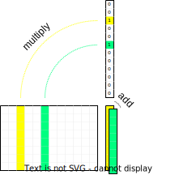

#### Clipped ReLU layer

This is an activation function based on normal ReLU, with the difference that it is bounded both from below and above. The formula is `y = min(max(x, 0), 1)`.

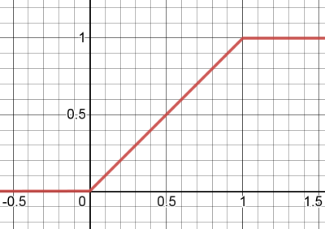

The purpose of this layer is to add non-linearity to the network. If it was just linear layers they could all be collapsed into one, because the matrices could be just multiplied together.

ClippedReLU would ideally be replaced with ReLU, but aggressive quantization requires reducing the dynamic range of hidden layer inputs, so capping the values at 1 becomes important for performance.

#### Sigmoid

This is an activation function that, contrary to [clipped] ReLU, is smooth. The formula is `y = 1/(1+e^-kx)`, where k is a parameter that determines how "stretched" the shape is.

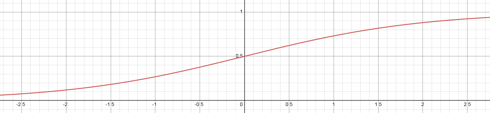

There are two main differences compared to clipped ReLU:

1. sigmoid is smooth, meaning that it is differentiable everywhere, meaning that there are no situations (realistically speaking) where the gradient disappears.
2. sigmoid is nonlinear, the output saturates towards 0 or 1 but never reaches it

While this function generally allows the network to learn more than ReLU it is costly and unsuitable for evaluation in the integer domain. It is however a good starting point for improvements...

#### Quantmoid4

With sigmoid being too costly we need to look for alternatives. One such alternative is to use an approximation. And it just so happens that `sigmoid(4x)` (scaled to integer domain in a particular way) can be fairly well approximated by a simple piece-wise quadratic function that needs just addition, multiplication, and bit-shifts. Since the primary purpose for this approximation is to be used in a quantized implementation directly we will present a specific variant that outputs values in range `[0, 126]` (and with input scaled accordingly). The reason for the choice of the upper range being defined as 126 is that this is the largest even 8-bit integer, and we want an even one to allow the value for `x=0` to be exactly in the middle. The equation is as follows:

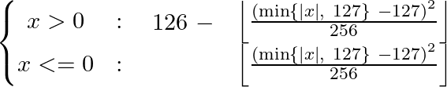

Note, that the equation for both positive and negative `x` is almost identical. The similarity allows for a branchless implementation even though there are two cases.

And the resulting graph is the following (with a scaled sigmoid(4x) for comparison):

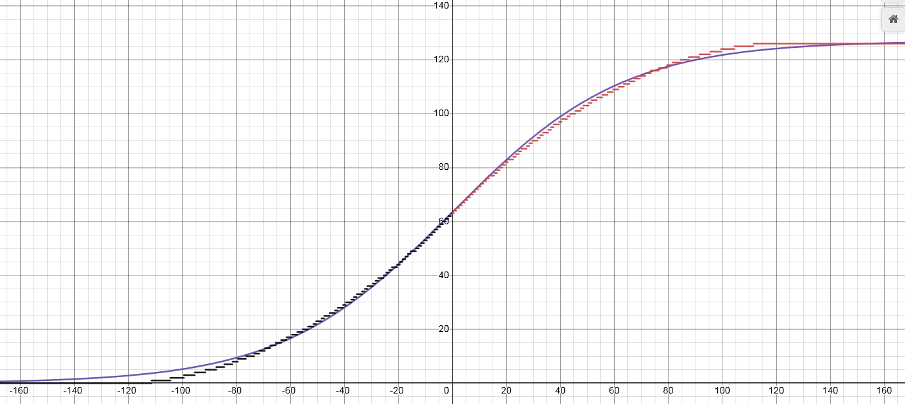

The disadvantage is that it loses the smoothness, and the output rounds to 0/1 quite early. This however doesn't appear to be an issue in practice, the actual error from this "rounding" is negligible.

More cool stuff will happen once we implement and optimize it, so we will get back to this layer in the optimized quantized implementation section.

#### Pooling layers

Sometimes it is desirable to reduce the input dimensionality to make the size of the layer more approachable. For example instead of having a `1024->8` layer, which has a very narrow output, one may prefer `512->16`. Pooling layers can provide some flexibility by reducing the dimensionality.

Pooling layers work by applying a function `F` over non-overlapping spans of the input, where `F` has more inputs than outputs. So for example one may have `F` take 2 consecutive inputs and produce one output, effectively halving the number of neurons.

The following types of pooling layers can be considered:

1. Average Pooling - outputs the average of inputs. Works well with any number of inputs.
2. Max Pooling - outputs the maximum of inputs. Works well with any number of inputs.
3. Product Pooling - outputs the product of inputs. Introduced by Stockfish, not common in machine learning in general. Only works well with 2 inputs. This one also appears to have similar benefits to sigmoid (quantmoid4); it increases the network's capacity, while other pooling layers only allow reducing dimensionality.

### A simple input feature set.

For the purpose of illustration we will consider a simple set of inputs based on piece placement. We will call it "A" features, because they will represent "All pieces".

There are 64 squares on the board, 6 piece types (pawn, knight, bishop, rook, queen, king), and 2 colors (white, black). What we want to encode as inputs are the positions of pieces, so each input will correspond to some (square, piece_type, color) tuple. There are `64*6*2=768` such tuples. If there is a piece `P` of color `C` on the square `S` we set the input `(S, P, C)` to 1, otherwise, we set it to 0. Even though the total number of inputs is 768 there can only be 32 non-zero inputs in any given legal chess position, because there are only at most 32 pieces on the board. Moreover, any move can only change at most 4 inputs (castling), and the average should be below 3.

The binary and sparse nature of the inputs is utilized when passing the features to the neural network - the input is simply the list of features (indices), there's no need for a full input vector as other positions have value 0 and we know that each active feature has a value 1 associated with it.

Let's look at an example position `1k6/8/8/8/3r4/2P5/8/K7 w - - 0 1`.

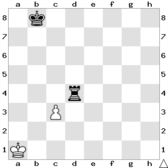

On the board above we have 4 active features: `(A1, king, white)`, `(C3, pawn, white)`, `(B8, king, black)`, `(D4, rook, black)`.

Now let's consider the move c4 - the only feature that became invalid is the `(C3, pawn, white)`, it needs to be replaced with `(C4, pawn, white)`.

Now let's consider the move cxd4 - the pawn moved, so like before we remove `(C3, pawn, white)` and add `(D4, pawn, white)`. But also the rook got removed from the board, so we have to remove `(D4, rook, black)` too. This is still less work than recreating the inputs from scratch!

### A simple NNUE network

We will use our "A" feature set from the previous paragraph, so we have 768 inputs. The layers for the purpose of this illustration will be the 3 linear layers, 768->8, 8->8, 8->1. All layers are linear, and all hidden neurons use ClippedReLU activation function. The image below illustrates the architecture:

![A[768]->8->8->1 architecture diagram](img/A-768-8-8-1.svg)

The flow is from the left to the right. The first layer is a large fully connected layer with 768 inputs, but only a small fraction of them is non-zero for each position - sparse matrix-vector multiplication can be utilized. Hidden layers are much smaller and always computed with dense matrix-vector multiplication. At the end, we get 1 output, which is usually trained to be the centipawn evaluation of the position (or proportional to it).

### Consideration of networks size and cost.

Choosing the right architecture is tricky as it's an accuracy/performance trade-off. Large networks provide more accurate evaluation, but the speed impact might completely negate the gains in real play. For example Stockfish slowly transitioned from `256x2->32->32->1` to `1024x2->8->32->1`.

#### Feature set

When choosing a feature set it might be tempting to go into complicated domain-specific knowledge, but the costs associated make simpler solutions more attractive. HalfKP, explained in detail later, is very simple, fast, and good enough. More sophisticated feature sets have been tried but they usually cannot combat the hit on performance. HalfKP features are easy to calculate, and change little from position to position.

Size also has to be considered. For the `256x2->32->32->1` architecture HalfKP inputs require about 10 million parameters in the first layer, which amounts to 20MB after quantization. For some users it might not be an issue to have a very large set of features, with possibly hundreds of millions of parameters, but for a typical user it's inconvenient. Moreover, increasing the feature set size may reduce the training speed for some implementations, and certainly will require more time to converge.

#### First set of hidden neurons

The number of outputs in the first layer is the most crucial parameter, and also has the highest impact on speed and size. The costs associated with this parameter are two-fold. For one, it increases the number of operations required when updating the accumulator. Second, for optimized implementations, one must consider the number of available registers - in Stockfish going past 256 neurons requires multiple passes over the feature indices as AVX2 doesn't have enough registers. It also partially determines the size of the first dense linear layer, which also greatly contributes to the total cost.

#### Further layers

Unlike in typical networks considered in machine learning here most of the knowledge is stored in the first layer, and because of that adding further small layers near the output adds little to accuracy, and may even be harmful if quantization is employed due to error accumulation. NNUE networks are kept unusually shallow, and keeping the size of the later layers small increases performance.

### Accumulator

Even though we observed that few inputs change from position to position we have yet to take advantage of that. Recall that a linear layer is just adding some weight matrix columns together. Instead of recomputing the first set of hidden neurons for each position we can keep them as part of the position's state, and update it on each move based on what features (columns) were added or removed! We have to handle only two simple cases:

1. the feature `i` was removed from the input (1 -> 0) - subtract column `i` of the weight matrix from the accumulator
2. the feature `i` was added to the input (0 -> 1) - add column `i` of the weight matrix to the accumulator

For a single move, it's trivial to find which "A" features changed - we know what piece we're moving, from where, and where to. Captures and promotions can be considered as a piece disappearing or appearing from nowhere.

However, care must taken when using floating point values. Repeatedly adding and subtracting floats results in error that accumulates with each move. It requires careful evaluation of whether the error is small enough for the net to still produce good results. Thankfully, it is best implemented such that the accumulator is not updated when undoing a move. Instead, it is simply stored on the search stack, so the error is bounded by `O(MAX_DEPTH)` and can mostly be ignored.

When using quantization this is no longer a problem, the incremental implementation is consistent, but now there is a possibility of overflowing the accumulator (regardless of whether incremental updates are used or not). The quantization scheme must be chosen such that no combination of possible active features can exceed the maximum value.

### HalfKP

HalfKP is the most common feature set and other successful ones build on top of it. It fits in a sweet spot of being just the right size, and requiring very few updates per move on average. Each feature is a tuple `(our_king_square, piece_square, piece_type, piece_color)`, where `piece_type` is not a king (in HalfKA feature set kings are included). This means that for each king position there is a set of features `P`, which are `(piece_square, piece_type, piece_color)`. This allows the net to better understand the pieces in relation to the king. The total number of features is `64*64*5*2=40960`. (Note that there is a leftover from Shogi in the current Stockfish implementation and there are 64 additional features that are unused, but we will disregard them in this document). The feature index can be calculated as
```cpp
p_idx = piece_type * 2 + piece_color
halfkp_idx = piece_square + (p_idx + king_square * 10) * 64
```
The one special case that needs to be handled is when the king moves, because it is tied to all the features. All features are changed, so an accumulator refresh is executed. This makes king moves more costly but on average it still keeps the number of updates per evaluation low.

Now, you might ask, "but which king?!". The answer is both...

#### Multiple perspectives, multiple accumulators

This is where we need to start accounting for the features of both sides separately. The white side will keep its own accumulator, and the black side its own accumulator too. Effectively, it means that the maximum active number of features is twice as high as for a simple feature set with only one perspective. There will be twice as many updates and the accumulator will be twice as large in total, but overall this tradeoff between speed and accuracy is worth it. This approach inevitably creates some problems, options, and choices with regard to the exact model topology. Let's go through them one by one.

##### How to combine multiple accumulator perspectives?

Since we now have two accumulators, we need to somehow combine them into one vector that gets passed further into the network. This can be solved in two (three) ways. Let's denote the accumulator for white as `A_w`, and the accumulator for black as `A_b`.

1. concatenate the `A_w` and `A_b`, placing `A_w` first and `A_b` second. This is the simplest option. The output in this case is always relative to the white's perspective.
2. concatenate the `A_w` and `A_b`, placing `A_w` first if it's white to move, otherwise `A_b` first, and the other accumulator second. This approach has the advantage that the net can learn tempo. It now knows whose turn it is, which is an important factor in chess and can have a huge impact on evaluation of some positions. The output in this case is always relative to the side to move perspective.
3. Either 1 or 2, but instead of concatenating interleave. So `A_w[0], A_b[0], A_w[1], A_b[1], ...`. This might be advantageous in some exotic architectures where not always the whole combined accumulator is used, in which case interleaving means that the slice used always contains the same number of outputs from white's and from black's perspectives. This might become useful, for example when employing structured sparsity to the first hidden layer, which ultimately works on the subset of the accumulator.

##### Which set of weights to use for each perspective?

So we compute the features for white and black the same, are their weights related? They can be, but it's not required. Engines differ in the handling of this.

1. Same weights for both perspectives. This means the board state needs to somehow be oriented. Otherwise white king on E1 would produce a different subset of features than a black king on E8, and white king on G4 would produce the same subset of features as a black king on G4. That's bad. The solution is to mirror the position and swap the color of the pieces for black's perspective; then the piece placement to feature mapping is logical for both. White king on E1 from white's perspective should be the same as a black king on E8 from black's perspective. Now you may think that flip is the way to go, but while chess has vertical symmetry, Shogi has rotational symmetry. The initial implementation of HalfKP in Stockfish used rotation to change the perspective, which is arguably incorrect for chess, but it worked surprisingly well.
2. Different weights for different perspectives. Is the white king on E1 actually equal to black king on E8? What about other pieces? Arguably one plays the game differently as black compared to as white, and it seems it makes sense to use different features for these perspectives. This is how some engines do it, and there's nothing wrong with this. The only downsides are larger size and slightly longer training time, but other than that it might even be better! It also completely removes the discussion about flip or rotate, which makes the implementation simpler.

#### HalfKP example and network diagram

Similar to the diagram above for the "A" feature set, here is the diagram for the same network but with HalfKP feature set, with combined weights. With a change that both accumulators are of size 4, so the network is in the end `HalfKP[40960]->4x2->8->1`

Let's look at the same example position as before: `1k6/8/8/8/3r4/2P5/8/K7 w - - 0 1`.


Now we have two perspectives, and will list the features for both of them separately. Remember the features are `(our_king_square, piece_square, piece_type, piece_color)` and we use flip to orient the squares for black and the colors are reversed! (One can think of the "color" as "us" or "them")

White's perspective: `(A1, C3, pawn, white)`, `(A1, D4, rook, black)`

Blacks's perspective: `(B1, C6, pawn, black)`, `(B1, D5, rook, white)`

The network diagram looks more interesting now.

![HalfKP[40960]->4x2->8->1](img/HalfKP-40960-4x2-8-1.svg)

## Forward pass implementation

In this part, we will look at model inference as it could be implemented in a simple chess engine. We will work with floating point values for simplicity here. Input generation is outside of the scope of this implementation.

### Example network

We will take a more generally defined network, with architecture `FeatureSet[N]->M*2->K->1`. The layers will therefore be:

1. `L_0`: Linear `N->M`
2. `C_0`: Clipped ReLU of size `M*2`
3. `L_1`: Linear `M*2->K`
4. `C_1`: Clipped ReLU of size `K`
5. `L_2`: Linear `K->1`

### Layer parameters

Linear layers have 2 parameters - weights and biases. We will refer to them as `L_0.weight` and `L_0.bias` respectively. The layers also contain the number of inputs and outputs, in `L_0.num_inputs` and `L_0.num_outputs` respectively.

Here something important has to be said about the layout of the weight matrix. For sparse multiplication, the column-major (a column is contiguous in memory) layout is favorable, as we're adding columns, but for dense multiplication this is not so clear and a row-major layout may be preferable. For now we will stick to the column-major layout, but we may revisit the row-major one when it comes to quantization and optimization. For now, we assume `L_0.weight` allows access to the individual elements in the following form: `L_0.weight[column_index][row_index]`.

The code presented is very close to C++ but technicalities might be omitted.

### Accumulator

The accumulator can be represented by an array that is stored along other position state information on the search stack.

```cpp
struct NnueAccumulator {
    // Two vectors of size M. v[0] for white's, and v[1] for black's perspectives.
    float v[2][M];

    // This will be utilised in later code snippets to make the access less verbose
    float* operator[](Color perspective) {
        return v[perspective];
    }
};
```

The accumulator can either be updated lazily on evaluation, or on each move. It doesn't matter here, but it has to be updated *somehow*. Whether it's better to update lazily or eagerly depends on the number of evaluations done during search. For updates, there are two cases, as laid out before:

1. The accumulator has to be recomputed from scratch.
2. The previous accumulator is reused and just updated with changed features

#### Refreshing the accumulator

```cpp
void refresh_accumulator(
    const LinearLayer&      layer,            // this will always be L_0
    NnueAccumulator&        new_acc,          // storage for the result
    const std::vector<int>& active_features,  // the indices of features that are active for this position
    Color                   perspective       // the perspective to refresh
) {
    // First we copy the layer bias, that's our starting point
    for (int i = 0; i < M; ++i) {
        new_acc[perspective][i] = layer.bias[i];
    }

    // Then we just accumulate all the columns for the active features. That's what accumulators do!
    for (int a : active_features) {
        for (int i = 0; i < M; ++i) {
            new_acc[perspective][i] += layer.weight[a][i];
        }
    }
}
```

#### Updating the accumulator

```cpp
void update_accumulator(
    const LinearLayer&      layer,            // this will always be L_0
    NnueAccumulator&        new_acc,          // it's nice to have already provided storage for
                                              // the new accumulator. Relevant parts will be overwritten
    const NNueAccumulator&  prev_acc,         // the previous accumulator, the one we're reusing
    const std::vector<int>& removed_features, // the indices of features that were removed
    const std::vector<int>& added_features,   // the indices of features that were added
    Color                   perspective       // the perspective to update, remember we have two,
                                              // they have separate feature lists, and it even may happen
                                              // that one is updated while the other needs a full refresh
) {
    // First we copy the previous values, that's our starting point
    for (int i = 0; i < M; ++i) {
        new_acc[perspective][i] = prev_acc[perspective][i];
    }

    // Then we subtract the weights of the removed features
    for (int r : removed_features) {
        for (int i = 0; i < M; ++i) {
            // Just subtract r-th column
            new_acc[perspective][i] -= layer.weight[r][i];
        }
    }

    // Similar for the added features, but add instead of subtracting
    for (int a : added_features) {
        for (int i = 0; i < M; ++i) {
            new_acc[perspective][i] += layer.weight[a][i];
        }
    }
}
```

And that's it! Pretty simple, isn't it?

### Linear layer

This is simple vector-matrix multiplication, what could be complicated about it you ask? Nothing for now, but it will get complicated once optimization starts. Right now we won't optimize, but we will at least write a version that uses the fact that the weight matrix has a column-major layout.

```cpp
float* linear(
    const LinearLayer& layer,  // the layer to use. We have two: L_1, L_2
    float*             output, // the already allocated storage for the result
    const float*       input   // the input, which is the output of the previous ClippedReLU layer
) {
    // First copy the biases to the output. We will be adding columns on top of it.
    for (int i = 0; i < layer.num_outputs; ++i) {
        output[i] = layer.bias[i];
    }

    // Remember that rainbowy diagram long time ago? This is it.
    // We're adding columns one by one, scaled by the input values.
    for (int i = 0; i < layer.num_inputs; ++i) {
        for (int j = 0; j < layer.num_outputs; ++j) {
            output[j] += input[i] * layer.weight[i][j];
        }
    }

    // Let the caller know where the used buffer ends.
    return output + layer.num_outputs;
}
```

### ClippedReLU

```cpp
float* crelu(,
    int          size,   // no need to have any layer structure, we just need the number of elements
    float*       output, // the already allocated storage for the result
    const float* input   // the input, which is the output of the previous linear layer
) {
    for (int i = 0; i < size; ++i) {
        output[i] = min(max(input[i], 0), 1);
    }

    return output + size;
}
```

### Putting it together

In a crude pseudo code. The feature index generation is left as an exercise for the reader.

```cpp
void Position::do_move(...) {
    ... // do the movey stuff

    for (Color perspective : { WHITE, BLACK }) {
        if (needs_refresh[perspective]) {
            refresh_accumulator(
                L_0,
                this->accumulator,
                this->get_active_features(perspective),
                perspective
            );
        } else {
            update_accumulator(
                L_0,
                this->accumulator,
                this->get_previous_position()->accumulator,
                this->get_removed_features(perspective),
                this->get_added_features(perspective),
                perspective
            );
        }
    }
}

float nnue_evaluate(const Position& pos) {
    float buffer[...]; // allocate enough space for the results

    // We need to prepare the input first! We will put the accumulator for
    // the side to move first, and the other second.
    float input[2*M];
    Color stm = pos.side_to_move;
    for (int i = 0; i < M; ++i) {
        input[  i] = pos.accumulator[ stm][i];
        input[M+i] = pos.accumulator[!stm][i];
    }

    float* curr_output = buffer;
    float* curr_input = input;
    float* next_output;

    // Evaluate one layer and move both input and output forward.
    // The last output becomes the next input.
    next_output = crelu(2 * L_0.num_outputs, curr_output, curr_input);
    curr_input = curr_output;
    curr_output = next_output;

    next_output = linear(L_1, curr_output, curr_input);
    curr_input = curr_output;
    curr_output = next_output;

    next_output = crelu(L_1.num_outputs, curr_output, curr_input);
    curr_input = curr_output;
    curr_output = next_output;

    next_output = linear(L_2, curr_output, curr_input);

    // We're done. The last layer should have put 1 value out under *curr_output.
    return *curr_output;
}
```

And that's it! That's the whole network. What do you mean you can't use it?! OH RIGHT, you don't have a net trained, what a bummer.

## Training a net with pytorch

This will be very brief, as this is on the nnue-pytorch repo after all so you can just look up the code! We will not explain how pytorch works, but we will, however, explain some of the basics, and the quirks needed to accommodate this exotic use case.

Let's continue using the architecture from the forward pass implementation.

### Model specification

Pytorch has built-in types for linear layers, so defining the model is pretty simple.

```python
class NNUE(nn.Module):
    def __init__(self):
        super(NNUE, self).__init__()

        self.ft = nn.Linear(NUM_FEATURES, M)
        self.l1 = nn.Linear(2 * M, N)
        self.l2 = nn.Linear(N, K)

    # The inputs are a whole batch!
    # `stm` indicates whether white is the side to move. 1 = true, 0 = false.
    def forward(self, white_features, black_features, stm):
        w = self.ft(white_features) # white's perspective
        b = self.ft(black_features) # black's perspective

        # Remember that we order the accumulators for 2 perspectives based on who is to move.
        # So we blend two possible orderings by interpolating between `stm` and `1-stm` tensors.
        accumulator = (stm * torch.cat([w, b], dim=1)) + ((1 - stm) * torch.cat([b, w], dim=1))

        # Run the linear layers and use clamp_ as ClippedReLU
        l1_x = torch.clamp(accumulator, 0.0, 1.0)
        l2_x = torch.clamp(self.l1(l1_x), 0.0, 1.0)
        return self.l2(l2_x)
```

Thankfully, Pytorch handles backpropagation automatically through automatic differentiation. Neat! The hard bit now is, maybe surprisingly, feeding the data.

### Preparing the inputs

There are two main bottlenecks in this part.

1. Parsing the training data sets
2. Preparing the tensor inputs

#### Parsing the training data sets and moving them to the python side

You might be tempted to implement this in python. It would work, but sadly, it would be orders of magnitude too slow. What we did in nnue-pytorch is we created a shared library in C++ that implements a very fast training data parser, and provides the data in a form that can be quickly turned into the input tensors.

We will use [Ctypes](https://docs.python.org/3/library/ctypes.html) for interoperation between C and Python. [Seer's trainer](https://github.com/connormcmonigle/seer-training/tree/6077a044c596963a34c504df8450aceaaa2b3fb1) uses pybind11 for example if you want more examples. In practice, anything that provides a way to pass pointers and call C functions from Python will work. Other languages can be used too, but keep in mind that only C has a stable ABI, which makes things easier and more portable. So for example, if you want to use C++ (like we will here) it's important to mark exported functions as `extern "C"`.

The data reader is passed a file on creation, and then it spawns the requested number of worker threads that chew through the data and prepare **whole batches** asynchronously. The batches are then passed to the python side and turned into PyTorch tensors. Going one sample at a time by one is not a viable option, corners need to be cut by producing whole batches. You may ask why. PyTorch can turn multiple tensors into a batch so what's the problem? Let's see...

Remember how the input is sparse? Now let's say our batch size is 8192. What would happen if we sent 8192 sparse tensors and tried to form a batch from them? Well, pytorch doesn't like doing that by itself, we need to help it. And the best way is to form one big 2D sparse input tensor that encompasses the whole batch. It has 2 sparse dimensions and the indices are `(position_index, feature_index)`, pretty simple, has great performance, and no need to create temporary tensors! The fact that we're forming whole batches from the start also means that we can reduce the number of allocations and use a better memory layout for the batch parts.

Because of that we also cannot simply use the PyTorch's `DataLoader`, instead we need to use it as a mere wrapper. But this effort is worth it. One worker thread can usually saturate even a high-end GPU without any issues.

#### Training batch structure and communication

The minimum that's needed are the features (from both perspectives), the side to move (for accumulator slice ordering), and the position evaluation (the score). Let's see how we can represent such a batch.

```cpp
struct SparseBatch {
    SparseBatch(const std::vector<TrainingDataEntry>& entries) {

        // The number of positions in the batch
        size = entries.size();

        // The total number of white/black active features in the whole batch.
        num_active_white_features = 0;
        num_active_black_features = 0;

        // The side to move for each position. 1 for white, 0 for black.
        // Required for ordering the accumulator slices in the forward pass.
        stm = new float[size];

        // The score for each position. This is the value that we will be teaching the network.
        score = new float[size];

        // The indices of the active features.
        // Why is the size * 2?! The answer is that the indices are 2 dimensional
        // (position_index, feature_index). It's effectively a matrix of size
        // (num_active_*_features, 2).
        // IMPORTANT: We must make sure that the indices are in ascending order.
        // That is first comes the first position, then second, then third,
        // and so on. And within features for one position the feature indices
        // are also in ascending order. Why this is needed will be apparent later.
        white_features_indices = new int[size * MAX_ACTIVE_FEATURES * 2];
        black_features_indices = new int[size * MAX_ACTIVE_FEATURES * 2];

        fill(entries);
    }

    void fill(const std::vector<TrainingDataEntry>& entries) {
        ...
    }

    int size;
    int num_active_white_features;
    int num_active_black_features;

    float* stm;
    float* score;
    int* white_features_indices;
    int* black_features_indices;

    ~SparseBatch()
    {
        // RAII! Or use std::unique_ptr<T[]>, but remember that only raw pointers should
        // be passed through language boundaries as std::unique_ptr doesn't have stable ABI
        delete[] stm;
        delete[] score;
        delete[] white_features_indices;
        delete[] black_features_indices;
    }
};
```

and in python

```python
class SparseBatch(ctypes.Structure):
    _fields_ = [
        ('size', ctypes.c_int),
        ('num_active_white_features', ctypes.c_int),
        ('num_active_black_features', ctypes.c_int),
        ('stm', ctypes.POINTER(ctypes.c_float)),
        ('score', ctypes.POINTER(ctypes.c_float)),
        ('white_features_indices', ctypes.POINTER(ctypes.c_int)),
        ('black_features_indices', ctypes.POINTER(ctypes.c_int))
    ]

    def get_tensors(self, device):
        # This is illustrative. In reality you might need to transfer these
        # to the GPU. You can also do it asynchronously, but remember to make
        # sure the source lives long enough for the copy to finish.
        # See torch.tensor.to(...) for more info.

        # This is a nice way to convert a pointer to a pytorch tensor.
        # Shape needs to be passed, remember we're forming the whole batch, the first
        # dimension is always the batch size.
        stm_t = torch.from_numpy(
            np.ctypeslib.as_array(self.stm, shape=(self.size, 1)))
        score_t = torch.from_numpy(
            np.ctypeslib.as_array(self.score, shape=(self.size, 1)))

        # As we said, the index tensor needs to be transposed (not the whole sparse tensor!).
        # This is just how pytorch stores indices in sparse tensors.
        # It also requires the indices to be 64-bit ints.
        white_features_indices_t = torch.transpose(
            torch.from_numpy(
                np.ctypeslib.as_array(self.white_features_indices, shape=(self.num_active_white_features, 2))
            ), 0, 1).long()
        black_features_indices_t = torch.transpose(
            torch.from_numpy(
                np.ctypeslib.as_array(self.black_features_indices, shape=(self.num_active_white_features, 2))
            ), 0, 1).long()

        # The values are all ones, so we can create these tensors in place easily.
        # No need to go through a copy.
        white_features_values_t = torch.ones(self.num_active_white_features)
        black_features_values_t = torch.ones(self.num_active_black_features)

        # Now the magic. We construct a sparse tensor by giving the indices of
        # non-zero values (active feature indices) and the values themselves (all ones!).
        # The size of the tensor is batch_size*NUM_FEATURES, which would
        # normally be insanely large, but since the density is ~0.1% it takes
        # very little space and allows for faster forward pass.
        # For maximum performance we do cheat somewhat though. Normally pytorch
        # checks the correctness, which is an expensive O(n) operation.
        # By using _sparse_coo_tensor_unsafe we avoid that.
        white_features_t = torch._sparse_coo_tensor_unsafe(
            white_features_indices_t, white_features_values_t, (self.size, NUM_FEATURES))
        black_features_t = torch._sparse_coo_tensor_unsafe(
            black_features_indices_t, black_features_values_t, (self.size, NUM_FEATURES))

        # What is coalescing?! It makes sure the indices are unique and ordered.
        # Now you probably see why we said the inputs must be ordered from the start.
        # This is normally a O(n log n) operation and takes a significant amount of
        # time. But here we **know** that the tensor is already in a coalesced form,
        # therefore we can just tell pytorch that it can use that assumption.
        white_features_t._coalesced_(True)
        black_features_t._coalesced_(True)

        # Now this is what the forward() required!
        return white_features_t, black_features_t, stm_t, score_t

# Let's also tell ctypes how to understand this type.
SparseBatchPtr = ctypes.POINTER(SparseBatch)
```

### Feature factorization

Let's focus on the features again. We will take a closer look at the `HalfKP` feature set. Recall, that `HalfKP` features are indexed by tuples of form `(king_square, piece_square, piece_type, piece_color)`, where `piece_type != KING`.

The `HalfKP` feature set was formed by specialization of the `P` feature set for every single king square on the board. This in turn increased the feature set size, and caused the accesses to become much more sparse. This sparsity directly impacts how much each feature is seen during training, and that negatively impacts the learning of weights.

Feature factorization effectively, and efficiently, relates features together during training, so that more features are affected during each step of training. This is particularly important during early stages of training, because it results in even the rarest of feature weights being populated quickly with reasonable values.

Feature factorization works by introducing a "virtual" feature set (as opposed to the "real" feature set, here `HalfKP`) that contains denser features, each being directly related to (and, importantly, redundant with) one or more "real" features. These "virtual" features are present only during the training process, and will learn the common factor for all "real" features they relate to. Let's see how it works in case of `HalfKP`.

`HalfKP` is just `P` taken 64 times, once for each king square, as mentioned previously. Each `P` feature is therefore related to 64 `HalfKP` features, and will learn the common factor for a `(piece_square, piece_type, piece_color)` feature for all possible king positions.

Because "virtual" features are redundant with the "real" features their weights can be coalesced into the "real" features weights after the training is finished. The way to coalesce them follows from the computation performed in the network layer (the feature transformer).

#### Virtual feature coalescing

So how can we coalesce them? Let's look at how matrix and vector multiplication is done again. Consider the example position from before (`1k6/8/8/8/3r4/2P5/8/K7 w - - 0 1`).

:

Let's focus on the feature `(A1, C3, pawn, white)`. Now, we're also gonna add the corresponding `P` feature `(C3, pawn, white)`. What happens when the input goes through the first layer?

```cpp
accumulator += weights[(A1, C3, pawn, white)];
accumulator += weights[(C3, pawn, white)];
```

which is equivalent to

```cpp
accumulator += weights[(A1, C3, pawn, white)] + weights[(C3, pawn, white)];
```

So the relation is very simple. We just need to add the weights of each `P` feature to all the related `HalfKP` feature weights!

#### Other factors

Sometimes it's possible to add even more factors. It should be noted, however, that just adding more factors doesn't necessarily improve the training and may even cause it to regress. In general, whether using some factors helps or not depends on the training setup and the net being trained. It's always good to experiment with this stuff. With that said, however, we can consider for example the following factors for `HalfKP`.

##### "K" factors

The king position, 64 features. This one requires some careful handling as a single position has this feature multiple times - equal to the number of pieces on the board. This virtual feature set is needed purely because with HalfKP the king position feature is not encoded anywhere. HalfKA doesn't need it for example because it specifically has the feature for the king's position. In general, handling this is tricky, it may even require reducing the gradient for these features (otherwise the gradient is `input*weight`, but input is large compared to others).

##### "HalfRelativeKP" factors

In `HalfKP` we use the absolute piece position, but what if we encoded the position as relative to the king? There are 15x15 such relative positions possible, and most of them correspond 1:many to some `HalfKP` feature. The HalfRelativeKP feature index could be calculated for example like this:
```cpp
int get_half_relative_kp_index(Color perspective, Square king_sq, Square piece_sq, Piece piece)
{
    const int p_idx = static_cast<int>(piece.type()) * 2 + (piece.color() != perspective);
    const Square oriented_king_sq = orient_flip(perspective, king_sq);
    const Square oriented_piece_sq = orient_flip(perspective, piece_sq);
    // The file/rank difference is always in range -7..7, and we need to map it to 0..15
    const int relative_file = oriented_piece_sq.file() - oriented_king_sq.file() + 7;
    const int relative_rank = oriented_piece_sq.rank() - oriented_king_sq.rank() + 7;
    return (p_idx * 15 * 15) + (relative_file * 15) + relative_rank;
}
```

#### Real effect of the factorizer

While the factorizer helps the net to generalize, it seems to only be relevant in the early stages, that is when the net doesn't really know anything yet. It accelerates the early stages of training and reduces the sparsity of the input (some inputs are very rare otherwise). But it quickly becomes unimportant and in later stages of the training can be removed to gain some training speed (after all it can add a lot of active features).

### Loss functions and how to apply them

#### The Goal

Training a network is really just minimizing a loss function, which needs to be smooth and have a minimum at the "optimal" evaluation (the training target). For the purpose of NNUE, this is done by gradient descent through usual machine learning methods (there are also non-gradient methods that are not described here).

#### Converting the evaluation from CP-space to WDL-space

By CP-space we mean the centipawn scale (or something proportional, like engine's internal units). By WDL-space we mean 0=loss, 0.5=draw, 1=win.

It's of course possible to apply the loss function directly on the evaluation value (in CP-space), but this can lead to large gradients (or a lot of hyperparameter tuning), restricts the set of loss functions available, and doesn't allow using results for loss. We will focus on evaluation in WDL-space. But how to convert between these spaces? Usually, the evaluation to performance correspondence can be well-fitted by a sigmoid. For example, in some data generated by Stockfish we have:


so in the code we may do the following:
```python
scaling_factor = 410 # this depends on the engine, and maybe even on the data
wdl_space_eval = torch.sigmoid(cp_space_eval / scaling_factor)
```

This transformation also has the nice effect that large evaluations become "closer" together, which aligns well with the real play, where large evaluations don't need to be that precise.

#### Using results along the evaluation

With the values for which we will compute loss being in WDL-space, we may now interpolate them with game results. We will introduce a `lambda_` parameter that governs the interpolation.
```python
# game_result is in WDL-space
wdl_value = lambda_ * wdl_space_eval + (1 - lambda_) * game_result
```

The interpolation can also be applied to the loss.
```python
loss_eval = ... # loss between model eval and position eval
loss_result = ... # loss between model eval and game result
loss = lambda_ * loss_eval + (1 - lambda_) * loss_result
```

Which way works better depends on your case :)

#### Mean Squared Error (MSE)

Now we know what we're trying to fit; let's look at how we will fit them.

This is a very simple loss function that just takes a square of the difference between the predicted value and the target. This results in a nice linear gradient.

With interpolation applied before:
```python
scaling = ... # depends on the engine and data. Determines the shape of
              # the sigmoid that transforms the evaluation to WDL space
              # Stockfish uses values around 400
wdl_eval_model = sigmoid(model(...) / scaling)
wdl_eval_target = sigmoid(target / scaling)
wdl_value_target = lambda_ * wdl_eval_target + (1 - lambda_) * game_result
loss = (wdl_eval_model - wdl_value_target)**2
```

With interpolation applied after:
```python
scaling = ...
wdl_eval_model = sigmoid(model(...) / scaling)
wdl_eval_target = sigmoid(target / scaling)
loss_eval   = (wdl_eval_model - wdl_eval_target)**2
loss_result = (wdl_eval_model - game_result)**2
loss = lambda_ * loss_eval + (1 - lambda_) * loss_result
```

Note: in practice, the exponent can be >2. Higher exponents give more weight towards precision at a cost of accuracy. Stockfish networks had good training results with an exponent of 2.6 for example.

##### loss

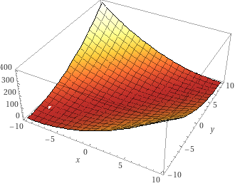
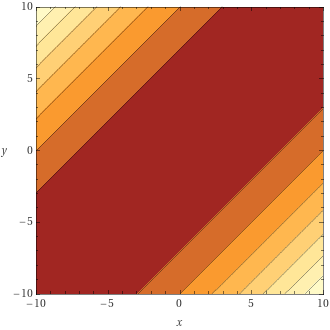

##### grad

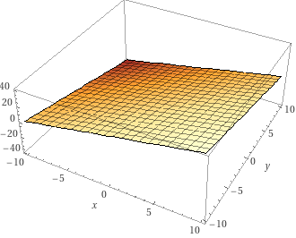
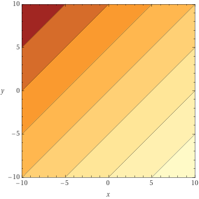

#### Cross entropy

This loss function is usually used for continuous classification problems, and our use case could be considered one.

Care must be taken around domain boundaries. Usually, a very small value (epsilon) is added such that the values never reach 0 under the logarithm.

With interpolation applied before:
```python
epsilon = 1e-12 # to prevent log(0)
scaling = ...
wdl_eval_model = sigmoid(model(...) / scaling)
wdl_eval_target = sigmoid(target / scaling)
wdl_value_target = lambda_ * wdl_eval_target + (1 - lambda_) * game_result

# The first term in the loss has 0 gradient, because we always
# differentiate with respect to `wdl_eval_model`, but it makes the loss nice
# in the sense that 0 is the minimum.
loss = (wdl_value_target * log(wdl_value_target + epsilon) + (1 - wdl_value_target) * log(1 - wdl_value_target + epsilon))
      -(wdl_value_target * log(wdl_eval_model   + epsilon) + (1 - wdl_value_target) * log(1 - wdl_eval_model   + epsilon))
```

With interpolation applied after:
```python
epsilon = 1e-12 # to prevent log(0)
scaling = ...
wdl_eval_model = sigmoid(model(...) / scaling)
wdl_eval_target = sigmoid(target / scaling)

# The first term in the loss has 0 gradient, because we always
# differentiate with respect to `wdl_eval_model`, but it makes the loss nice
# in the sense that 0 is the minimum.
loss_eval   = (wdl_eval_target * log(wdl_eval_target + epsilon) + (1 - wdl_eval_target) * log(1 - wdl_eval_target + epsilon))
             -(wdl_eval_target * log(wdl_eval_model  + epsilon) + (1 - wdl_eval_target) * log(1 - wdl_eval_model  + epsilon))
loss_result = (game_result     * log(wdl_eval_target + epsilon) + (1 - game_result)     * log(1 - wdl_eval_target + epsilon))
             -(game_result     * log(wdl_eval_model  + epsilon) + (1 - game_result)     * log(1 - wdl_eval_model  + epsilon))
loss = lambda_ * loss_eval + (1 - lambda_) * loss_result
```

##### loss

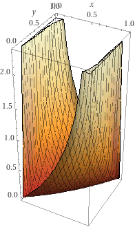
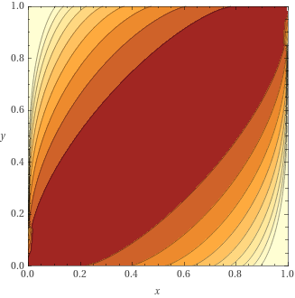

##### grad

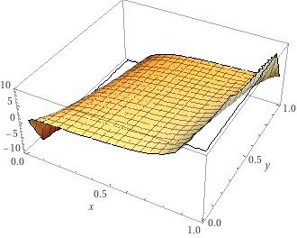
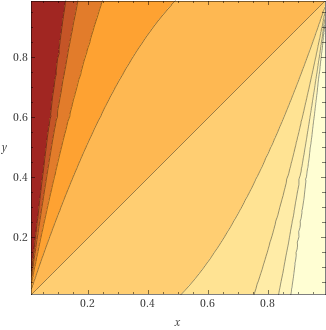

## Quantization

At the start of this document, it was briefly mentioned what quantization is and that it will be important. Now it's time to understand it properly. The goal is that we want to use the smallest possible integers everywhere. Most CPU architectures provide instructions that can work on 8, 16, 32, or even 64 int8 values at a time, and we should take advantage of that. That means we need to use int8 values, with range -128..127, for weights and inputs; or int16, with range -32768..32767, where int8 is not possible.

Coming up with the right quantization scheme is not easy, so first we'll present the one currently used by Stockfish, and then we'll explain how to get there, how to code it, and finally how to optimize it.

### Stockfish quantization scheme

#### Feature Transformer

Let's start with the feature transformer. Recall that its purpose is to accumulate between 0 to 30 (for HalfKP) rows of weights. We want to have int8 values as inputs to the later layers, with the activation range (ClippedReLU) being 0..127, but that means that using int8 integers for the accumulator doesn't provide enough space as the values would go beyond the range of int8 before applying the ClippedReLU... so we use int16 for the accumulator and then convert to int8 when doing the ClippedReLU.

#### Linear layer

We wanted int8 inputs and we can get them without losing too much precision. The nature of matrix-purposed SIMD instructions is that, thankfully, the accumulation happens in int32. So we don't experience the same issue as in the feature transformer where we're manually adding rows, and we can utilize the int8 multiplication with int32 accumulation to the fullest extent, and only later go back to int8 in the ClippedReLU layer. We will add the biases after the accumulation has happened, so they should be stored in int32.

#### ClippedReLU

Nothing special going on in here. Since the inputs are not being scaled, this is simply the same operation but in a different domain. Instead of clamping to 0..1 we clamp to 0..127. The input type is usually different than the output type as inputs will be either int32 or int16, and the output we want is int8. The values won't change but the conversion needs to be applied.

### The math of quantization and how to make it fit

To quantize the network we need to multiply the weights and biases by some constant to translate them to a different range of values. This poses a problem when confronted with multiplication during network inference - `(a*x) * (a*w) = a*a*x*w`, and we have to sometimes scale back the outputs too. But each layer is still independent so let's go through them one by one again.

#### Feature Transformer

Remember we want our activation range to change from 0..1 to 0..127. Since the feature transformer is a purely additive process,  it's enough that we multiply the weights and biases by 127. Both weights and biases are stored as int16. We could divide the output by some factor `a` to get more precision, in which case the weights and biases would have to be multiplied by `a*127` instead, but in practice, it increases the accuracy only by a little bit.

#### Linear layer

To arrive at int8 weights we have to apply some scaling factor. This scaling factor ultimately depends on how much precision needs to be preserved, but cannot be too large because then the weights will be limited in magnitude. For example, if we took the scaling factor to be 64 (used in Stockfish), then the maximum weight in the floating point space is `127/64=1.984375`. This is enough to have good nets, but care needs to be taken to clamp the weights during training so that they don't go outside that range. The scaling factor of 64 can also be understood as the smallest weight step that can be represented being `1/64=0.015625`.

A linear layer is just matrix multiplication, so we're multiplying inputs and weights, but now both are scaled relative to the float version. Let's denote the input scaling factor (activation range scaling) as `s_A`, and the weight scaling factor by `s_W`. `x` is the unquantized input, `w` is the unquantized weight, 'b' is the unquantized bias, and `y` is the unquantized output.
So we have:
```
x * w + b = y
((s_A * x) * (s_W * w)) + (b * s_A * s_W) = (y * s_A) * s_W
(((s_A * x) * (s_W * w)) + (b * s_A * s_W)) / s_W = (y * s_A)
```
From that we learn that we need to scale the bias by `(s_A * s_W)`, weights by `s_W`, and divide output by `s_W` to get the desired `(y * s_A)`, which is correctly scaled to the activation range.

Now, this applies only when the next layer is the ClippedReLU layer. For the last layer, the output range is very different and the quantization will also be different. In Stockfish we want the last layer to output values in range -10000..10000 while still keeping int8 weights. This can be achieved without any additional scaling factors, but it's easiest to do and understand with an additional scaling factor.

We'll introduce a new scaling factor, `s_O`. This scaling factor, unlike others, needs to be applied to the output both during training (for loss calculation against the actual evaluation) and inference. The purpose of it is to scale the float output of the network to match the range of the integer evaluation used by Stockfish. Basically, it means that `1` in the float space is equal to `s_O` internal evaluation units. It has an additional advantage that it allows us to have the layer weights be similar in magnitude to the previous layers.

So the math is now:
```
x * w + b = y
(((s_A * x) * (s_W * w)) + (b * s_A * s_W)) * s_O = ((y * s_A) * s_W) * s_O
(((s_A * x) * (s_W * w)) + (b * s_A * s_W)) * s_O / s_A / s_W = (y * s_O)
(((s_A * x) * (s_W / s_A * w)) + (b * s_A * s_W / s_A)) * s_O / s_W = (y * s_O)
(((s_A * x) * (s_W * s_O / s_A * w)) + (b * s_W * s_O)) / s_W = (y * s_O)
```
From that we learn that we need to scale the bias by `s_W * s_O`, weights by `s_W * s_O / s_A`, and divide the output by `s_W` to get the desired `(y * s_O)`.

### Implementation

For the unoptimized implementation, not much changes. One just has to remember to change the data types to integers with desired size, scale weights on input, and divide the output from linear layers by `s_W`. `s_W` is usually chosen to be a power of two, so that this operation is a simple bitwise right shift, as there are no SIMD division instructions for integers and even if there were it would be slow.

### Optimized implementation

For simplicity, we will focus on optimization only for the AVX2 extension of the x86-64 instruction set.

#### Feature Transformer

The benefit of SIMD for the feature transformer is two-fold:

1. multiple additions per instruction can be performed
2. large total register size means we don't need to write to memory as often

Our accumulation structure doesn't change much, we just change float to int16:
```cpp
// We now also make sure that the accumulator structure is aligned to the cache line.
// This is not strictly required by AVX2 instructions but may improve performance.
struct alignas(64) NnueAccumulator {
    // Two vectors of size N. v[0] for white's, and v[1] for black's perspectives.
    int16_t v[2][N];

    // This will be utilised in later code snippets to make the access less verbose
    int16_t* operator[](Color perspective) {
        return v[perspective];
    }
};
```

Now let's look at the refresh function. For simplicity, we will assume that there are enough registers so that spills don't happen, but in reality (`M > 256`) it is required to do multiple passes over the active features, each time considering a part of the accumulator only. A single AVX2 register can fit 16 int16 values and there are 16 AVX2 registers (32 since AVX-512).

```cpp
void refresh_accumulator(
    const LinearLayer&      layer,            // this will always be L_0
    NnueAccumulator&        new_acc,          // storage for the result
    const std::vector<int>& active_features,  // the indices of features that are active for this position
    Color                   perspective       // the perspective to refresh
) {
    // The compiler should use one register per value, and hopefully
    // won't spill anything. Always check the assembly generated to be sure!
    constexpr int register_width = 256 / 16;
    static_assert(M % register_width == 0, "We're processing 16 elements at a time");
    constexpr int num_chunks = M / register_width;
    __m256i regs[num_chunks];

    // Load bias to registers and operate on registers only.
    for (int i = 0; i < num_chunks; ++i) {
        regs[i] = _mm256_load_si256(&layer.bias[i * register_width]);
    }

    for (int a : active_features) {
        for (int i = 0; i < num_chunks; ++i) {
            // Now we do 1 memory operation instead of 2 per loop iteration.
            regs[i] = _mm256_add_epi16(regs[i], _mm256_load_si256(&layer.weight[a][i * register_width]));
        }
    }

    // Only after all the accumulation is done do the write.
    for (int i = 0; i < num_chunks; ++i) {
        _mm256_store_si256(&new_acc[perspective][i * register_width], regs[i]);
    }
}
```

similarly for the update:

```cpp
void update_accumulator(
    const LinearLayer&      layer,            // this will always be L_0
    NnueAccumulator&        new_acc,          // it's nice to have already provided storage for
                                              // the new accumulator. Relevant parts will be overwritten
    const NNueAccumulator&  prev_acc,         // the previous accumulator, the one we're reusing
    const std::vector<int>& removed_features, // the indices of features that were removed
    const std::vector<int>& added_features,   // the indices of features that were added
    Color                   perspective       // the perspective to update, remember we have two,
                                              // they have separate feature lists, and it even may happen
                                              // that one is updated while the other needs a full refresh
) {
    // The compiler should use one register per value, and hopefully
    // won't spill anything. Always check the assembly generated to be sure!
    constexpr int register_width = 256 / 16;
    static_assert(M % register_width == 0, "We're processing 16 elements at a time");
    constexpr int num_chunks = M / register_width;
    __m256i regs[num_chunks];

    // Load the previous values to registers and operate on registers only.
    for (int i = 0; i < num_chunks; ++i) {
        regs[i] = _mm256_load_si256(&prev_acc[perspective][i * register_width]);
    }

    // Then we subtract the weights of the removed features
    for (int r : removed_features) {
        for (int i = 0; i < num_chunks; ++i) {
            regs[i] = _mm256_sub_epi16(regs[i], _mm256_load_si256(&layer.weight[r][i * register_width]));
        }
    }

    // Similar for the added features, but add instead of subtracting
    for (int a : added_features) {
        for (int i = 0; i < num_chunks; ++i) {
            regs[i] = _mm256_add_epi16(regs[i], _mm256_load_si256(&layer.weight[a][i * register_width]));
        }
    }

    // Only after all the accumulation is done do the write.
    for (int i = 0; i < num_chunks; ++i) {
        _mm256_store_si256(&new_acc[perspective][i * register_width], regs[i]);
    }
}
```

#### Linear layer

Matrix multiplication is hard to optimize in general, and there are many approaches depending on the size of the matrices. Since we expect the layers to be small, we will not delve into any fancy blocked algorithms. And just rely on manual unrolling and trying to process multiple values at a time. This is not optimal, but it's simple and very close. We will only describe the case where the number of outputs is divisible by 4. The output layer has 1 output but it's also very small and doesn't require anything clever. We will also require the input size to be a multiple of 32, otherwise adding 0 padding is required.

```cpp
int32_t* linear(
    const LinearLayer& layer,  // the layer to use. We have two: L_1, L_2
    int32_t*           output, // the already allocated storage for the result
    const int8_t*      input   // the input, which is the output of the previous ClippedReLU layer
) {
    constexpr int register_width = 256 / 8;
    assert(layer.num_inputs % register_width == 0, "We're processing 32 elements at a time");
    assert(layer.num_outputs % 4 == 0, "We unroll by 4");
    const int num_in_chunks = layer.num_inputs / register_width;
    const int num_out_chunks = layer.num_outputs / 4;

    for (int i = 0; i < num_out_chunks; ++i) {
        // Prepare weight offsets. One offset for one row of weights.
        // This is a simple index into a 2D array.
        const int offset0 = (i * 4 + 0) * layer.num_inputs;
        const int offset1 = (i * 4 + 1) * layer.num_inputs;
        const int offset2 = (i * 4 + 2) * layer.num_inputs;
        const int offset3 = (i * 4 + 3) * layer.num_inputs;

        // Accumulation starts from 0, we add the bias only at the end.
        __m256i sum0 = _mm256_setzero_si256();
        __m256i sum1 = _mm256_setzero_si256();
        __m256i sum2 = _mm256_setzero_si256();
        __m256i sum3 = _mm256_setzero_si256();

        // Each innermost loop processes a 32x4 chunk of weights, so 128 weights at a time!
        for (int j = 0; j < num_in_chunks; ++j) {
            // We unroll by 4 so that we can reuse this value, reducing the number of
            // memory operations required.
            const __m256i in = _mm256_load_si256(&input[j * register_width]);

            // This function processes a 32x1 chunk of int8 and produces a 8x1 chunk of int32.
            // For definition see below.
            m256_add_dpbusd_epi32(sum0, in, _mm256_load_si256(&layer.weights[offset0 + j * register_width]));
            m256_add_dpbusd_epi32(sum1, in, _mm256_load_si256(&layer.weights[offset1 + j * register_width]));
            m256_add_dpbusd_epi32(sum2, in, _mm256_load_si256(&layer.weights[offset2 + j * register_width]));
            m256_add_dpbusd_epi32(sum3, in, _mm256_load_si256(&layer.weights[offset3 + j * register_width]));
        }

        const __m128i bias = _mm_load_si128(&layer.bias[i * 4]);
        // This function adds horizontally 8 values from each sum together, producing 4 int32 values.
        // For the definition see below.
        __m128i outval = m256_haddx4(sum0, sum1, sum2, sum3, bias);
        // Here we account for the weights scaling.
        outval = _mm_srai_epi32(outval, log2_weight_scale);
        _mm_store_si128(&output[i * 4], outval);
    }

    return output + layer.num_outputs;
}
```

##### m256_add_dpbusd_epi32

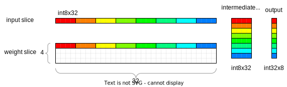

The output needs to be horizontally accumulated further, but it's faster to do it with 4 sums (sum0, sum1, sum2, sum3) later.

This function can benefit from VNNI extension, here controlled by `USE_VNNI`.

```cpp
void m256_add_dpbusd_epi32(__m256i& acc, __m256i a, __m256i b) {
#if defined (USE_VNNI)

    // This does exactly the same thing as explained below but in one instruction.
    acc = _mm256_dpbusd_epi32(acc, a, b);

#else

    // Multiply a * b and accumulate neighbouring outputs into int16 values
    __m256i product0 = _mm256_maddubs_epi16(a, b);

    // Multiply product0 by 1 (idempotent) and accumulate neighbouring outputs into int32 values
    __m256i one = _mm256_set1_epi16(1);
    product0 = _mm256_madd_epi16(product0, one);

    // Add to the main int32 accumulator.
    acc = _mm256_add_epi32(acc, product0);

#endif
};
```

##### m256_haddx4

This function takes 4 \_\_m256i registers containing 8 int32 values each, accumulates them horizontally, and produces one \_\_m128i register containing 4 int32 values, each corresponding to one input sum. In the matrix multiplication above we keep one sum per weight row/input, so in the end, we fill the output 4 values at a time.

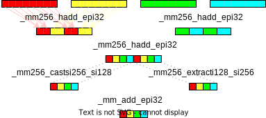

```cpp
__m128i m256_haddx4(__m256i sum0, __m256i sum1, __m256i sum2, __m256i sum3, __m128i bias) {
    sum0 = _mm256_hadd_epi32(sum0, sum1);
    sum2 = _mm256_hadd_epi32(sum2, sum3);

    sum0 = _mm256_hadd_epi32(sum0, sum2);

    __m128i sum128lo = _mm256_castsi256_si128(sum0);
    __m128i sum128hi = _mm256_extracti128_si256(sum0, 1);

    return _mm_add_epi32(_mm_add_epi32(sum128lo, sum128hi), bias);
};
```

#### Linear layer with sparse input

In the previous part we described the generic dense matrix multiplication, but let's try to delve a little bit deeper. The case we will be considering here is similar to how our feature transformer operates, but here we always need to perform the full operation instead and the matrices are smaller. But why are we even considering this? Well, it turns out that the feature transformer output, after being passed through ClippedReLU, can have quite significant sparsity. Here is some data presenting the density of the inputs to the first dense fully connected layer, for networks with different feature transformer size:

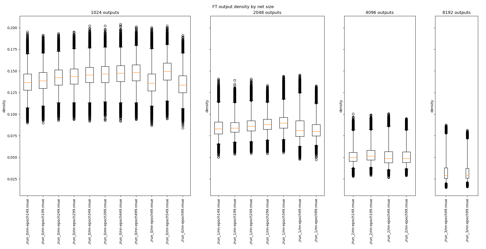

(boxes correspond to the [25%, 75%] interval, whiskers correspond to the [1%, 99%] interval)

That's already <=15% density for the common sizes, and it's consistent between different networks! However we cannot make it as much faster, there is some cost related to the changed access patterns and more required preprocessing, so whether this approach works for your particular case needs to be thoroughly tested.

Let's see the code that can take advantage of it.

```cpp
int lsb(std::uint32_t v) {
    // returns the least significant set bit in v
    // implementation detail
    // can be implemented for example using compiler intrinsics
    // https://www.chessprogramming.org/BitScan#Leading_Zero_Count
}

// This implementation requires changing the layout and expanding the weights to int16.
// We will transpose the weights as now we'll be going through the columns instead of rows.
void load_weights(
    const LinearLayer& layer,
    const int8_t* data
) {
    static_assert(is_same_v<LinearLayer::WeightType, int16_t>,
        "This approach requires weights to be 16-bit. Otherwise, it's hard to widen the multiplication output to 32 bits.");

    for (int i = 0; i < layer.num_outputs; ++i) {
        for (int j = 0; j < layer.num_inputs; ++j) {
            layer.weights[j*layer.num_outputs + i] = data[i*layer.num_inputs + j];
        }
    }

    // For AVX2 we must also swap some lanes in the weights. This is
    // because AVX2 registers functions as two 128-bit ones, and
    // therefore some data is interleaved in the inference process.
    // This makes it so that they end up where we want.
    // Will be more apparent in the visualization.
    // This effectively swaps out the middle 2 64-bit chunks in each 256-bit chunk.
    for (int i = 0; i < layer.num_outputs; ++i) {
        for (int j = 0; j < layer.num_inputs; ++j) {
            const int simd_lane = j % 16;
            const int simd_lane_64 = simd_lane / 4;
            if (simd_lane_64 == 1) {
                swap(
                    layer.weights[i*layer.num_outputs + j + 0],
                    layer.weights[i*layer.num_outputs + j + 4]
                );
            }
        }
    }
}

int32_t* linear_sparse_input(
    const LinearLayer& layer,
    int32_t*           output,
    const int8_t*      input
) {
    static_assert(is_same_v<LinearLayer::WeightType, int16_t>,
        "This approach requires weights to be 16-bit. Otherwise, it's hard to widen the multiplication output to 32 bits.");

    constexpr int register_width = 256 / 8;
    constexpr int input_register_width = register_width; // uint8_t
    constexpr int output_register_width = register_width / 4; // int32_t
    constexpr int output_chunk_size = output_register_width * 2; // we will be processing 2 registers at a time
    assert(layer.num_outputs % output_chunk_size == 0, "We're processing 16 output elements at a time");
    assert(layer.num_inputs % input_register_width == 0);

    // We need to find out the indices of the input values that are non-zero
    uint16_t nnz_input_indices[layer.num_inputs];
    int num_nnz_input_indices = 0;

    for (int i = 0; i < layer.num_inputs; i += input_register_width) {
        const __m256i input_chunk = _mm256_load_si256(input + i);
        // Find out where the values are greater than 0 and set the corresponding bits in nnz
        uint32_t nnz =
            _mm256_movemask_epi8(
                _mm256_cmpgt_epi8(input_chunk, _mm256_setzero_si256())
            );

        // Extract the indices of the set bits in nnz
        while (nnz) {
            const int lsb_index = lsb(nnz);
            nnz &= nnz - 1; // reset the least significant set bit in nnz
            nnz_input_indices[num_nnz_input_indices++] = i + lsb_index;
        }
    }

    // First we just copy the biases. Compilers are good at vectorizing this.
    // Could also use memcpy
    for (int i = 0; i < layer.num_outputs; ++i) {
        output[i] = layer.biases[i];
    }

    const int num_chunks = layer.num_outputs / output_chunk_size;
    int i = 0;
    for (; i + 1 < num_nnz_input_indices; i += 2) {
        // We will try to process 2 at a time as much as possible,
        // as we can utilize the available intrinsics better.
        // Will become more apparent on the visualization.
        const int input_id0 = nnz_input_indices[i+0];
        const int input_id1 = nnz_input_indices[i+1];
        const __m256i factor = _mm256_set1_epi32(
            input[input_id0] | (input[input_id1] << 16)
        );

        for (int j = 0; j < num_chunks; ++j) {
            const int output_offset0 = (j*2 + 0)*output_register_width;
            const int output_offset1 = (j*2 + 1)*output_register_width;

            // Weights are packed 2 times as densely as the output.
            const int weight_offset  = (j*1 + 0)*output_register_width;

            // Each chunk requires a load+store.
            // However, if the output is small enough it can be unrolled and
            // all outputs might fit into the registers.
            // Though the compiler probably is not allowed to do it by itself.
            __m256i sum0 = _mm256_load_si256(output + output_offset0);
            __m256i sum1 = _mm256_load_si256(output + output_offset1);

            // Remember, weights are 16 bit here, so one __m256i can hold 16 of them.
            const __m256i col0 = _mm256_load_si256(
                layer.weights + input_id0 * layer.num_outputs + weight_offset
            );
            const __m256i col1 = _mm256_load_si256(
                layer.weights + input_id1 * layer.num_outputs + weight_offset
            );

            // See next below for visualization
            m256_process_chunk(sum0, sum1, col0, col1, factor);

            _mm256_store_si256(output + output_offset0, sum0);
            _mm256_store_si256(output + output_offset1, sum1);
        }
    }

    // Process the remaining single input
    for (; i < num_nnz_input_indices; ++i) {
        const int input_id = nnz_input_indices[i];
        const __m256i factor = _mm256_set1_epi32(input[input_id]);

        for (int j = 0; j < num_chunks; ++j) {
            const int output_offset0 = (j*2 + 0)*output_register_width;
            const int output_offset1 = (j*2 + 1)*output_register_width;

            const int weight_offset  = (j*1 + 0)*output_register_width;

            __m256i sum0 = _mm256_load_si256(output + output_offset0);
            __m256i sum1 = _mm256_load_si256(output + output_offset1);

            const __m256i col0 = _mm256_load_si256(
                layer.weights + input_id * layer.num_outputs + weight_offset
            );

            m256_process_chunk(sum0, sum1, col0, _mm256_setzero_si256(), factor);

            _mm256_store_si256(output + output_offset0, sum0);
            _mm256_store_si256(output + output_offset1, sum1);
        }
    }
    
    for (int j = 0; j < layer.num_outputs; j += output_register_width) {
        _mm256_store_si256(output + j, _mm256_srai_epi32(_mm256_load_si256(output + j), log2_weight_scale));
    }

    return output + layer.num_outputs;
}
```

##### m256_process_chunk

This function takes int16 weights, a factor being a composition of 2 int8 inputs broadcasted as int32, and produces int32 outputs.


```cpp
inline void m256_process_chunk(__m256i& sum0, __m256i& sum1, __m256i col0, __m256i col1, __m256i factor) {
    // We interleave the two columns, because madd adds adjacent values.
    // This way we effectively add the results from both columns.
    sum0 = _mm256_add_epi32(
        sum0, _mm256_madd_epi16(factor, _mm256_unpacklo_epi16(col0, col1))
    );
    sum1 = _mm256_add_epi32(
        sum1, _mm256_madd_epi16(factor, _mm256_unpackhi_epi16(col0, col1))
    );
}
```

#### Linear layer with sparse input, alternative approach

In the first approach, we used 16-bit weights, but it's possible to use 8-bit weights with slightly more unpacking fun. We'll also see an alternative way of computing the indices on non-zero inputs by using a lookup table. For some more approaches and measurements to the latter see [here](https://github.com/syzygy1/Cfish/issues/204#issue-944790893).

```cpp
// This implementation requires changing the layout and expanding the weights to int16.
// We will transpose the weights as now we'll be going through the columns instead of rows.
void load_weights(
    const LinearLayer& layer,
    const int8_t* data
) {
    static_assert(is_same_v<LinearLayer::WeightType, int8_t>,
        "This approach requires weights to be 8-bit.");

    for (int i = 0; i < layer.num_outputs; ++i) {
        for (int j = 0; j < layer.num_inputs; ++j) {
            layer.weights[j*layer.num_outputs + i] = data[i*layer.num_inputs + j];
        }
    }

    // No need for clever tricks with shuffling the weights now.
    // However, we will require one more zero-weight column. We assume enough space is allocated.
    for (int i = 0; i < layer.num_outputs; ++i) {
        layer.weights[layer.num_inputs*layer.num_outputs + i] = 0;
    }
}

// A constexpr version of least significant bit computation.
static constexpr int lsb_constexpr(std::uint32_t v)
{
    int c = 0;
    if (!v) return 32;
    while (!(v & 1))
    {
        v >>= 1;
        ++c;
    }
    return c;
}

// A lookup table of indices of non-zero bits in the input.
// Each entry of std::array<std::uint16_t, 8> can be interpreted as __m128i.
alignas(64) static constexpr std::array<std::array<std::uint16_t, 8>, 256> LookupTableIndices = [](){
    std::array<std::array<std::uint16_t, 8>, 256> v{};
    for (int i = 0; i < 256; ++i)
    {
        int j = i;
        int k = 0;
        while(j)
        {
            const IndexType lsbIndex = lsb_constexpr(std::uint32_t(j));
            j &= j - 1;
            v[i][k] = lsbIndex;
            ++k;
        }
    }
    return v;
}();

// A lookup table for popcount of a byte.
// Using the dedicated popcnt instruction might or might not work better.
static constexpr std::array<std::uint8_t, 256> LookupTableCounts = [](){
    std::array<std::uint8_t, 256> v{};
    for (int i = 0; i < 256; ++i)
    {
        int j = i;
        int k = 0;
        while(j)
        {
            j &= j - 1;
            ++k;
        }
        v[i] = k;
    }
    return v;
}();

int32_t* linear_sparse_input(
    const LinearLayer& layer,
    int32_t*           output,
    const int8_t*      input
) {
    // We will take a tiled approach with accumulators in registers.
    // Similar to how the feature transformer is best implemented.
    constexpr int input_register_width = 256 / 8;
    constexpr int chunk_size = 256 / 32;
    constexpr int num_chunks_per_tile = 8;
    constexpr int tile_size = chunk_size * num_chunks_per_tile;
    assert(layer.num_outputs % tile_size == 0, "We're processing 64 output elements at a time. Though it's easy to change it.");
    assert(num_chunks_per_tile % 4 == 0, "We're processing 4 chunks at a time.");
    constexpr int num_tiles = layer.num_outputs / tile_size;

    // We need to find out the indices of the input values that are non-zero
    // We'll use a lookup table approach. Overallocate 16 elements
    // so that stores are always valid (we will be using larger stores)
    uint16_t nnz_input_indices[layer.num_inputs + 16];
    int num_nnz_input_indices = 0;

    {
        // These will be used for offsetting the looked-up indices.
        // A variation with int16 lookup is also possible (see the link above)
        // and is faster in isolation, but requires more memory and may trash the cache.
        __m128i base = _mm_set1_epi16(0);
        __m128i increment = _mm_set1_epi16(8);
        for (int i = 0; i < layer.num_inputs; i += input_register_width) {
            const __m256i input_chunk = _mm256_load_si256(input + i);
            unsigned nnz = _mm256_movemask_epi8(_mm256_cmpgt_epi8(input_chunk, _mm256_setzero_si256()));

            unsigned b0 = (nnz) & 0xFF;
            unsigned b1 = (nnz >> 8) & 0xFF;
            unsigned b2 = (nnz >> 16) & 0xFF;
            unsigned b3 = (nnz >> 24) & 0xFF;

            unsigned c0 = LookupTableCounts[b0];
            unsigned c1 = LookupTableCounts[b1];
            unsigned c2 = LookupTableCounts[b2];
            unsigned c3 = LookupTableCounts[b3];

            // These stores can reach above layer.num_inputs in extreme cases. That's why we preallocate.
            // Only the first c0 values matter.
            _mm_storeu_si128(
                reinterpret_cast<__m128i*>(nnz_input_indices + num_nnz_input_indices),
                _mm_add_epi32(_mm_loadu_si128(reinterpret_cast<const __m128i*>(&LookupTableIndices[b0])), base)
            );
            num_nnz_input_indices += c0;
            base = _mm_add_epi32(base, increment);

            _mm_storeu_si128(
                reinterpret_cast<__m128i*>(nnz_input_indices + num_nnz_input_indices),
                _mm_add_epi32(_mm_loadu_si128(reinterpret_cast<const __m128i*>(&LookupTableIndices[b1])), base)
            );
            num_nnz_input_indices += c1;
            base = _mm_add_epi32(base, increment);

            _mm_storeu_si128(
                reinterpret_cast<__m128i*>(nnz_input_indices + num_nnz_input_indices),
                _mm_add_epi32(_mm_loadu_si128(reinterpret_cast<const __m128i*>(&LookupTableIndices[b2])), base)
            );
            num_nnz_input_indices += c2;
            base = _mm_add_epi32(base, increment);

            _mm_storeu_si128(
                reinterpret_cast<__m128i*>(nnz_input_indices + num_nnz_input_indices),
                _mm_add_epi32(_mm_loadu_si128(reinterpret_cast<const __m128i*>(&LookupTableIndices[b3])), base)
            );
            num_nnz_input_indices += c3;
            base = _mm_add_epi32(base, increment);
        }
    }

    // We will be processing 4 inputs at a time, and to avoid having two similar loops
    // we pad the input indices to a multiple of 4. For the added ones we use a dummy input
    // with all weights set to 0.
    while (num_nnz_input_indices % 4 != 0)
      nnz_input_indices[num_nnz_input_indices++] = layer.num_inputs;

    // Hopefully will fit in the register file.
    __m256i acc[num_chunks_per_tile];

    for (int i = 0; i < num_tiles; ++i)
    {
        const __m256i* biases_tile = reinterpret_cast<const __m256i*>(&layer.biases[i * tile_size]);
              __m256i* output_tile = reinterpret_cast<      __m256i*>(&      output[i * tile_size]);

        for (int k = 0; k < num_chunks_per_tile; ++k)
            acc[k] = _mm256_setzero_si256();

        for (int j = 0; j < num_nnz_input_indices; j += 4)
        {
            const __m256i  mul0 = _mm256_set1_epi16(input[nnz_input_indices[j+0]] | (input[nnz_input_indices[j+1]] << 8));
            const __m256i  mul2 = _mm256_set1_epi16(input[nnz_input_indices[j+2]] | (input[nnz_input_indices[j+3]] << 8));
            const __m256i* col0 = reinterpret_cast<const __m256i*>(&layer.weights[nnz_input_indices[j+0] * layer.num_outputs + i * tile_size]);
            const __m256i* col1 = reinterpret_cast<const __m256i*>(&layer.weights[nnz_input_indices[j+1] * layer.num_outputs + i * tile_size]);
            const __m256i* col2 = reinterpret_cast<const __m256i*>(&layer.weights[nnz_input_indices[j+2] * layer.num_outputs + i * tile_size]);
            const __m256i* col3 = reinterpret_cast<const __m256i*>(&layer.weights[nnz_input_indices[j+3] * layer.num_outputs + i * tile_size]);
            for (int k = 0; k < num_chunks_per_tile / 4; ++k)
            {
                // Due to AVX2 interpreting the 256-bit registers as 2 128-bit ones the unpacking
                // shuffles the lanes. We will have to account for that when getting the final result.
                m256_process_chunk_alternative(
                    acc[k*4 + 0], acc[k*4 + 1], acc[k*4 + 2], acc[k*4 + 3],
                         col0[k],      col1[k],      col2[k],      col3[k],
                            mul0,                       mul2
                );
            }
        }

        for (int k = 0; k < num_chunks_per_tile / 4; ++k)
        {
            // We have to unshuffle the lanes. See the visualization to get a better picture.
            const __m128i acc00 = _mm256_extracti128_si256(acc[k*4 + 0], 0);
            const __m128i acc01 = _mm256_extracti128_si256(acc[k*4 + 0], 1);
            const __m128i acc10 = _mm256_extracti128_si256(acc[k*4 + 1], 0);
            const __m128i acc11 = _mm256_extracti128_si256(acc[k*4 + 1], 1);
            const __m128i acc20 = _mm256_extracti128_si256(acc[k*4 + 2], 0);
            const __m128i acc21 = _mm256_extracti128_si256(acc[k*4 + 2], 1);
            const __m128i acc30 = _mm256_extracti128_si256(acc[k*4 + 3], 0);
            const __m128i acc31 = _mm256_extracti128_si256(acc[k*4 + 3], 1);

            output_tile[k*4 + 0] = _mm256_srai_epi32(_mm256_add_epi32(_mm256_setr_m128i(acc00, acc10), biases_tile[k*4 + 0]), log2_weight_scale);
            output_tile[k*4 + 1] = _mm256_srai_epi32(_mm256_add_epi32(_mm256_setr_m128i(acc20, acc30), biases_tile[k*4 + 1]), log2_weight_scale);
            output_tile[k*4 + 2] = _mm256_srai_epi32(_mm256_add_epi32(_mm256_setr_m128i(acc01, acc11), biases_tile[k*4 + 2]), log2_weight_scale);
            output_tile[k*4 + 3] = _mm256_srai_epi32(_mm256_add_epi32(_mm256_setr_m128i(acc21, acc31), biases_tile[k*4 + 3]), log2_weight_scale);
        }
    }

    return output + layer.num_outputs;
}
```

##### m256_process_chunk_alternative

This function takes int8 weights corresponding to 4 inputs, 2 factors being a composition of 4 int8 inputs broadcasted as int16, and produces int32 outputs.


```cpp
inline void m256_process_chunk_alternative(
    __m256i& acc0, __m256i& acc1, __m256i& acc2, __m256i& acc3,
    __m256i  col0, __m256i  col1, __m256i  col2, __m256i  col3,
    __m256i  mul0,                __m256i  mul2
) {
    // For madd.
    const __m256i ones = _mm256_set1_epi16(1);

    const __m256i prod0 = _mm256_maddubs_epi16(mul0, _mm256_unpacklo_epi8(col0, col1));
    const __m256i prod1 = _mm256_maddubs_epi16(mul0, _mm256_unpackhi_epi8(col0, col1));
    const __m256i prod2 = _mm256_maddubs_epi16(mul2, _mm256_unpacklo_epi8(col2, col3));
    const __m256i prod3 = _mm256_maddubs_epi16(mul2, _mm256_unpackhi_epi8(col2, col3));
    acc0 = _mm256_add_epi32(acc0, _mm256_madd_epi16(ones, _mm256_unpacklo_epi16(prod0, prod2)));
    acc1 = _mm256_add_epi32(acc1, _mm256_madd_epi16(ones, _mm256_unpackhi_epi16(prod0, prod2)));
    acc2 = _mm256_add_epi32(acc2, _mm256_madd_epi16(ones, _mm256_unpacklo_epi16(prod1, prod3)));
    acc3 = _mm256_add_epi32(acc3, _mm256_madd_epi16(ones, _mm256_unpackhi_epi16(prod1, prod3)));
}
```

#### Linear layer with blocked sparse input

If you read the previous two sections you realize that this approach can get complicated. The complication stems from the fact that in the naive way, we have to process every row separately. But what if we grouped the inputs into chunks that are easier to work with? At first, this may appear as a pessimisation, because such an approach would have to consider an input to be non-zero if any of the values in a group is non-zero.

Anyway, let's consider a group of size 4. With basic probability math, we can calculate that if we group by 4, and the chance of a single input to be zero is `x`, then the chance of all 4 inputs to be zero is `x^4`. For example, if `x = 0.9` then `x^4 ~= 0.65` - that's almost 4 times as many indices to process... BUT. There are also 4 times fewer indices now, because they are grouped! What about the amount of work required for each non-zero input? Normally it would be 4 times as much, because inputs are grouped by 4. However, two things align to help our cause. First, as we saw, the implementation is clunky for a group size of 1, and requires either more memory for the weights or additional work to unpack them. Second, It prevents us from efficiently handling a small amount of outputs, because we're limited by SIMD register width. Stockfish, for example, uses only 16 outputs after the large layer, so processing multiple (4) inputs at a time is a natural optimization.

So, overall, we have the following tradeoffs:

1. 4 times fewer indices to calculate
2. 4 times more inputs to process per index
3. but cheaper, we can do simple and fast processing for each input chunk again (no weight unpacking, no int16 weights), especially with fewer outputs

Combined, it gives a sizable speedup for larger networks.

Let's see the rough code.

```cpp
int lsb(std::uint32_t v) {
    // returns the least significant set bit in v
    // implementation detail
    // can be implemented for example using compiler intrinsics
    // https://www.chessprogramming.org/BitScan#Leading_Zero_Count
}

// 4 outputs per input
constexpr int ChunkSize = 4;

// We will be processing 4 inputs at a time, so to do it efficiently we need to permute the weights.
// Figuring out why this permutation is like this is left as an exercise to the reader.
int get_weight_index_scrambled(const LinearLayer& layer, int i)
{
  return
    (i / ChunkSize) % (layer.num_inputs / ChunkSize) * layer.num_outputs * ChunkSize +
    i / layer.num_inputs * ChunkSize +
    i % ChunkSize;
}

void load_weights(
    const LinearLayer& layer,
    const int8_t* data
) {
    for (int i = 0; i < layer.num_outputs * layer.num_inputs; ++i) {
        layer.weights[get_weight_index_scrambled(i)] = data[i];
    }
}

int32_t* linear_sparse_input(
    const LinearLayer& layer,
    int32_t*           output,
    const int8_t*      input
) {
    static_assert(is_same_v<LinearLayer::WeightType, int8_t>,
        "This approach requires weights to be 8-bit.");

    constexpr int register_width = 256 / 8;
    constexpr int input_register_width = register_width; // uint8_t
    constexpr int output_register_width = register_width / 4; // int32_t
    assert(layer.num_inputs % input_register_width == 0);

    // We need to find out the indices of the input values that are non-zero.
    // Remember that we group the inputs by 4, so comparisons now use epi32.
    uint16_t nnz_input_indices[layer.num_inputs / ChunkSize];
    int num_nnz_input_indices = 0;

    for (int i = 0; i < layer.num_inputs; i += input_register_width) {
        const __m256i input_chunk = _mm256_load_si256(input + i);
        // Find out where the values are greater than 0 and set the corresponding bits in nnz
        // Annoyingly, we have to use _ps, because _epi32 doesn't exist for this instruction.
        // This does incur some performance penalty due to domain change.
        _mm256_movemask_ps((__m256)
            _mm256_cmpgt_epi32(input_chunk, _mm256_setzero_si256())
        );

        // Extract the indices of the set bits in nnz
        while (nnz) {
            const int lsb_index = lsb(nnz);
            nnz &= nnz - 1; // reset the least significant set bit in nnz
            nnz_input_indices[num_nnz_input_indices++] = i + lsb_index;
        }
    }

    // This time we will hold all outputs in registers, since we don't expect many of them.
    const int num_regs = layer.num_outputs / output_register_width;
    __m256i acc[num_regs];

    // Initialize the accumulators with biases.
    const __m256i* biasvec = reinterpret_cast<const __m256i*>(layer.biases);
    for (int k = 0; k < num_regs; ++k)
        acc[k] = biasvec[k];

    // We will be loading inputs 4 at a time.
    const auto input32 = reinterpret_cast<const std::int32_t*>(input);

    // We process one chunk at a time, but it's possible to unroll with some potential gains.
    for (int i = 0; i < num_nnz_input_indices; ++i) {
        const int input_id = nnz_input_indices[i];
        // We load 4 inputs at a time.
        const __m256i factor = _mm256_set1_epi32(input32[input_id]);

        // Find the corresponding weights.
        const auto col = reinterpret_cast<const __m256i*>(&weights[input_id * ChunkSize * layer.num_outputs]);

        // See how simple this part got now?!
        // Back to our old and trusted m256_add_dpbusd_epi32. Horizontal accumulation for free!
        for (int k = 0; k < num_regs; ++k)
            m256_add_dpbusd_epi32(acc[k], factor, col[k]);
    }

    // Store the accumulators directly into the output
    __m256i* outptr = reinterpret_cast<__m256i*>(output);
    for (int k = 0; k < num_regs; ++k)
        outptr[k] = acc[k];

    return output + layer.num_outputs;
}
```

##### Helping the odds

The math of `x^4` assumes a uniform distribution of non-zero inputs. We, however, help it a little bit by reordering the weights such that values that are more likely to be non-zero are grouped together (say, at the beginning). This can be performed empirically. This is a minor (~2%), but essentially free, speedup!

#### Linear layer with sparse input and blocked sparse output

Let's go one step further. For now, all linear layers had dense outputs, but we can consider a layer where each input is connected only to a subset of outputs. We can consider the weights to be 0 where no connection is present. To make it possible to implement efficiently with vectorization in mind we have to zero out whole blocks of weights. A 16x128 Weight matrix with 2 non-zero 1x16 blocks per input may look like this for example:

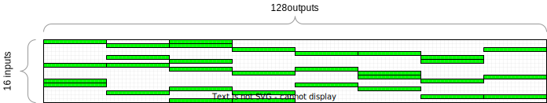

For AVX2 such blocks must be at least 8 int32s (type of the output values) wide, but we will consider only 16-wide blocks because it's more convenient. With this approach one can have for example a linear layer with 256 outputs, but only 4 (this being constant is quite important for being able to write optimized code) non-zero weight blocks of size 16 per input, effectively having each input only affect 64 outputs.

There is some additional workload in the forward pass to support it, and it doesn't vectorize as nicely as in previous cases, but it might still be a win for some architectures.

However, with this approach, the training needs to be aware of this and try to create those blocks of 0 weights without harming the network too much. This can be achieved with weight pruning, which will be described later. The inference code will be very similar to the linear layer with sparse inputs case.


```cpp
void load_weights(
    const LinearLayer& layer,
    const int8_t* data
) {
    // This goes the same as in the case with sparse inputs, however
    // the weights matrix is no longer continuous and we need to fill
    // some block indices to know which weights correspond to which outputs.
    // This can be done either by discovering the zero blocks during loading,
    // or with a different serialized format with the block indices precomputed.
    // We will omit this here and just assume that layer.nnz_block_ids[input_id][4]
    // contains non-zero weight block indices corresponding to each input.
}

int32_t* linear_sparse_input_block_sparse_output(
    const LinearLayer& layer,
    int32_t*           output,
    const int8_t*      input
) {
    static_assert(is_same_v<LinearLayer::WeightType, int16_t>,
        "This approach requires weights to be 16-bit. Otherwise, it's hard to widen the multiplication output to 32 bits.");

    constexpr int register_width = 256 / 8;
    constexpr int input_register_width = register_width; // uint8_t
    constexpr int output_register_width = register_width / 4; // int32_t
    constexpr int output_chunk_size = output_register_width * 2; // we will be processing 2 registers at a time
    assert(layer.num_outputs % output_chunk_size == 0, "We're processing 16 output elements at a time");
    assert(layer.num_inputs % input_register_width == 0);

    uint16_t nnz_input_indices[layer.num_inputs];
    int num_nnz_input_indices = 0;

    for (int i = 0; i < layer.num_inputs; i += input_register_width) {
        const __m256i input_chunk = _mm256_load_si256(input + i);
        uint32_t nnz =
            _mm256_movemask_epi8(
                _mm256_cmpgt_epi8(input_chunk, _mm256_setzero_si256())
            );

        while (nnz) {
            const int lsb_index = lsb(nnz);
            nnz &= nnz - 1; // reset the least significant set bit in nnz
            nnz_input_indices[num_nnz_input_indices++] = i + lsb_index;
        }
    }

    for (int i = 0; i < layer.num_outputs; ++i) {
        output[i] = layer.biases[i];
    }

    const int num_chunks = layer.num_outputs / output_chunk_size;
    // There are always tradeoffs. We cannot process two inputs at a time, because
    // they might have different non-zero weight blocks. Makes it visibly slower.
    // There might be some tricks with AVX512, but AVX2 is fairly limited for this use case.
    for (int i = 0; i < num_nnz_input_indices; ++i) {
        const int input_id = nnz_input_indices[i]
        const __m256i factor = _mm256_set1_epi32(input[input_id]);

        // We have hardcoded 4 16-wide non-zero weight blocks per input.
        for (int j = 0; j < 4; ++j) {
            const int block_id = layer.nnz_block_ids[input_id][j];
            const int output_offset0 = (block_id*2 + 0)*output_register_width;
            const int output_offset1 = (block_id*2 + 1)*output_register_width;

            const int weight_offset  = (block_id*1 + 0)*output_register_width;

            __m256i sum0 = _mm256_load_si256(output + output_offset0);
            __m256i sum1 = _mm256_load_si256(output + output_offset1);

            const __m256i col0 = _mm256_load_si256(
                layer.weights + input_id * layer.num_outputs + weight_offset
            );

            m256_process_chunk(sum0, sum1, col0, _mm256_setzero_si256(), factor);

            _mm256_store_si256(output + output_offset0, sum0);
            _mm256_store_si256(output + output_offset1, sum1);
        }
    }
    
    for (int i = 0; i < layer.num_outputs; i += output_register_width) {
        _mm256_store_si256(output + i, _mm256_srai_epi32(_mm256_load_si256(output + i), log2_weight_scale));
    }

    return output + layer.num_outputs;
}
```

#### ClippedReLU

The clipping is not hard, the more complicated part is conversion. We also need two versions, one for int16 -> int8, and one for int32 -> int8.

##### int16 -> int8

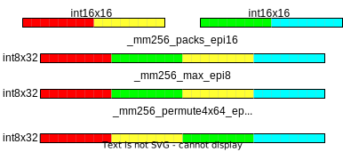

```cpp
int8_t* crelu16(,
          int      size,   // no need to have any layer structure, we just need the number of elements
          int8_t*  output, // the already allocated storage for the result
    const int16_t* input   // the input, which is the output of the previous linear layer
) {
    constexpr int in_register_width = 256 / 16;
    constexpr int out_register_width = 256 / 8;
    assert(size % out_register_width == 0, "We're processing 32 elements at a time");
    const int num_out_chunks = size / out_register_width;

    const __m256i zero    = _mm256_setzero_si256();
    const int     control = 0b11011000; // 3, 1, 2, 0; lane 0 is the rightmost one

    for (int i = 0; i < num_out_chunks; ++i) {
        const __m256i in0 = _mm256_load_si256(&input[(i * 2 + 0) * in_register_width]);
        const __m256i in1 = _mm256_load_si256(&input[(i * 2 + 1) * in_register_width]);

        const __m256i result =
            // packs changes the order, so we need to fix that with a permute
            _mm256_permute4x64_epi64(
                // clamp from below
                _mm256_max_epi8(
                    // packs saturates to 127, so we only need to clamp from below
                    _mm256_packs_epi16(in0, in1),
                    zero
                ),
                control
            );

        _mm256_store_si256(&output[i * out_register_width], result);
    }

    return output + size;
}
```

##### int32 -> int8

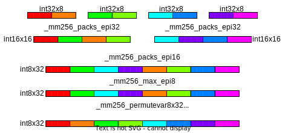

```cpp
int8_t* crelu32(,
          int      size,   // no need to have any layer structure, we just need the number of elements
          int8_t*  output, // the already allocated storage for the result
    const int32_t* input   // the input, which is the output of the previous linear layer
) {
    constexpr int in_register_width = 256 / 32;
    constexpr int out_register_width = 256 / 8;
    assert(size % out_register_width == 0, "We're processing 32 elements at a time");
    const int num_out_chunks = size / out_register_width;

    const __m256i zero    = _mm256_setzero_si256();
    const __m256i control = _mm256_set_epi32(7, 3, 6, 2, 5, 1, 4, 0);

    for (int i = 0; i < num_out_chunks; ++i) {
        const __m256i in0 =
            _mm256_packs_epi32(
                _mm256_load_si256(&input[(i * 4 + 0) * in_register_width]),
                _mm256_load_si256(&input[(i * 4 + 1) * in_register_width])
            );
        const __m256i in1 =
            _mm256_packs_epi32(
                _mm256_load_si256(&input[(i * 4 + 2) * in_register_width]),
                _mm256_load_si256(&input[(i * 4 + 3) * in_register_width])
            );

        const __m256i result =
            _mm256_permutevar8x32_epi32(
                _mm256_max_epi8(
                    _mm256_packs_epi16(in0, in1),
                    zero
                ),
                control
            );

        _mm256_store_si256(&output[i * out_register_width], result);
    }

    return output + size;
}
```

#### Quantmoid4

As previously mentioned, we will be considering the variant with output in range `[0, 126]`. Let's remind ourselves about the equation we need to implement.


First thing to notice is that `min(x, y) - y` can be replaced by `-subs(y, x)`, where `subs` is unsigned subtraction with saturation, in this case, saturation to the range `[0, 255]`.

For handling the "piece-wise" nature we can either use a copysign function, or a blend function. Since blending is available in AVX2 we will use this.

The code can then be as simple as the following:

```cpp
// Since the output is always 0/1 outside of the int8 range the input could
// in theory be (saturated) int8, BUT there is no int8 multiplication in AVX2 so we
// will take int16 for convenience.
int8_t* quantmoid4(
          int      size,
    const int16_t* input,
          int8_t*  output
) {
    constexpr int in_register_width = 256 / 16;
    constexpr int out_register_width = 256 / 8;
    assert(size % out_register_width == 0); // We won't bother with the remainder here
    const int num_out_chunks = size / out_register_width;

    const __m256i cst_127_epi16 = _mm256_set1_epi16(127);
    const __m256i cst_126_epi8 = _mm256_set1_epi8(126);

    // Since AVX2 processes interleave between 128-bit lanes we will have to
    // revert this at the end, to combine two processed inputs into one output.
    // This Control contains the information on how to permute the 64-bit lanes
    // of the result. Control = [0, 2, 1, 3].
    constexpr int Control = 0b11011000;
    for (int i = 0; i < num_out_chunks; ++i)
    {
        __m256i v0 = _mm256_load_si256(&input[(i * 2 + 0) * in_register_width]);
        __m256i v1 = _mm256_load_si256(&input[(i * 2 + 1) * in_register_width]);

        // We will need the initial input sign for the blend later.
        // Blend uses the highest bit only for the choice, and that
        // happens to be the sign bit.
        __m256i sign = _mm256_packs_epi16(v0, v1);

        // From the identity stated earlier.
        // v0 = min(abs(input[i]), 127) - 127;
        v0 = _mm256_subs_epu16(cst_127_epi16, _mm256_abs_epi16(v0));
        v1 = _mm256_subs_epu16(cst_127_epi16, _mm256_abs_epi16(v1));

        // Since we use mulhi later we have to prepare the input such that
        // the high part (16 highest bits, as the 16-bit multiplication produces
        // a 32-bit result) after the multiplication land correctly. We want to
        // divide by 256==2^8 later (right shift by 8), so we would have 8 spare
        // bits that we would need to get rid of (from the full 32-bit result).
        // So we can first shift left by 4 bits, which the multiplication (squaring)
        // will double to 8, and so the 16-bit high part of the 32-bit result will
        // extract exactly what we want.
        v0 = _mm256_slli_epi16(v0, 4);
        v1 = _mm256_slli_epi16(v1, 4);

        v0 = _mm256_mulhi_epi16(v0, v0);
        v1 = _mm256_mulhi_epi16(v1, v1);

        // Now we can convert to int8 after that for the rest.
        v0 = _mm256_packs_epi16(v0, v1);

        // Blend between v and 126-v, based on the input sign, so that we effectively
        // evaluate the right part of the piece-wise function.
        v0 = _mm256_blendv_epi8(_mm256_subs_epi8(cst_126_epi8, v0), v0, sign);

        // Deinterleave the output due to AVX2 semantics.
        _mm256_store_si256(&output[i * out_register_width], _mm256_permute4x64_epi64(v0, Control));
    }

    return output + size;
}
```

#### Pooling Layers

##### Average Pooling

The exact implementation will depend on how many inputs per output one wants to take. Here we will show an implementation which reduces 2 inputs into 1 output, and will work on uint8 input.

Note, that it is often not optimal to take the neighbouring values. For example, here we divide the input in half and average those halves, as there is no instruction in AVX2 that allows to do it well otherwise. Also, be aware of rounding differences - for example, AVX2 avg rounds towards the nearest integer, while a simple division will round towards 0.

```cpp
void average_pooling_2(
          int      size,
    const uint8_t* input,
          uint8_t*  output
) {
    constexpr int register_width = 256 / 8;
    assert(size % (register_width * 2) == 0); // We won't bother with the remainder here
    const int num_out_chunks = size / (register_width * 2);

    for (int i = 0; i < num_out_chunks; ++i)
    {
        __m256i v0 = _mm256_load_si256(&input[ i                   * register_width]);
        __m256i v1 = _mm256_load_si256(&input[(i + num_out_chunks) * register_width]);

        _mm256_store_si256(&output[i * register_width], _mm256_avg_epu8(v0, v1));
    }
}
```

##### Max Pooling

Pretty much identical. Though there are more options for input/output types with `max` in AVX2.

```cpp
void max_pooling_2(
          int      size,
    const uint8_t* input,
          uint8_t*  output
) {
    constexpr int register_width = 256 / 8;
    assert(size % (register_width * 2) == 0); // We won't bother with the remainder here
    const int num_out_chunks = size / (register_width * 2);

    for (int i = 0; i < num_out_chunks; ++i)
    {
        __m256i v0 = _mm256_load_si256(&input[ i                   * register_width]);
        __m256i v1 = _mm256_load_si256(&input[(i + num_out_chunks) * register_width]);

        _mm256_store_si256(&output[i * register_width], _mm256_max_epu8(v0, v1));
    }
}
```

##### Product Pooling

This one is more complicated, since multiplication introduces a non-linearity that has to be accounted for in the quantization. We will consider a version that works on input range `[0, 127]`, where 0 corresponds to floating-point 0.0, and 127 corresponds to floating-point 1.0. We want the output to preserve this range, but to do that we would have to divide by 127 (because `127*127/127` would be the desired result for `1.0*1.0=1.0`). In practice we have to sacrifice some output range and divide by 128 instead, effectively producing output in range `[0, 126]` (1.0 point can still logically be at 127, but the output won't span the full `[0.0, 1.0]` range). This change has to be accounted for in the trainer, since we're effectively changing the function to not only multiply the inputs, but also scale the outputs. Anyway, here's how the optimized implementation may look like in C++ with AVX2:

(In Stockfish this is applied after the feature transformer activation, hence int16->uint8 example)

```cpp
void product_pooling_2(
          int      size,
    const int16_t* input,
          uint8_t* output
) {
    constexpr int in_register_width = 256 / 16;
    constexpr int out_register_width = 256 / 8;
    assert(size % (out_register_width * 2) == 0); // We won't bother with the remainder here
    const int num_out_chunks = size / (out_register_width * 2);

    // For deinterleave
    constexpr int Control = 0b11011000;

    for (int i = 0; i < num_out_chunks; ++i)
    {
        // We process 4 input registers at a time and produce one output register.
        // This is because we do 2->1 reduction and input type is twice the width of the output.
        const __m256i v0a = _mm256_load_si256(&input[(i * 2 + 0)                  * in_register_width]);
        const __m256i v0b = _mm256_load_si256(&input[(i * 2 + 1)                  * in_register_width]);
        const __m256i v1a = _mm256_load_si256(&input[(i * 2 + 0 + num_out_chunks) * in_register_width]);
        const __m256i v1b = _mm256_load_si256(&input[(i * 2 + 1 + num_out_chunks) * in_register_width]);

        // Multiply and divide by 128 (right shift by 7), rounding towards 0.
        const __m256i pa = _mm256_srli_epi16(_mm256_mullo_epi16(v0a, v1a), 7);
        const __m256i pb = _mm256_srli_epi16(_mm256_mullo_epi16(v0b, v1b), 7);

        // Deinterleave
        out[j] = _mm256_permute4x64_epi64(_mm256_packs_epi16(pa, pb), Control);
    }
}
```

This layer can also be nicely combined with Clipped ReLU but first clamping the input to a specific range (doing it in a fused way will reduce the number of loads/stores).


```cpp
void max_pooling_2(
          int      size,
    const uint8_t* input,
          uint8_t*  output
) {
    constexpr int register_width = 256 / 8;
    assert(size % (register_width * 2) == 0); // We won't bother with the remainder here
    const int num_out_chunks = size / (register_width * 2);

    for (int i = 0; i < num_out_chunks; ++i)
    {
        __m256i v0 = _mm256_load_si256(&input[ i                   * register_width]);
        __m256i v1 = _mm256_load_si256(&input[(i + num_out_chunks) * register_width]);

        _mm256_store_si256(&output[i * register_width], _mm256_max_epu8(v0, v1));
    }
}
```

### Accounting for quantization in the trainer

#### Range

Adding (quite aggressive) quantization has reduced the possible range of values for the weights and biases. We can, however, ignore the feature transformer and all biases, as they use large integer types and we don't ever expect to hit the limit. The problematic cases are the int8 weights of the linear layer, which for example in Stockfish can only go to about 2 (activation range in 0..1). This is potentially a big problem, as the training can diverge from the quantized representation by more than just rounding. To prevent this from happening, it is necessary to somehow limit the range for these parameters inside the trainer. So far the easiest way of doing it is to modify the optimizer to clamp the values to the available range after each optimization step. These minimum and maximum values can be passed, for example when registering the optimizable parameters in the optimizer.

##### Inside the optimizer

One way to account for this is directly in the optimizer. This is nice because the clipping is applied directly after the step, but requires having access to the optimizer's source. For example:

```python
# The min/max constants are specific to the Stockfish quantization scheme.
train_params = [
    {'params' : [self.ft.weight, self.ft.bias] },
    {'params' : [self.l1.weight], 'min_weight' : -127/64, 'max_weight' : 127/64 },
    {'params' : [self.l1.bias] },
    {'params' : [self.l2.weight], 'min_weight' : -127/64, 'max_weight' : 127/64 },
    {'params' : [self.l2.bias] },
    {'params' : [self.output.weight], 'min_weight' : -127*127/9600, 'max_weight' : 127*127/9600 },
    {'params' : [self.output.bias] },
]
optimizer = ranger.Ranger(train_params, lr=LR, betas=(.9, 0.999), eps=1.0e-7)
```

and then in the optimizer:

```python
class Ranger(Optimizer):
    def __init__([...]):
        [...]
        defaults = dict([...]
                        min_weight=None, max_weight=None)

def step(self, closure=None):
    [...]

    for group in self.param_groups:
        for p in group['params']:
            ...
            min_weight = group['min_weight']
            max_weight = group['max_weight']
            if min_weight is not None and max_weight is not None:
                p_data_fp32.clamp_(min_weight, max_weight)
```

##### Outside the optimizer

Alternatively one can do it outside the optimizer for more flexibility:

```python
# The min/max constants are specific to the Stockfish quantization scheme.
self.weight_clipping = [
    {'params' : [self.l1.weight], 'min_weight' : -127/64, 'max_weight' : 127/64 },
    {'params' : [self.l2.weight], 'min_weight' : -127/64, 'max_weight' : 127/64 },
    {'params' : [self.output.weight], 'min_weight' : -127*127/9600, 'max_weight' : 127*127/9600 },
]
```

```python
# and call this in some step function
def _clip_weights(self):
    for group in self.weight_clipping:
        for p in group['params']:
            p_data_fp32 = p.data
            min_weight = group['min_weight']
            max_weight = group['max_weight']
            p_data_fp32.clamp_(min_weight, max_weight)
            p.data.copy_(p_data_fp32)
```

##### Accounting for virtual layers (factorization)

Sometimes more complex architectures make some layers' parameters be a sum of two layers during training. Just like feature factorization but for whole layers (see for example [this](#multiple-psqt-outputs-and-multiple-subnetworks)). We can account for example like this:

```python
# The min/max constants are specific to the Stockfish quantization scheme.
self.weight_clipping = [
    {'params' : [self.l1.weight], 'min_weight' : -127/64, 'max_weight' : 127/64, 'virtual_params' : self.some_virtual_factor.weight },
    {'params' : [self.l2.weight], 'min_weight' : -127/64, 'max_weight' : 127/64 },
    {'params' : [self.output.weight], 'min_weight' : -127*127/9600, 'max_weight' : 127*127/9600 },
]
```

```python
def _clip_weights(self):
    for group in self.weight_clipping:
        for p in group['params']:
            p_data_fp32 = p.data
            min_weight = group['min_weight']
            max_weight = group['max_weight']
            if 'virtual_params' in group:
                virtual_params = group['virtual_params']
                # The virtual layer is usually N times smaller
                xs = p_data_fp32.shape[0] // virtual_params.shape[0]
                ys = p_data_fp32.shape[1] // virtual_params.shape[1]
                expanded_virtual_layer = virtual_params.repeat(xs, ys)
                min_weight_t = p_data_fp32.new_full(p_data_fp32.shape, min_weight) - expanded_virtual_layer
                max_weight_t = p_data_fp32.new_full(p_data_fp32.shape, max_weight) - expanded_virtual_layer
                p_data_fp32 = torch.max(p_data_fp32, min_weight_t)
                p_data_fp32 = torch.min(p_data_fp32, max_weight_t)
            else:
                p_data_fp32.clamp_(min_weight, max_weight)
            p.data.copy_(p_data_fp32)
```

#### Non-differentiable layers

One may want to use some non-differentiable layers that are made for quantized inference from the beginning. One such layer is Quantmoid4. In this case, we have two options:

1. Use the function as is in the float domain.
2. Use some other function.

The first option is the simplest, but may still result in issues on boundary points. For example, Quantmoid4, uses non-smooth functions that will cause the gradient to disappear. This is an issue. Additionally, it's often a lot of simple operations that may slow the trainer down (by bloating the backward pass graph).

The second option is very tempting, especially since usually the quantized function is an approximation to some other smooth function, in this case, a `sigmoid(4x)`. In some cases it is enough to just replace the gradient, leaving the quantized version for the forward pass.

##### Custom kernel for training-safe amalgamated Quantmoid4

Quantmoid4 is a good enough approximation that we can just use it for the forward pass and use `sigmoid(4x)` gradient for the backward pass!

```python
import torch
import cupy as cp

# For lazy compilation.
quantmoid_kernels = dict()
def make_quantmoid4_forward_kernel():
    key = 'quantmoid4_forward_kernel'
    if not key in quantmoid_kernels:
        # an approximation of sigmoid(x*4)
        quantmoid4_forward_kernel = cp.RawKernel(r'''
            extern "C" __global__
            void quantmoid4_forward(
                const float*   const input,
                      float*   const output,
                const int            total
            ) {
                const int i = blockIdx.x * blockDim.x + threadIdx.x;
                if (i >= total)
                   return;

                // Remember that we want to scale the output to [0.0, 1.0]
                const float x = input[i];
                const float v = min(floor(abs(x * 127.0f)), 127.0f) - 127.0f;
                const float vv = floor(v * v / 256.0f);
                const float vvv = x > 0.0f ? 126.0f - vv : vv;
                output[i] = vvv / 127.0f;
            }
        ''',
            'quantmoid4_forward'
        )
        quantmoid4_forward_kernel.compile()
        quantmoid_kernels[key] = quantmoid4_forward_kernel
    return quantmoid_kernels[key]

# Now we define a python function that will encapsulate that raw kernel.
def _quantmoid4(x):
    assert x.is_contiguous()
    assert x.is_cuda
    assert x.dtype == torch.float32

    kernel = make_quantmoid4_forward_kernel()
    device = x.device
    count = x.numel()
    output = torch.empty(*x.shape, dtype=torch.float32, device=device, requires_grad=False)

    kernel(
        grid=((count + 1023) // 1024,),
        block=(1024,),
        args=(
            x.data_ptr(),
            output.data_ptr(),
            count
        )
    )
    return output

# And now we define a class that pytorch will understand.
# Here we substitute the gradient by the gradient for sigmoid(4x).
class Quantmoid4(torch.autograd.Function):
  @staticmethod
  def forward(ctx, input):
    ctx.save_for_backward(torch.sigmoid(input * 4.0))
    return _quantmoid4(input)

  @staticmethod
  def backward(ctx, grad_output):
    sigmoid_output, = ctx.saved_tensors
    return grad_output * (1.0 - sigmoid_output) * 4.0 * sigmoid_output

quantmoid4 = Quantmoid4.apply

# Output for some verification
if __name__ == '__main__':
    for i in range(-255, 255):
        x = i / 127.0
        print(x, quantmoid4(torch.tensor([x]).cuda()), quantmoid4(torch.tensor([x]).cuda())-torch.sigmoid(torch.tensor([x]).cuda()*4.0))
```

## Optimizing the trainer (CUDA)

### Using custom CUDA kernels

How to run our own kernel? Don't we need a complicated setup with the CUDA compiler and all that? CuPy to the rescue. CuPy is a python library that allows easy creation of CUDA kernels using plain python strings containing the CUDA code. CuPy handles compilation and everything else for us. For example:

```python
import cupy as cp

# Create the kernel
kernel = cp.RawKernel(r'''
void kernel_name(...) {
    // your usual kernel code
}
''', 'kernel_name')

# Optionally compile it, otherwise it will compile on first use
kernel.compile()

# Run the kernel
kernel(
    grid=(batch_size,), # The grid shape
    block=(num_threads,), # The block shape
    args=(...) # The arguments that are passed to the kernel
)
```

PyTorch tensors can be easily passed to the kernel by using `.data_ptr()`, which results the pointer to the tensor. One must however ensure that the memory is contiguous.

### Feature transformer

Up until now we've using pytorch's sparse matrix multiplication for the feature transformer, but their implementation is not great, and we have additional assumptions that we can use.

1. We have an upper bound on the nnz elements for each position.
2. We have large batches

We can therefore replace the feature indices from a 2D tensor of shape `[total_num_active_features, 2]`, which contains the position index and feature index for each value, with a 2D tensor of shape `[batch_size, max_num_features]`, which contains one feature index per one values and the position index is known. We need to somehow handle positions where the number of features is lower than `max_num_features` now. One way to do it is to assign unused spots a feature index of `-1` and then omit such indices in the kernel.

This approach obviously also requires modifying the data loader, but it'll end up being simpler now, as we won't have to work around pytorch's problematic sparse tensors. Let's look at the modified data loader first.

#### New data loader

```cpp
struct SparseBatch {
    SparseBatch(const std::vector<TrainingDataEntry>& entries) {
        size = entries.size();

        max_active_features = MAX_ACTIVE_FEATURES;

        stm = new float[size];
        score = new float[size];

        // New layout for the indices, now it's [size][MAX_ACTIVE_FEATURES].
        // Also we don't need to sort the indices because the new implementation
        // is fast regardless of the order!
        white_features_indices = new int[size * MAX_ACTIVE_FEATURES];
        black_features_indices = new int[size * MAX_ACTIVE_FEATURES];

        fill(entries);
    }

    void fill(const std::vector<TrainingDataEntry>& entries) {
        ...
    }

    int size;
    int max_active_features;

    float* stm;
    float* score;
    int* white_features_indices;
    int* black_features_indices;

    ~SparseBatch()
    {
        delete[] stm;
        delete[] score;
        delete[] white_features_indices;
        delete[] black_features_indices;
    }
};
```

and in python

```python
class SparseBatch(ctypes.Structure):
    _fields_ = [
        ('size', ctypes.c_int),
        ('max_active_features', ctypes.c_int),
        ('stm', ctypes.POINTER(ctypes.c_float)),
        ('score', ctypes.POINTER(ctypes.c_float)),
        ('white_features_indices', ctypes.POINTER(ctypes.c_int)),
        ('black_features_indices', ctypes.POINTER(ctypes.c_int))
    ]

    def get_tensors(self, device):
        # This is illustrative. In reality, you might need to transfer these
        # to the GPU. You can also do it asynchronously, but remember to make
        # sure the source lives long enough for the copy to finish.

        stm_t = torch.from_numpy(np.ctypeslib.as_array(self.stm, shape=(self.size, 1)))
        score_t = torch.from_numpy(np.ctypeslib.as_array(self.score, shape=(self.size, 1)))

        # Now we don't have to bother with the sparse pytorch tensors!
        # And no transpositions required too because we have control over the layout!
        white_features_indices_t = torch.from_numpy(
            np.ctypeslib.as_array(self.white_features_indices, shape=(self.size, self.max_active_features)))
        black_features_indices_t = torch.from_numpy(
            np.ctypeslib.as_array(self.black_features_indices, shape=(self.size, self.max_active_features)))

        # The values are all ones, so we can create these tensors in place easily.
        # No need to go through a copy.
        white_features_values_t = torch.ones(self.num_active_white_features)
        black_features_values_t = torch.ones(self.num_active_black_features)

        # No more coalescing! Our implementation will be fast regardless of whether the inputs are sorted or not!
        return white_features_indices_t, white_features_values_t, black_features_indices_t, black_features_values_t, stm_t, score_t

# Let's also tell ctypes how to understand this type.
SparseBatchPtr = ctypes.POINTER(SparseBatch)
```

#### Feature transformer forward kernel

Now let's try to write a custom CUDA kernel for the feature transformer. At this point, you should have a good understanding of how the feature transformer works and how to implement it in C. Here we will need two kernels, one for the forward, and one for the backward pass. We'll write these kernels in a generic way that uses values, but for some uses it can of course be assumed that all values are 1 (depends on feature set and factorization scheme). It'll be the easiest to present the kernels with notes in the comments:

```Cuda
typedef unsigned int uint32_t;
typedef int int32_t;

extern "C" __global__

/*
    @assumptions:
        The blocks must have dimensionality (BATCH_SIZE,)
        The threads must have dimensionality (N,), where
        N * output_thread_slice_size == output_size.

    @param: feature_indices
        A matrix of shape (BATCH_SIZE, max_active_features)
        containing indices of active features for each position
        in a batch. Feature index of -1 means that the slot is empty
        and the weights will not be accumulated for it. Moreover,
        no further indices from this block will be considered.
        The indices form an implicit matrix of shape
        (BATCH_SIZE, NUM_INPUTS), where the first dimension index is
        inferred from the memory location (BATCH_SIZE), and the
        second dimension index is stored in the feature_indices matrix.
        The type for feature indices is int32_t.

    @param: feature_values
        A matrix of shape (BATCH_SIZE, max_active_features)
        containing the values (arity) of the corresponding
        feature index in feature_indices.
        The type for the feature value (arity) is float32.

    @param: weight
        The weight matrix of shape (NUM_INPUTS, output_size).
        Weights must be of type float32.

    @param: bias
        The bias vector of shape (output_size,).
        Bias values must be of type float32.

    @param: output
        An output matrix of shape (BATCH_SIZE, output_size).
        It may not be initialized, bias is always copied
        to the output first.
        Output values must have type float32.

    @const: max_active_features
        The maximum number of features that are active
        (non-zero) for a single position. This value determines
        the shape of the inputs.
        This value is of type uint32_t.

    @const: output_size
        The number of outputs. Must match the shape of weights
        and biases.
        This value is of type uint32.

    @const: output_thread_slice_size
        The number of outputs to process per thread. Must be output_size/num_threads.
        Equivalent to output_size/threadDim.x, but computing it at runtime is wasteful.
        This value is of type uint32.
*/

void feature_transformer_slice_forward(
    const int32_t* const feature_indices,
    const float*   const feature_values,
    const float*   const weight,
    const float*   const bias,
          float*   const output
) {
    // The idea is to process one position per CUDA block, and in each block
    // there will be N threads, each working on some slice of the output.

    // These values are constant to allow more optimization.
    // Since with CuPy we have JIT compilation for free these
    // values can be for example set by string interpolation
    // whenever a specifically parameterized kernel is needed.
    const uint32_t       max_active_features      = ...;
    const uint32_t       output_thread_slice_size = ...;
    const uint32_t       output_size              = ...;

    // We get some memory that is shared between all threads.
    // In theory we don't access it between threads, so this could
    // be local, but arrays defined without __shared__ are
    // placed in the global memory which might be slower, and
    // we'd have to rely on the compiler to optimize it.
    __shared__
          float          shared_output[output_size];

    // 1 block is 1 position
    const uint32_t       block_idx           = blockIdx.x;
    // Each thread processes only a small number of outputs for a position.
    const uint32_t       slice_offset        = threadIdx.x * output_thread_slice_size;

    // Each thread fills only a small number of outputs for a position.
    // Here we calculate the offset into the output [batch_size, output_size] array
    // where we need to put the results from this thread.
          float*   const output_slice        = output + block_idx * output_size + slice_offset;
    // And other similar stuff.
    const float*   const bias_slice          = bias                             + slice_offset;
          float*         shared_output_slice = shared_output                    + slice_offset;

    // When we were using the pytorch's sparse matrices we needed to put 2 indices per value,
    // they were the position index and the feature index. Now we're exploiting
    // our first assumption - we have a dense matrix of shape [batch_size, max_active_features],
    // and we only store one index per feature, the position index is known.
    const int32_t* const feature_index_row   = feature_indices + block_idx * max_active_features;
    const float*   const feature_value_row   = feature_values  + block_idx * max_active_features;

    #pragma unroll
    // Copy bias to the "local" memory.
    for (uint32_t s = 0; s < output_thread_slice_size; ++s)
    {
        shared_output_slice[s] = bias_slice[s];
    }

    // Each thread goes through all active features.
    for (uint32_t k = 0; k < max_active_features; ++k)
    {
        const int32_t feature_index = feature_index_row[k];
        const float   feature_value = feature_value_row[k];
        // We made it so that a feature index of -1 stops execution.
        // This condition is the same for all threads, so we can break early
        // and get some additional performance.
        if (feature_index != -1)
        {
            // Compute which weights we need to accumulate.
            const float* const weight_slice = weight + feature_index * output_size + slice_offset;
            #pragma unroll
            for (uint32_t s = 0; s < output_thread_slice_size; ++s)
            {
                // And accumulate the weights to the "local" memory.
                shared_output_slice[s] += weight_slice[s] * feature_value;
            }
        } else break;
    }

    #pragma unroll
    for (uint32_t s = 0; s < output_thread_slice_size; ++s)
    {
        // Only at the end we put the results back into global memory.
        output_slice[s] = shared_output_slice[s];
    }
}
```

#### Feature transformer backward kernel

```Cuda
typedef unsigned int uint32_t;
typedef int int32_t;

extern "C" __global__
/*
    @assumptions:
        The blocks must have dimensionality (BATCH_SIZE,)
        The threads must have dimensionality (N,), where
        N * output_thread_slice_size == output_size.

    @param: weight_grad
        The weight gradient matrix of shape (NUM_INPUTS, output_size).
        The gradient is accumulated, i.e. it must be zero-initialized
        on the first call.
        Weights must be of type float32.

    @param: bias_grad
        The bias gradient vector of shape (output_size,).
        The gradient is accumulated, i.e. it must be zero-initialized
        on the first call.
        Bias values must be of type float32.

    @param: output_grad
        An output gradient matrix of shape (BATCH_SIZE, output_size).
        Output values must have type float32.
*/
void feature_transformer_slice_backward(
    const int32_t* const feature_indices,
    const float*   const feature_values,
          float*   const weight_grad,
          float*   const bias_grad,
    const float*   const output_grad
) {{
    // The helper indices and pointers we compute are very similar
    // to the forward pass, we're just going to be doing it backward.
    const uint32_t       max_active_features      = ...;
    const uint32_t       output_thread_slice_size = ...;
    const uint32_t       output_size              = ...;

    // We don't really need to store this in the shared memory, because
    // it's almost surely cached, but since it's free and we do
    // use it many times in this kernel we might as well do it.
    __shared__
          float          shared_output_grad[output_size];

    const uint32_t       block_idx                = blockIdx.x;
    const uint32_t       slice_offset             = threadIdx.x * output_thread_slice_size;

    const float*   const output_grad_slice        = output_grad + block_idx * output_size + slice_offset;
          float*   const bias_grad_slice          = bias_grad                             + slice_offset;
          float*         shared_output_grad_slice = shared_output_grad                    + slice_offset;

    const int32_t* const feature_index_row        = feature_indices + block_idx * max_active_features;
    const float*   const feature_value_row        = feature_values  + block_idx * max_active_features;

    #pragma unroll
    for (uint32_t s = 0; s < output_thread_slice_size; ++s)
    {
        // Copy the values to "local" memory to hopefully speed up the repeated access.
        shared_output_grad_slice[s] = output_grad_slice[s];
    }

    #pragma unroll
    for (uint32_t s = 0; s < output_thread_slice_size; ++s)
    {
        // x*w+b=y, so the bias gradient is just increased by the output gradient.
        const float sog = shared_output_grad_slice[s];
        // We expect this layer to come before a ClippedReLU so there will be a lot of zeros.
        // Also our kernel is completely memory-bound, so we can utilize this to remove
        // redundant additions.
        if (sog != 0.0f)
        {
            // Due to how Nvidia GPUs work, since Kepler architecture, atomic
            // additions execute in specialized units that are closer to global memory.
            // Our access is mostly random, so be benefit here two-fold:
            // 1. atomicAdd executes **faster** than += because it's closer to memory
            // 2. we "rarely" have two atomic accesses to the same memory location.
            // We have to use atomic additions either way, because we're modifying
            // one gradient matrix (instead of multiple outputs as in the forward case),
            // so this is fortunate for us.
            atomicAdd(&bias_grad_slice[s], sog);
        }
    }

    // Same loop as in forward, but we accumulate the gradients now.
    for (uint32_t k = 0; k < max_active_features; ++k)
    {
        const int32_t feature_index = feature_index_row[k];
        const float   feature_value = feature_value_row[k];
        // Exit early after all active indices are processed.
        if (feature_index != -1)
        {
            float* const weight_grad_slice = weight_grad + feature_index * output_size + slice_offset;
            #pragma unroll
            for (int s = 0; s < output_thread_slice_size; ++s)
            {
                const float sog = shared_output_grad_slice[s];
                // Same optimization as in the case of the bias.
                if (sog != 0.0f)
                {
                    // x*w+b=y, so we accumulate output gradient multiplied by x (input).
                    atomicAdd(&weight_grad_slice[s], sog * feature_value);
                }
            }
        } else break;
    }
}
```

#### FeatureTransformerSlice layer

Now we create a safe wrapper so that the kernels can be easily used from PyTorch.

```python
class FeatureTransformerSliceFunction(autograd.Function):

    @staticmethod
    def forward(ctx, feature_indices, feature_values, weight, bias):
        # Save the required stuff for the backward pass.
        ctx.save_for_backward(feature_indices, feature_values, weight, bias)

        # A lot of assertions are needed to ensure the correctness.
        assert len(feature_indices.shape) == 2
        assert len(feature_values.shape) == 2
        assert feature_indices.shape[0] == feature_values.shape[0]
        assert feature_indices.shape[1] == feature_values.shape[1]
        assert feature_indices.dtype == torch.int32
        assert feature_values.dtype == torch.float32

        assert len(weight.shape) == 2
        assert weight.dtype == torch.float32

        assert len(bias.shape) == 1
        assert bias.dtype == torch.float32

        assert feature_indices.is_cuda
        assert feature_values.is_cuda
        assert weight.is_cuda
        assert bias.is_cuda

        assert feature_values.device == feature_indices.device
        assert weight.device == feature_indices.device
        assert bias.device == feature_indices.device

        assert feature_indices.is_contiguous()
        assert feature_values.is_contiguous()
        assert weight.is_contiguous()
        assert bias.is_contiguous()

        device = feature_indices.device
        batch_size = feature_indices.shape[0]
        max_active_features = feature_indices.shape[1]
        output_size = weight.shape[1]

        output = torch.empty(batch_size, output_size, dtype=torch.float32, device=device, requires_grad=True)

        # Implementation for make_feature_transformer_slice_forward_kernel not provided. It could
        # for example dynamically create and cache the kernels.
        kernel, num_threads = make_feature_transformer_slice_forward_kernel(max_active_features, output_size)
        kernel(
            grid=(batch_size,), # One position per batch
            block=(num_threads,), # Number of threads per block as "advised" by the function above
            args=( # Pointers to all the tensors, we ensured they are contiguous.
                feature_indices.data_ptr(),
                feature_values.data_ptr(),
                weight.data_ptr(),
                bias.data_ptr(),
                output.data_ptr()
            )
        )

        return output

    @staticmethod
    def backward(ctx, grad_output):
        # We don't handle the gradient for the feature indices and values, so
        # make sure it's not required.
        assert not ctx.needs_input_grad[0]
        assert not ctx.needs_input_grad[1]

        grad_output = grad_output.contiguous()

        # Retrieve the saved tensors.
        feature_indices, feature_values, weight, bias = ctx.saved_tensors

        device = feature_indices.device
        batch_size = feature_indices.shape[0]
        max_active_features = feature_indices.shape[1]
        output_size = weight.shape[1]

        weight_grad = torch.zeros(weight.shape[0], weight.shape[1], dtype=torch.float32, device=device)
        bias_grad = torch.zeros(output_size, dtype=torch.float32, device=device)

        # Similar to the forward case
        kernel, num_threads = make_feature_transformer_slice_backward_kernel(max_active_features, output_size)
        kernel(
            grid=(batch_size,),
            block=(num_threads,),
            args=(
                feature_indices.data_ptr(),
                feature_values.data_ptr(),
                weight_grad.data_ptr(),
                bias_grad.data_ptr(),
                grad_output.data_ptr()
            )
        )

        # The order of returned values here is the same as the order of inputs to the forward pass.
        return None, None, weight_grad, bias_grad

class FeatureTransformerSlice(nn.Module):
    def __init__(self, num_inputs, num_outputs):
        super(FeatureTransformerSlice, self).__init__()
        self.num_inputs = num_inputs
        self.num_outputs = num_outputs

        # Initialize in the same way nn.Linear would be initialized.
        sigma = math.sqrt(1/num_inputs)
        self.weight = nn.Parameter(torch.rand(num_inputs, num_outputs, dtype=torch.float32) * (2 * sigma) - sigma)
        self.bias = nn.Parameter(torch.rand(num_outputs, dtype=torch.float32) * (2 * sigma) - sigma)

    def forward(self, feature_indices, feature_values):
        # Use our FeatureTransformerSliceFunction for the forward pass.
        # Backward will automatically use the backward function from the FeatureTransformerSliceFunction class
        return FeatureTransformerSliceFunction.apply(feature_indices, feature_values, self.weight, self.bias)
```

## Architectures and new directions

### Simple HalfKP Stockfish architecture

This is the first architecture used in Stockfish. The only thing that is different is that in this document, we use HalfKP that doesn't have these 64 additional unused features that are a leftover from Shogi. Other than that, there's nothing new, just using the primitives described earlier to put things into perspective.

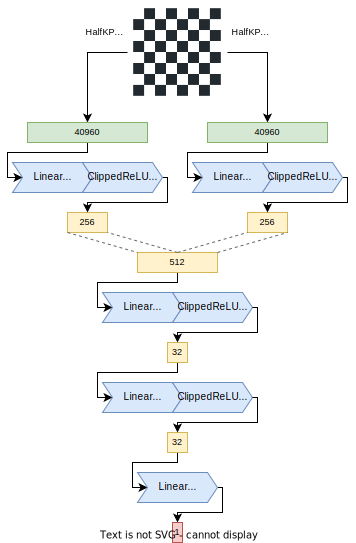

### HalfKAv2 feature set.

HalfKA feature set was briefly mentioned in this document as a brother of HalfKP. It initially had a small drawback that wasted some space. HalfKAv2 is the improved version that uses 8% less space, but otherwise is identical. What's the difference? Let's consider a subset of features for a given our king square `S`. Normally in HalfKA there are 768 possible features, that is `64*12`, as there are 64 squares and 12 pieces (type + color). But we can notice that with our king square fixed at `S` we know that the opponent's king is not at `S` - our king uses just 1 feature from the 64 given for it, and the other king only uses 63 (minus our king ring, but it doesn't matter) from its 64 given features, and the two sets are disjoint! So we can merge the two pieces "into one", and reduce the number of buckets from 12 into 11, reducing the size by about 8%. However, care must be taken when applying factorization, as this compression needs to be reverted and a whole `A` subset with 768 features must be used. Otherwise, it's possible to mix up king positions, as while the compression is valid for a single `64*11` bucket, it doesn't hold when we try to mix the buckets, as it happens when we factorize the features.

### HalfKAv2_hm feature set.

"hm" here stands for "horizontally mirrored". This feature set is basically HalfKAv2, but the board is assumed to have horizontal symmetry. While this assumption obviously doesn't hold in chess it works well in practice. The idea behind this feature set is to, for each perspective, transform the board such that our king is on the e..h files (by convention, could also be a..d file). Knowing that only half of the king squares will be used allows us to cut the number of input features in half, effectively halving the size of the feature transformer. Stockfish uses this feature set since early August 2021 to support large feature transformers without the need for inconveniently large nets. This has also been used in Scorpio, along with other ways of minimizing the network size.

Let's consider an example where the white king is on a1 and the black king on g1. The board will have to be mirrored horizontally for the white's perspective to put the king within the e..h files; from black's perspective, the king is already within the e..h files. At first sight it may appear that this creates discrepancies between the perspective in cases where the board is mirrored only for one perspective, but it works out remarkably well in practice - the strength difference is hardly measurable.

### A part of the feature transformer directly forwarded to the output.

Normally the nets have a hard time learning high material imbalance, or even representing high evaluations at all. But we can help it with that. We already accumulate some 256 values for each piece on the board, does this ring a bell? What if we added one more and designated it to mean "PSQT"? That's what we will do. We will simply make the feature transformer weight row have 257 values, and use the last one as "PSQT". We can help it during training by initializing it to something that resembles good PSQT values (but remember to scale it according to quantization!). But we have two perspectives? What about that? Right, we do, but we can average them, like `(our - their) / 2` (keeping in mind that their must be negated). Handling it in the trainer is quite easy.

```python
wp = self.ft(w_in)
bp = self.ft(b_in)
w, wpsqt = torch.split(wp, wp.shape[1]-1, dim=1)
b, bpsqt = torch.split(bp, bp.shape[1]-1, dim=1)
[...]
y = self.output(l2_) + (wpsqt - bpsqt) * (us - 0.5)
```

We should also use a feature set that includes king features, as it provides additional PSQT values that may be important. So we will use HalfKAv2.


### Multiple PSQT outputs and multiple subnetworks

Until now all networks have been using one PSQT output and one layer stack (that -32-32-1 part in the Stockfish's network; whatever comes after the feature transformer). But what if we could use more? We need to find some easy-to-compute discriminator to choose the outputs/layer stacks by. One such good discriminator is the piece count, as it's cheap to compute, fairly well-behaved during the game, and the number of pieces can dramatically change how we look at the position. So let's try 8 buckets for both, based on `(piece_count - 1) / 4`.


But how to implement it in the trainer? "Choosing stuff" is not very GPU-friendly, and we're doing batching too, right? It's not indeed, but thankfully the layers are very small, so we can just evaluate all of them and only choose the results! Moreover, multiple `N` linear layers can just be emulated by a single one with `N` times as many outputs. Let's see how it could be implemented in PyTorch:

```python
# Numbers of hidden neurons
L1 = 256
L2 = 32
L3 = 32

class LayerStacks(nn.Module):
    def __init__(self, count):
        super(LayerStacks, self).__init__()

        self.count = count
        # Layers are larger, very good for GPUs
        self.l1 = nn.Linear(2 * L1, L2 * count)
        self.l2 = nn.Linear(L2, L3 * count)
        self.output = nn.Linear(L3, 1 * count)

        # For caching some magic later.
        self.idx_offset = None

        # Don't forget to initialize the layers to your liking.
        # It might be worth it to initialize the layers in each layer
        # stack identically, or introduce a factorizer for the first
        # layer in the layer stacks.

    def forward(self, x, layer_stack_indices):
        # Precompute and cache the offset for gathers
        if self.idx_offset == None or self.idx_offset.shape[0] != x.shape[0]:
            # This is the "magic". There's no easy way to gather just one thing out of
            # many for each position in the batch, but we can interpret the whole batch as
            # N * batch_size outputs and modify the layer_stack_indices to point to
            # `N * i + layer_stack_indices`, where `i` is the position index.
            # Here we precompute the additive part. This part includes just the values `N * i`
            self.idx_offset = torch.arange(0, x.shape[0] * self.count, self.count, device=layer_stack_indices.device)

        # And here we add the current indices to the additive part.
        indices = layer_stack_indices.flatten() + self.idx_offset

        # Evaluate the whole layer
        l1s_ = self.l1(x)
        # View the output as a `N * batch_size` chunks
        # Choose `batch_size` chunks based on the indices we computed before.
        l1c_ = l1s_.view(-1, L2)[indices]
        # We could have applied ClippedReLU earlier, doesn't matter.
        l1y_ = torch.clamp(l1c_, 0.0, 1.0)

        # Same for the second layer.
        l2s_ = self.l2(l1y_)
        l2c_ = l2s_.view(-1, L3)[indices]
        l2y_ = torch.clamp(l2c_, 0.0, 1.0)

        # Same for the third layer, but no clamping since it's the output.
        l3s_ = self.output(l2y_)
        l3y_ = l3s_.view(-1, 1)[indices]

        return l3y_
```

Handling of the PSQT outputs is easier since the is in fact, a simple way of gathering individual values (we couldn't use it above because we were gathering whole rows):

```python
wp = self.input(w_in)
bp = self.input(b_in)
w, wpsqt = torch.split(wp, wp.shape[1]-8, dim=1)
b, bpsqt = torch.split(bp, bp.shape[1]-8, dim=1)
[...]
psqt_indices_unsq = psqt_indices.unsqueeze(dim=1)
wpsqt = wpsqt.gather(1, psqt_indices_unsq)
bpsqt = bpsqt.gather(1, psqt_indices_unsq)
y = self.layer_stacks(l0_, layer_stack_indices) + (wpsqt - bpsqt) * (us - 0.5)
```

## Historical Stockfish evaluation network architectures

### "SFNNv8" architecture

Same as "SFNNv5" with L1 size increased to 2560.

2023-09-22 - *

[Commit 782c32223583d7774770fc56e50bd88aae35cd1a](https://github.com/official-stockfish/Stockfish/commit/70ba9de85cddc5460b1ec53e0a99bee271e26ece)

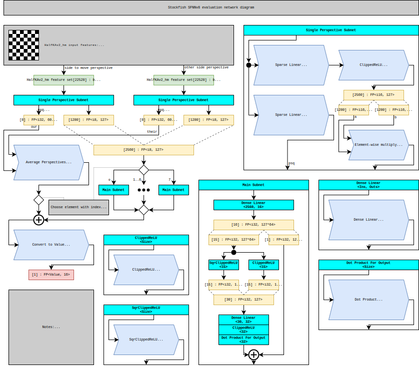

### "SFNNv7" architecture

Same as "SFNNv5" with L1 size increased to 2048.

2023-07-01 - 2023-09-22

[Commit 915532181f11812c80ef0b57bc018de4ea2155ec](https://github.com/official-stockfish/Stockfish/commit/915532181f11812c80ef0b57bc018de4ea2155ec)


### "SFNNv6" architecture

Same as "SFNNv5" with L1 size increased from 1024 to 1536.

2023-05-31 - 2023-07-01

[Commit c1fff71650e2f8bf5a2d63bdc043161cdfe8e460](https://github.com/official-stockfish/Stockfish/commit/c1fff71650e2f8bf5a2d63bdc043161cdfe8e460)


### "SFNNv5" architecture

2022-05-14 - 2023-05-31

[Commit c079acc26f93acc2eda08c7218c60559854f52f0](https://github.com/official-stockfish/Stockfish/commit/c079acc26f93acc2eda08c7218c60559854f52f0)


### "SFNNv4" architecture

2022-02-10 - 2022-05-14

[Commit cb9c2594fcedc881ae8f8bfbfdf130cf89840e4c](https://github.com/official-stockfish/Stockfish/commit/cb9c2594fcedc881ae8f8bfbfdf130cf89840e4c)


### "SFNNv3" architecture

2021-08-15 - 2022-02-10

[Commit d61d38586ee35fd4d93445eb547e4af27cc86e6b](https://github.com/official-stockfish/Stockfish/commit/d61d38586ee35fd4d93445eb547e4af27cc86e6b)


### "SFNNv2" architecture

2021-05-18 - 2021-08-15

[Commit e8d64af1230fdac65bb0da246df3e7abe82e0838](https://github.com/official-stockfish/Stockfish/commit/e8d64af1230fdac65bb0da246df3e7abe82e0838)


### "SFNNv1" architecture

Also known as "Stockfish 12 architecture".

2020-08-06 - 2021-05-18

[Commit 84f3e867903f62480c33243dd0ecbffd342796fc](https://github.com/official-stockfish/Stockfish/commit/84f3e867903f62480c33243dd0ecbffd342796fc)


