# Historical Stockfish evaluation network architectures

This document records the complete history of Stockfish's NNUE evaluation network architectures. For NNUE principles, implementation, training, and architectural explanations, see [NNUE](nnue.md).

## Table of contents

* ["SFNNv17" architecture](#sfnnv17-architecture)
* ["SFNNv16" architecture](#sfnnv16-architecture)
* ["SFNNv15" architecture](#sfnnv15-architecture)
* ["SFNNv14.1" architecture](#sfnnv141-architecture)
* ["SFNNv14" architecture](#sfnnv14-architecture)
* ["SFNNv13" architecture](#sfnnv13-architecture)
* ["SFNNv12" architecture](#sfnnv12-architecture)
* ["SFNNv11" architecture](#sfnnv11-architecture)
* ["SFNNv10" architecture](#sfnnv10-architecture)
* ["SFNNv9" architecture](#sfnnv9-architecture)
* ["SFNNv8" architecture](#sfnnv8-architecture)
* ["SFNNv7" architecture](#sfnnv7-architecture)
* ["SFNNv6" architecture](#sfnnv6-architecture)
* ["SFNNv5" architecture](#sfnnv5-architecture)
* ["SFNNv4" architecture](#sfnnv4-architecture)
* ["SFNNv3" architecture](#sfnnv3-architecture)
* ["SFNNv2" architecture](#sfnnv2-architecture)
* ["SFNNv1" architecture](#sfnnv1-architecture)

## "SFNNv17" architecture

Removed the direct PSQT-like connection.

2026-09-30 - *

[Commit a17c0ce28d5a4cc40e3f2d0e8892cb1cb4234730](https://github.com/official-stockfish/Stockfish/commit/a17c0ce28d5a4cc40e3f2d0e8892cb1cb4234730)

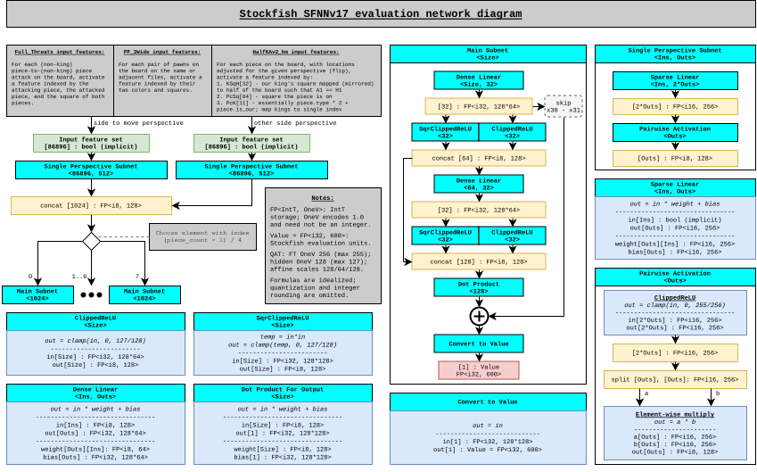

## "SFNNv16" architecture

Added PP_3Wide features.

2026-07-20 - 2026-09-30

[Commit f4bcd40409f94bd397a083c5d6243bac6dcc6d85](https://github.com/official-stockfish/Stockfish/commit/f4bcd40409f94bd397a083c5d6243bac6dcc6d85)

## "SFNNv15" architecture

2026-07-03 - 2026-07-20

[Commit e33bb26ee7320629dd9114a936a38e6f4d43d52a](https://github.com/official-stockfish/Stockfish/commit/e33bb26ee7320629dd9114a936a38e6f4d43d52a)

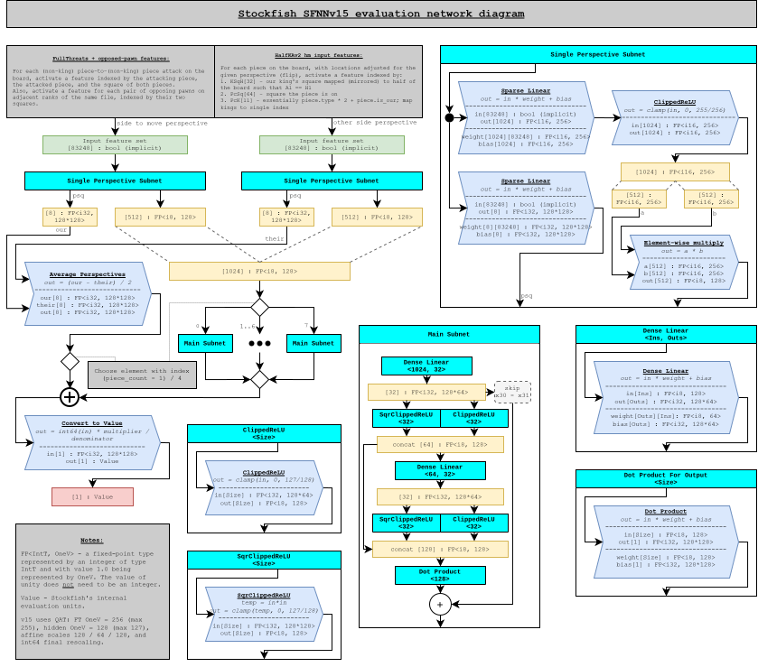

## "SFNNv14.1" architecture

Same as "SFNNv14" with updated fixed-point quantization.

2026-05-26 - 2026-07-03

[Commit 313ea4ab0410872e99f0668c74edc7e49e9a0b6a](https://github.com/official-stockfish/Stockfish/commit/313ea4ab0410872e99f0668c74edc7e49e9a0b6a)

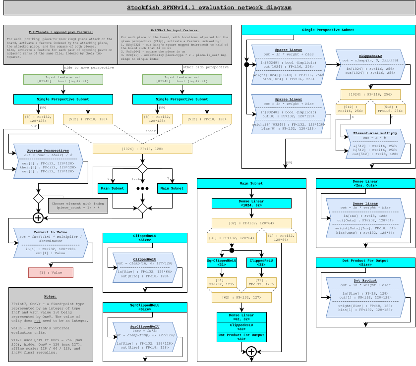

## "SFNNv14" architecture

Added opposed-pawn features to FullThreats.

2026-04-02 - 2026-05-26

[Commit 5eeca7392ee90b7a43da69e647e3d596e42992fd](https://github.com/official-stockfish/Stockfish/commit/5eeca7392ee90b7a43da69e647e3d596e42992fd)

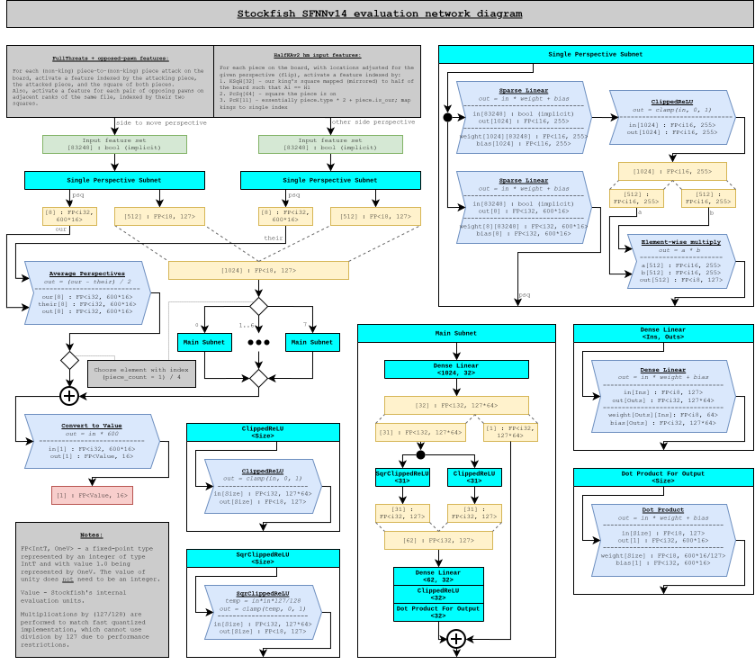

## "SFNNv13" architecture

Same as "SFNNv12" with L2 size increased to 32.

2026-02-18 - 2026-04-02

[Commit a6d055d7e27ab3e29a42e8b94215102824760057](https://github.com/official-stockfish/Stockfish/commit/a6d055d7e27ab3e29a42e8b94215102824760057)

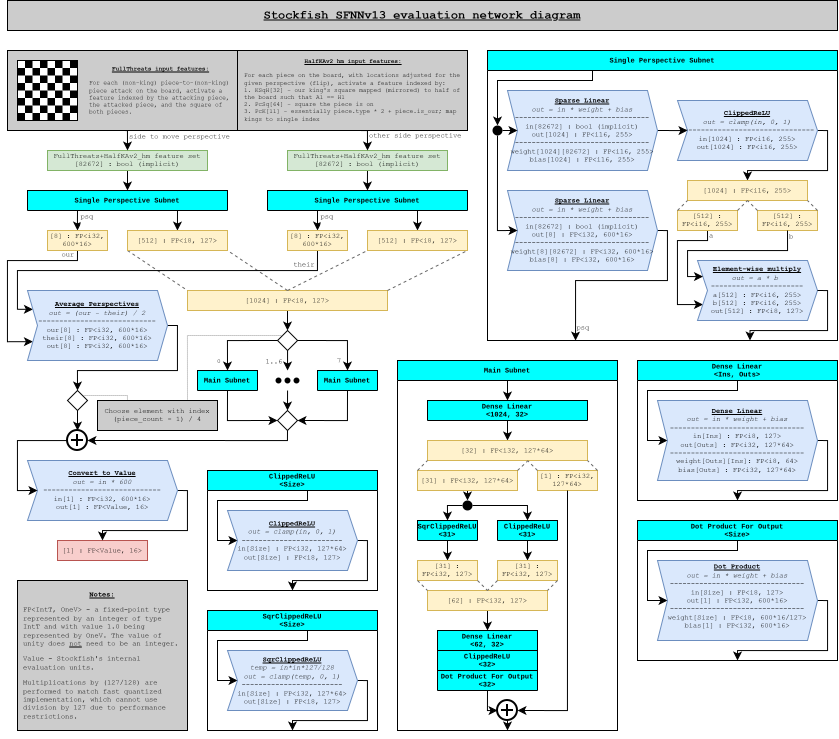

## "SFNNv12" architecture

Removed king to piece threats from FullThreats.

2026-02-12 - 2026-02-18

[Commit 83e42045a62c3690a6ee29862679403ea1644728](https://github.com/official-stockfish/Stockfish/commit/83e42045a62c3690a6ee29862679403ea1644728)

## "SFNNv11" architecture

Removed piece to king threats from FullThreats.

2026-02-04 - 2026-02-12

[Commit fac506bdf3f0ed46fd0823ff1ed592824f91aa5a](https://github.com/official-stockfish/Stockfish/commit/fac506bdf3f0ed46fd0823ff1ed592824f91aa5a)

## "SFNNv10" architecture

Added FullThreats input features, L1 size reduced to 1024, and used 255 as the feature transformer quantization scale.

2025-11-12 - 2026-02-04

[Commit 8e5392d79a36aba5b997cf6fb590937e3e624e80](https://github.com/official-stockfish/Stockfish/commit/8e5392d79a36aba5b997cf6fb590937e3e624e80)

## "SFNNv9" architecture

Same as "SFNNv8" with L1 size increased to 3072.

2024-04-01 - 2025-11-12

[Commit 0716b845fdef8a20102b07eaec074b8da8162523](https://github.com/official-stockfish/Stockfish/commit/0716b845fdef8a20102b07eaec074b8da8162523)

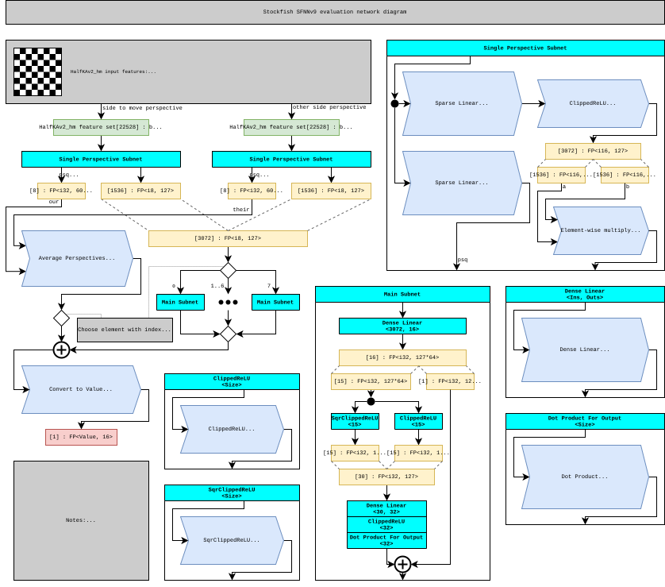

## "SFNNv8" architecture

Same as "SFNNv7" with L1 size increased to 2560.

2023-09-22 - 2024-04-01

[Commit 782c32223583d7774770fc56e50bd88aae35cd1a](https://github.com/official-stockfish/Stockfish/commit/70ba9de85cddc5460b1ec53e0a99bee271e26ece)

## "SFNNv7" architecture

Same as "SFNNv6" with L1 size increased to 2048.

2023-07-01 - 2023-09-22

[Commit 915532181f11812c80ef0b57bc018de4ea2155ec](https://github.com/official-stockfish/Stockfish/commit/915532181f11812c80ef0b57bc018de4ea2155ec)

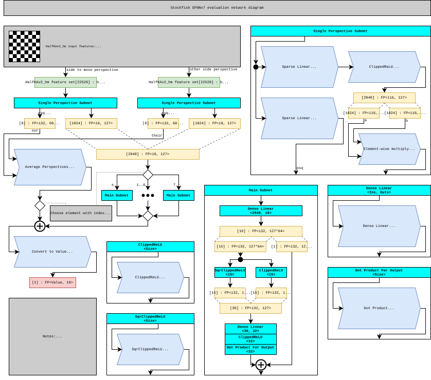

## "SFNNv6" architecture

Same as "SFNNv5" with L1 size increased from 1024 to 1536.

2023-05-31 - 2023-07-01

[Commit c1fff71650e2f8bf5a2d63bdc043161cdfe8e460](https://github.com/official-stockfish/Stockfish/commit/c1fff71650e2f8bf5a2d63bdc043161cdfe8e460)

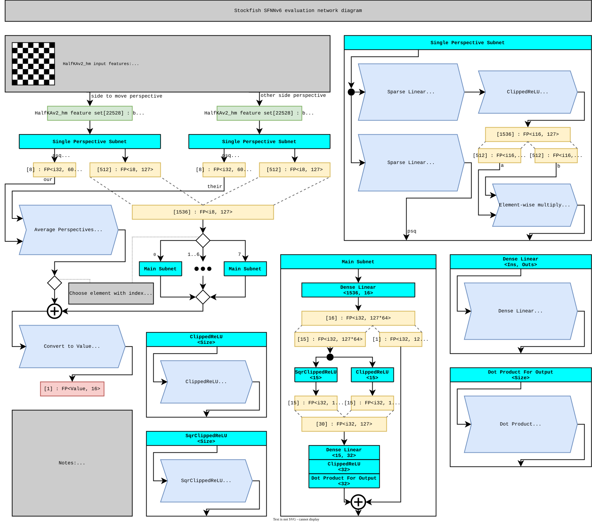

## "SFNNv5" architecture

2022-05-14 - 2023-05-31

[Commit c079acc26f93acc2eda08c7218c60559854f52f0](https://github.com/official-stockfish/Stockfish/commit/c079acc26f93acc2eda08c7218c60559854f52f0)

## "SFNNv4" architecture

2022-02-10 - 2022-05-14

[Commit cb9c2594fcedc881ae8f8bfbfdf130cf89840e4c](https://github.com/official-stockfish/Stockfish/commit/cb9c2594fcedc881ae8f8bfbfdf130cf89840e4c)

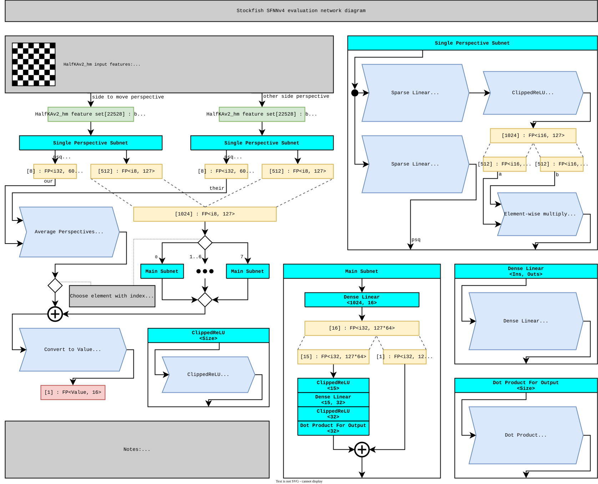

## "SFNNv3" architecture

2021-08-15 - 2022-02-10

[Commit d61d38586ee35fd4d93445eb547e4af27cc86e6b](https://github.com/official-stockfish/Stockfish/commit/d61d38586ee35fd4d93445eb547e4af27cc86e6b)

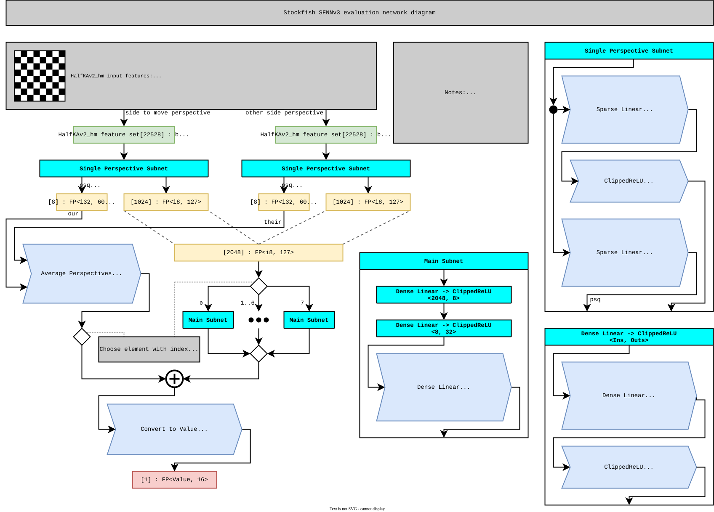

## "SFNNv2" architecture

2021-05-18 - 2021-08-15

[Commit e8d64af1230fdac65bb0da246df3e7abe82e0838](https://github.com/official-stockfish/Stockfish/commit/e8d64af1230fdac65bb0da246df3e7abe82e0838)

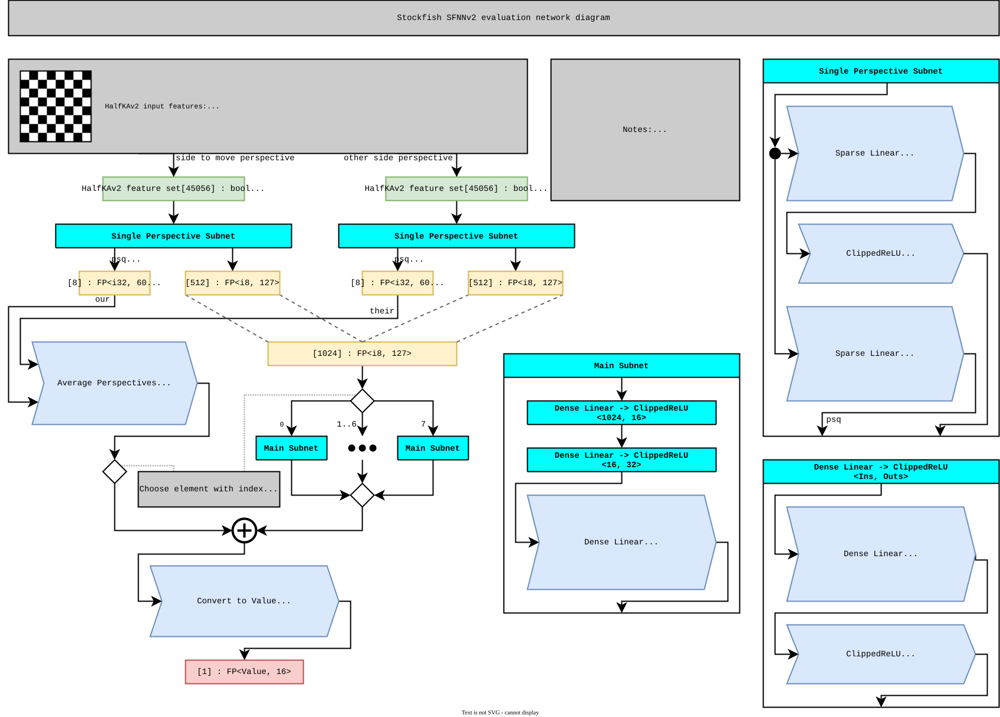

## "SFNNv1" architecture

Also known as "Stockfish 12 architecture".

2020-08-06 - 2021-05-18

[Commit 84f3e867903f62480c33243dd0ecbffd342796fc](https://github.com/official-stockfish/Stockfish/commit/84f3e867903f62480c33243dd0ecbffd342796fc)

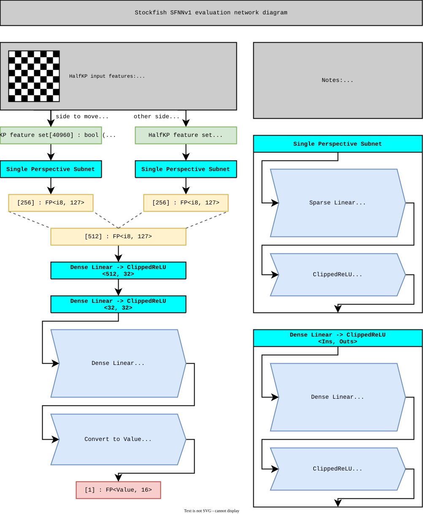
